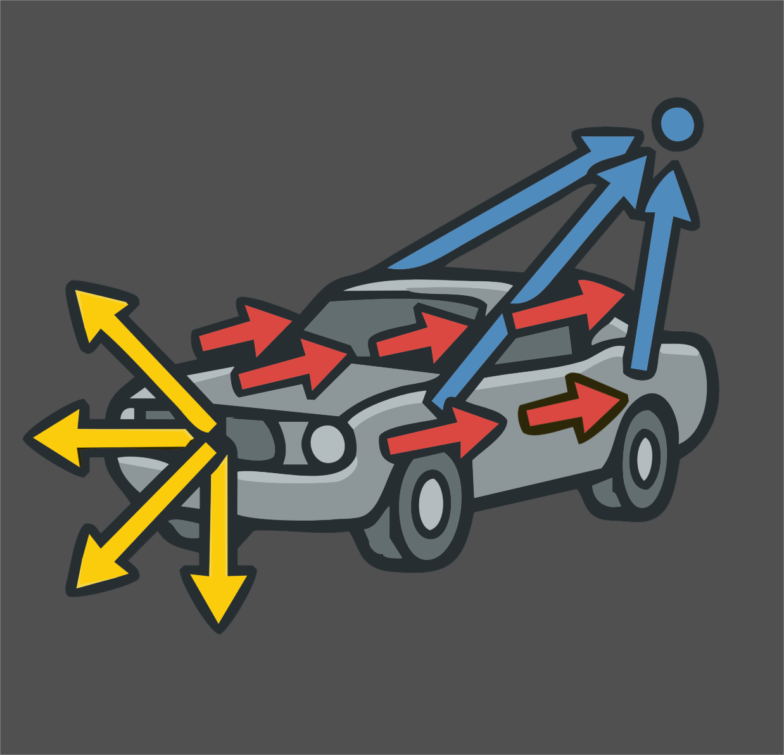
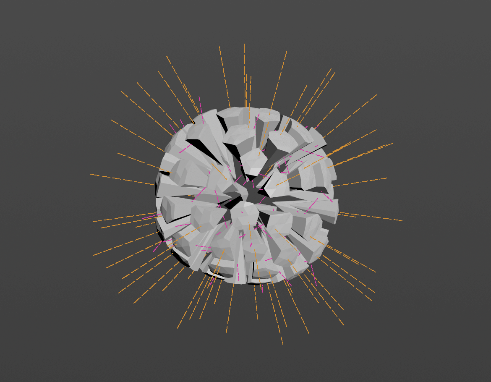

# Advanced Velocity

  

<a href="https://jvtonehammer.gumroad.com/l/advanced_velocity_hda"><strong>Get it on Gumroad →</strong></a>

Welcome! **Advanced Velocity** (v1.0) is a single Houdini SOP that authors the `@v` velocity attribute your simulations read — fixed, aimed, exploding, inherited from motion, turbulent — and blends them together on one node. And because one velocity is rarely the whole story, it can also play a whole *sequence* of velocity events over time: a car lifted at frame 10, torn apart at frame 40, spun at frame 70, all from one node.

Every simulation in Houdini starts with velocity. Getting it right normally means a small pile of wrangles, attribute adjusts and ramps that you rebuild on every shot. Advanced Velocity gathers that into one node, with the same set of Adjust and Mask controls on every velocity type, and viewport guides that show exactly what each type is contributing.

<!-- Screenshot 1 (hero) — a fractured object with the coloured velocity guides on:
 -->

## What it does for you

* **Six velocity types on one node** — Basic (a fixed vector), Directional (aimed at, around, or away from a target), Exploding (an outward burst), Velocity from Motion (derived from animated input), Curl Noise (divergence-free turbulence), and Angular (`@w`) — each switched on with a checkbox in its own section header.
* **Timed Events** — snapshot the setup into events at different frames, each with its own attack / hold / release envelope, and play them back as one summed timeline. An on-screen event timeline, solo/mute, motion preview and per-event editing come with it. See [Timed Events](timed-events.md).
* **Identical Adjust and Mask controls on every type** — scale, rotate, randomise or noise the result, and restrict it with a constant, an attribute, noise, or a line / radial / bounding-box gradient. Promoted from Houdini's own Attribute Adjust nodes, so they behave exactly as you expect. A one-click **Randomize** row adds natural variation at five strengths.
* **A real mixer** — combine the types additively with per-type gains, or blend them with normalized weights. The velocity already on your geometry joins in as its own stream, so nodes stack and caches survive.
* **Interactive blast placement** — for fractured RBD, drop the explosion source by dragging on the mesh in the viewport, push it into the body with the mouse wheel, and watch the affected pieces tint live inside the radius sphere.
* **Solver-aware output** — write velocity for an RBD Bullet Solver or accumulated force for POP and Vellum, with **Injecting Now** and **Mute Gravity** signals that let events punch a solve and then hand it straight back to physics. **Create Connected RBD Sim** builds a solver already wired to both.
* **Scale by Piece Size** — big chunks fly slower than slivers, from a mass attribute or each packed piece's real size.
* **Honest, clean visualization** — per-type guide trails scaled by each stream's *actual* contribution to the mix, drawn as guide geometry that never touches your output. The output carries `@v` (or `@force`) and nothing else, unless you explicitly export a sub-velocity.

## Who it's for

Anyone who sets up FLIP, Pyro, Vellum, POP, or RBD simulations in Houdini and is tired of rebuilding the same velocity rig. It's aimed squarely at the everyday cases — a wall bursting apart, debris thrown from an impact, a body blown outward in stages, a fluid pushed toward a target, pre-sim momentum handed from animation to a solve.

## Requirements

* **Houdini 22.0** or newer (Indie or Apprentice — the asset ships as `.hdalc`).
* Any geometry with points. Packed fractured RBD pieces are fully supported — the node reads and writes one velocity per piece, and measures blasts against each piece's real bounds.

## How to use this documentation

1. [Getting Started](getting-started.md) — install the asset and find your way around the node.
2. [Quickstart](quickstart.md) — a 30-second explosion, then the full telekinetic sequence: a car lifted, burst apart, orbited and pulled back into a ball, driving a real RBD solve.
3. [Using Advanced Velocity](using.md) — the six velocity types, the mixer, the output, and the visualization.
4. [Timed Events](timed-events.md) — the event workflow: baking, envelopes, the timeline, and driving an RBD solve.
5. [Parameter Reference](parameters.md) — every parameter, grouped as it appears in the interface.
6. [Troubleshooting](troubleshooting.md) — when the result isn't what you expected.
