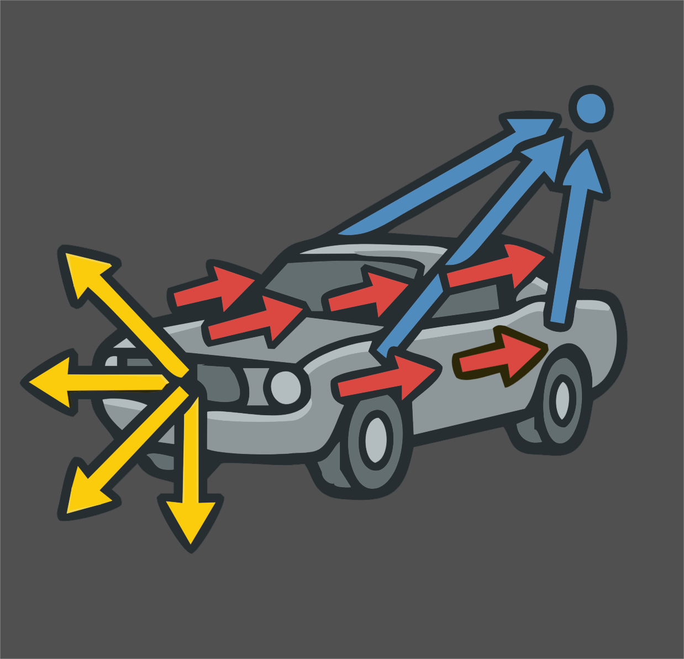

# Advanced Velocity v1.0

  

<a href="https://jvtonehammer.gumroad.com/l/advanced_velocity_hda"><strong>Get it on Gumroad →</strong></a>

Welcome! **Advanced Velocity** is a single Houdini SOP that authors the `@v` velocity attribute your simulations read — fixed, directional, exploding, and angular — and blends them together on one node.

Every simulation in Houdini starts with velocity. Getting it right normally means a small pile of wrangles, attribute adjusts and ramps that you rebuild on every shot. Advanced Velocity gathers that into one node, with the same set of Adjust and Mask controls on every velocity type, and a viewport display that shows you exactly what each type is contributing.

## What it does for you

* **Four velocity types on one node** — Basic (a fixed vector), Directional (aimed at a target), Exploding (an outward burst), and Angular (`@w`) — each switched on with a checkbox in its own section header.
* **Identical Adjust and Mask controls on every type** — scale, rotate, randomise or noise the result, and restrict it to part of the geometry with a constant, an attribute, noise, or a line / radial / bounding-box gradient. Promoted from Houdini's own Attribute Adjust nodes, so they behave exactly as you expect.
* **A real mixer** — combine the types additively with per-type gains, or blend them with normalized weights and one overall scale.
* **Interactive blast placement** — for fractured RBD, drop the explosion source by dragging on the mesh in the viewport, and push it into the body with the mouse wheel. The affected pieces tint live so you can see the blast before you run anything.
* **Built for thin objects too** — a Both direction mode splits walls, panels and floors off *both* faces instead of sliding the pieces sideways inside the slab.
* **Honest visualization** — per-type guide lines scaled by each type's *actual* contribution to the mix, plus one-click toggles for Houdini's own `@v` vectors and point trails.
* **Clean output** — internal attributes are stripped before the output. You get `@v`, plus any sub-velocity you explicitly ask to keep.

## Who it's for

Anyone who sets up FLIP, Pyro, Vellum, or RBD simulations in Houdini and is tired of rebuilding the same velocity rig. It's aimed squarely at the everyday cases — a wall bursting apart, debris thrown from an impact, a fluid pushed toward a target, a body blown outward from its own centre.

## Requirements

* **Houdini 22.0** or newer (Indie or Apprentice — the asset ships as `.hdalc`).
* Any geometry with points. Packed fractured RBD pieces are fully supported — the node reads and writes one velocity per piece.

## How to use this documentation

1. [Getting Started](getting-started.md) — install the asset and author your first velocity.
2. [Using Advanced Velocity](using.md) — the four velocity types, the mixer, and the interactive blast placement.
3. [Parameter Reference](parameters.md) — every parameter, grouped as it appears in the interface.
4. [Troubleshooting](troubleshooting.md) — when the result isn't what you expected.
