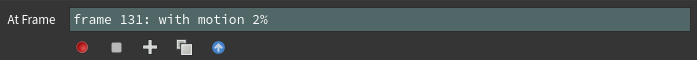
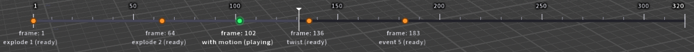

# Timed Events

One velocity field is rarely the whole story. The shot is a car *lifted* at frame 10, *torn apart* at frame 40, *spun* at frame 70 — three different velocity setups, at three different times, summed where they overlap. **Timed Events** is exactly that: a keyframe animator for velocity.

Think of the Setup and Mixer tabs as a template. You dial in a velocity, press **Create Event**, and the node bakes the field it produces into an event stamped at the current frame. Then you change the setup and create the next one. At playback, every event contributes its baked field, faded in and out by its own envelope, and the output is the sum of all of them.

!!!info Why the sliders "do nothing"
In Timed Events mode the live Setup does not reach the output — only baked events do. If you tweak a slider and the sim doesn't respond, the event you're shaping simply hasn't been re-baked yet: press **Update** on its row. See [Editing an event](#editing-an-event).
!!!

## Creating events



* **Create Event** bakes the current setup into a new event at the playbar frame.

* **Record Events** plays from wherever the playbar sits to the range end (wrapping back to the start at the very end) — press Create Event as it plays to mark events in real time, like tapping keys into a performance. It also brings the timeline HUD up if the viewer had wandered out of the node's state. **Stop** ends it. While recording, Create Event only *marks* the moment (hollow discs appear on the timeline) — the real events, bake and all, are created together the instant the take ends, so playback stays interactive and anything downstream (an RBD solve included) keeps its cache instead of resimulating on every press. The marks survive a crash — press Record again and you'll be offered them back. Guides pause for the take and come back when playback ends.

  Recording by feel wants a responsive playbar, so it's at its best on **lighter inputs** — packed pieces or meshes up to a few tens of thousands of points. On very dense raw-point inputs the take slows down as events stack up; rough it in on a lighter proxy, then Update the events against the full-resolution input afterwards.

* **Copy Event** duplicates an existing event at the current frame — the same blast, later, with nothing re-baked.

* **Copy From** points the other way: it overwrites the event you're *currently on* with another event's data. The event keeps its own frame and name — those are what make it that event — and everything else is replaced. Use it when two events should match and one has drifted, instead of deleting and re-copying.

* **Sort by Frame** reorders the rows chronologically (playback doesn't care about row order; this is purely for reading).

Each event is a tab in the **Events** list, named, stamped with its frame, and carrying a **Captured** summary of what it actually baked — which types, how many points, the peak speed. That line is worth glancing at every time: an event named "explosion" that captured `basic | 60 pts | max |v| 1` is telling you something.

## The envelope

Every event has an Attack / Hold / Release envelope around its **Event Frame** — the peak moment. Each phase has an enable checkbox and a duration in **frames**, the same unit as the Event Frame itself:

* **Attack** ramps the event in from zero to full, ending at the event frame — an Attack of 5 opens five frames *before* the event frame. Off = it switches on instantly.
* **Hold** keeps it at full strength after the peak.
* **Release** fades it out afterwards, in one of two modes: **Fade to Zero** ramps down over the Release time; **Drag** decays gradually at a rate, so the pieces the event threw visibly slow down. Drag is the one timing control expressed per *second* rather than in frames — a decay rate per frame would be an unreadable fraction.

So an event's window — the span where it delivers full strength — runs from `Event Frame − Attack` to `Event Frame + Hold`. That window is what **Injecting Now** and **Mute Gravity** key off, and it's worth being able to read it off the timeline at a glance.

**Extend to Next**, on the Hold row, sets Hold so this event holds until the next one takes over: the two windows touch with no gap and without both sitting at full strength at once. "Next" means next by frame, whatever is soloed or muted; it does nothing on the last event. The small **undo** button beside it puts Hold back to what that press replaced — one setting, one press deep.

Attack and Release each take a **Curve** — Linear, Ease, Sharp, Snap, or Soft.

All three phases are **on** by default, so a fresh event ramps in, holds, and fades back out. Switching all three **off** makes an event *latch* — it starts at its frame and keeps delivering at full strength forever. For a velocity that stays on for the whole shot, use **Single Field** mode instead.

Latching is the right shape when an RBD solver overwrites `@v` every frame (which it only does when `v` is actually listed in its Overwrite Attributes field — see below) — a fading velocity handed to that solver would *brake* the pieces it just threw. (Better still: keep the fade and gate the solver on **Injecting Now** — see [Driving an RBD solver](#driving-an-rbd-solver).) One cost: a latched event keeps the node cooking every frame after it starts, which adds up on heavy inputs.

## Editing an event

**Recall** loads an event's captured setup back into the live Setup and jumps to its frame. Edit whatever you like, then press **Update** to re-bake it.

The node watches for the trap in that loop: if the live Setup no longer matches the event it was last based on, the **Stale** readout names the event and its timeline marker turns **pink**. Nothing is lost — press Update to capture your changes, or Create Event to make the changes a new event instead.

**Clear Setup** (the broom next to Fold / Unfold All) switches every velocity type in the live Setup off and parks the playhead back at the start of the range — a clean slate for authoring the next event, from the top.

## Solo and Mute

**Solo** plays back *only* the listed events; **Mute** silences the listed ones. Both take space-separated numbers and ranges (`1 3-5`), and picking from the dropdown *adds* to the list rather than replacing it. Solo wins over Mute, and a soloed event is never cut short by the events it was soloed away from.

## Event Strength

Once a few events are baked, balancing them against each other used to mean Recall → tweak → Update for every one. **Event Strength** (top of the Velocity Mixer tab, one slider per event, named live after the event) does it directly: each slider scales that whole event, across the whole frame range, applied at playback — so it responds instantly and never makes an event stale. The type **Gains** balance the streams *inside* the event you're about to bake; Event Strength balances the *baked events* against each other.

A strength of 0 quiets an event's velocity but deliberately does **not** close its Injecting Now / Mute Gravity windows — those follow the event's timing, not its amount. Want an event genuinely out of the solve? That's **Mute**.

## The event timeline

With **Event Timeline** on (Visualization tab), a frame ruler draws along the bottom of the viewport with a marker per event and a playhead. The marker colours tell you each event's state at a glance:



* **Orange** — ready: baked and waiting for its frame.
* **Green** — playing: contributing right now.
* **Pink** — stale: the live Setup has moved since this event was baked.

Each event's label carries the same state in words, and the **At Frame** readout in the parameters spells out exactly which events are contributing at the current frame — including, in a gap, when the next one starts.

**Scheme** switches the timeline between Dark and Light palettes to match your viewport background.

!!!info If the timeline disappears
The timeline is drawn by the node's viewer state, and some actions (like refreshing asset libraries) drop the viewer out of it. **Utilities ▸ Restore Viewport HUD** brings it back.
!!!

## Motion preview

Baked vectors are only half the picture — you also want to see where the pieces *go*. **Preview Motion** (Visualization tab) advances the baked-event guides to where the events predict the pieces will be at the current frame, and the **ghost** draws a wireframe of the pieces there, tumbling with any baked `@w`. **Offset** slides the whole prediction sideways in multiples of the object's width, so the forecast reads beside the real geometry instead of on top of it.

It ships **off**, and that's deliberate — it's the most expensive control in the node, since the ghost draws a *second complete copy* of your input on every viewport redraw. On something heavy that slows down more than just playback: parm edits and playbar scrubbing get sluggish too, since it's redraws that cost. Switch it on to check your timing, then switch it back off.

**Ghost Style** is what keeps the ghost affordable. It ships on **Full Wireframe**, best-looking and most expensive; on heavy input drop it to **Bounding Boxes** (one tumbling wire box per piece, cheap at any density) or **Points**, cheaper still. The preview never switches itself off, whatever the input size — the **Visualization Limit** caps the guide *trails* only, with **Guide Density** scaling within that budget.

The live Setup guides stay on the input mesh; the prediction sits beside it. And it's a straight-line integration of the baked fields — no collisions, no drag — a forecast, not a simulation.

### Track Motion

An event's baked vectors were sampled at the input positions. Once the pieces travel, a "toward the target" field frozen at bake time no longer points at the target. **Track Motion** (per event, on by default) re-aims the event's directional velocity at the pieces' predicted positions each frame — an orbit stays tangential, a Toward keeps pointing home.

It's only available when the event captured a *plain* Directional field: Adjust, Mask, Distance Falloff, per-piece scaling or a mix of types can't be re-evaluated, and in those cases the event honestly replays frozen rather than guessing.

## Rest position attributes

Every cook stamps `@startframe_rest` — each point's position at the scene start frame — and each event with **Create Rest Position Attribute** on records its own `<name>_rest` at its frame. The Directional type's **To Rest Pose** mode aims each point at its own captured position. The attributes are stripped from the output unless **Export Rest Position Attributes** (with the other exports at the bottom of the Output tab) keeps them.

!!!warning To Rest Pose needs Track Motion, and something to have moved first
Advanced Velocity sits **upstream of your sim**, so its input is always the un-simulated geometry. On static input each point's captured rest position *is* its current position, so at bake time `rest - P` is exactly zero and the event bakes an empty field — `Captured` reads `max |v| 0`.

**Track Motion is what makes it work** (on by default). Instead of replaying that empty bake, it re-evaluates `rest - P` against the pieces' *predicted* positions every frame, so once an earlier event has thrown the pieces, the reassembly event pulls each one back to its own captured spot.

Two things follow: a rest-pose event **alone** still does nothing, correctly, since nothing's moved yet — it needs an earlier event to displace the pieces. And Track Motion **refuses** if anything per-point sits between the field and the bake — Adjust, Mask, Distance Falloff — because the scale it needs can't be measured from an all-zero bake. `Captured` names the reason when that happens.
!!!

## Driving an RBD solver

The RBD Bullet Solver reads `@v` through **Override Attributes from SOP** (under **Properties ▸ Pieces ▸ Override Attributes**) — but left on every frame, it re-stamps the velocity constantly and the pieces fight gravity. What you want is for the events to *inject*, then let physics own the pieces. That's **Injecting Now** (Output tab): it reads 1 while any event is delivering energy (attack + hold), 0 otherwise.

On the solver:

1. Leave **Override Attributes from SOP** ON. (Don't gate the toggle itself — the solver latches it at the sim's first frame, and gating it delivers nothing at all.)
2. Gate the **Attributes** field beneath it instead — an expression that returns `v` only while Injecting Now reads 1, e.g. a Python expression on that parameter:

```python
"v" if hou.node("/obj/geo1/advanced_velocity1").evalParm("dyn_injecting") else ""
```

The solve then takes the velocity on the impulse frames and runs free in between — pieces launch, arc, and land under gravity, and the next event kicks them again. Leave `w` out of the list unless your events author angular velocity, or the solver's own tumble gets overwritten. If the baked direction is wrong because the pieces have already moved, see [Exporting the trigger](#exporting-the-trigger) — it lets you supply the direction from the live simulation instead of the bake.

!!!warning Whatever drives the solve has to be named in that Attributes field
This is the one step that catches everyone, so it's worth stating plainly. There are two workflows, and they need **different** entries in **Properties ▸ Pieces ▸ Override Attributes ▸ Attributes**:

* Driving the solve with the node's velocity directly (this section) — list **`v`**, gated on Injecting Now.
* Driving it with [Export Trigger](#exporting-the-trigger) and your own wrangle — list **`trigger`**, and **remove `v`**.

Never both. `v` in that field is re-stamped from the SOP every frame, so it overwrites whatever your wrangle just wrote.

Why this fails so quietly: an attribute *missing* from the list still exists in the sim, because the solver copies every SOP attribute once when it builds the objects at the first frame. It's simply frozen at that first-frame value from then on. So a forgotten `trigger` is usually frozen at **0** — `f@trigger` reads zero on every substep of every frame, `if (amp > 0)` never fires, and your wrangle does nothing at all. No error on the wrangle, no error on the solver, no warning anywhere. If a trigger setup looks completely inert, check this field before you check anything else.
!!!

**In a hurry? Press Create Connected RBD Sim** (Output tab). It builds an RBD Bullet Solver below the node with a ground plane, gravity, and both gates already wired.

**Or sidestep the gating entirely.** Everything above is the price of Velocity mode: velocity is *set*, so it has to be gated. Set **Output As** to Force and there's nothing to gate at all — a force adds to the solve instead of replacing it, so gravity keeps acting the whole time. POP and Vellum read it natively; on Bullet, Create Connected RBD Sim builds the wrangle that applies it. See [Output](using.md#output) for Force Scale and the `av_force` attribute name.

### Staggering the points

By default every point in an event launches on the same frame — one slab, leaving together. **Stagger Points** (per event, in **Event Options**) brings them in one at a time instead: each waits for its own moment, shuffled evenly across the event's window, then takes its full share.

The shuffle is *even*, not random-per-point — points are shared out across the window rather than each rolling a die, so you get a steady cascade instead of clumps. It's also stable: a point keeps its slot while you scrub, and the guides and motion preview show the same arrivals as the output.

Two ways to use it, depending on the other envelope controls:

* **Attack off, Hold on** — the pure cascade. The envelope is flat across the window, so each point snaps to full strength the instant its turn comes.
* **Attack on** — each point *also* fades in as it joins, for a softer build.

!!!warning Waiting points hang, they do not fall
A point that hasn't activated yet is still being written to, with a velocity of zero, for as long as the solver is reading from SOP — so it holds in mid-air rather than falling, though it still collides and gets jostled.

For a telekinetic effect that hang *is* the look. If a piece should fall until it gets picked up, give it its own later event instead.
!!!

**Shape Distribution** reveals a ramp over the activation times. Left to right is each point's place in the shuffle, the height is when it activates — 0 at the start of the window, 1 at the end. A straight line is the even spread; bend it down to front-load the cascade, or up to hold most points back and leave stragglers. The default is straight, so switching the toggle on changes nothing until you actually move it.

**Order** decides *who leads* the cascade — the spacing stays even, only the sequence changes:

* **Random** — the seeded shuffle above.
* **Strongest First** — the points the event hits hardest go first. With a Point Source blast that sweeps outward from the source like a shockwave, which is exactly the setting this mode exists for. **Weakest First** is the mirror: the fringe crumbles and the core holds out longest.
* **Along Axis** — a wipe along **Sweep Axis**, low end first. The default axis sweeps bottom to top; negate it to go the other way.
* **Small Pieces First / Large Pieces First** — packed pieces ranked by size, so a body can shed its slivers before the big chunks let go.

A mode with nothing to measure — uniform strength, unpacked input for the size modes, a zero axis — falls back to Random rather than doing something misleading.

Stagger is applied at *playback*, not baked — so you can switch it on for an event that's already baked without pressing Update.

### Pulse timing

The **Timing** dropdown above the envelope controls picks how an event delivers its energy: **Envelope** is the Attack / Hold / Release described above, and **Pulse** replaces it with a train of grips — grab, let go, grab again.

Pulse timing has four controls, and no envelope:

* **Range (F)** — the frames the train spans, starting at the Event Frame. Its own **Extend to Next** button (same one-press undo) stretches the range to where the next event opens.
* **Pulse Count** — how many grips tile that range, evenly.
* **Pattern** — each grip's intensity curve: **Hit** (full strength then a decay — repeated impacts), **Build** (ramps up and gets cut by the next grip; the final one holds its peak — charging up), or **Wave** (a smooth swell — breathing). **Curve** eases Hit's decay and Build's ramp; the waveform icon at the end of the row follows the choice and cycles patterns on click.
* **Hold (F)** — the same job Attack + Hold do in Envelope timing: the frames each grip counts as *delivering* energy. **Injecting Now** and **Mute Gravity (During Impulse)** open for that span, anchored at each grip's peak — between grips a connected solver owns the pieces, and the object visibly sags before the next grab.

Like Stagger, Pulse timing is applied at playback — no re-bake needed. Stagger itself is Envelope-timing only; the two never combine.

### Exporting the activation age

**Export Activation Age (@av_age)** (in the Output tab's *Additional Exports*) writes, for every point, how many frames ago a playing event last took hold of it — `-1` for points never touched. It's stagger-aware (a cascade lights points up one at a time) and pulse-aware (every new grip resets the clock), which makes it a ready-made shading input: pieces that glow as the force grabs them and cool off as it lets go.

### Exporting the trigger

Every bake happens against the input's **rest positions** — the geometry as it arrives at the node, before anything simulates it. The direction is only correct there. An Exploding event aimed outward from world centre, baked while a ball sits well above the origin, bakes mostly +Y — up, because up is what "outward from centre" means *at that position*. Once the pieces have fallen and are lying on the floor, what you actually want is radial in XZ, and the baked vectors keep punting them upward. Track Motion doesn't save this: it only re-aims the Directional type, off the node's own straight-line prediction, which knows nothing about gravity, collisions, or the ground.

**Export Trigger (@trigger)** (Additional Exports) is the way out — let the node own the timing and magnitude, and compute the direction yourself, downstream, from where the pieces actually are.

It writes a per-point float: the magnitude the playing events are delivering this frame, with no direction. For a single event with no incoming base layer it's exactly `length(@v)`, so multiplying your own direction by it preserves the energy the tool would have used — a direction substitution, not a gain. It follows Scale by Piece Size and Clamp Speed for the same reason, and Event Strength folds in; Incoming Velocity does not, since the trigger is events only.

Events sum **without cancellation**. Two events pushing opposite ways cancel to zero in `@v` but still read as a strong trigger — deliberately, since the question it answers is "how much is being injected", not "what's the net vector". It comes from the event's own baked field, so an event with no velocity types enabled gives zero, and it isn't a 0-1 envelope — a Strength of 5 peaks near 5, not 1.

**Worked example — reaiming a pulse at a body already on the ground.** A fractured ball falls under gravity in an RBD Bullet Solver, lands, and should jerk outward from world centre a few times while it lies there.

1. Give the event Pulse timing with a Pulse Count of 4. Any velocity type does for the magnitude — the direction it bakes doesn't matter, since it's about to be replaced.
2. Turn on **Export Trigger (@trigger)**.
3. Put `trigger` in the solver's **Attributes** field under Override Attributes from SOP (**Properties ▸ Pieces ▸ Override Attributes**), so the value reaches the sim each frame. Not gated, not conditional — a plain, always-on `trigger`, since the envelope shape is already in the value. This *replaces* the Injecting Now gate described in [Driving an RBD solver](#driving-an-rbd-solver), so **delete `v` from that field**: anything listed there is re-stamped from the SOP every frame and would overwrite what the wrangle writes. So a field reading `active animated deforming __pin __guide_*` becomes `active animated deforming __pin __guide_* trigger`.

    Skip this step and the whole setup is silently inert — see the warning in [Driving an RBD solver](#driving-an-rbd-solver) for why it produces no error.
4. Add a POP Wrangle to the solver's forces:

```c
float amp = f@trigger;
if (amp > 0) {
    vector radial = @P * {1, 0, 1};
    v@v += normalize(radial) * amp;
}
```

`@P` is the *live simulated* position — that's the whole point — and multiplying by `{1, 0, 1}` flattens it into XZ so the kick runs sideways along the floor instead of back up.

!!!warning Writing `v@force` instead? Multiply the mass back in
`v@v` is the direct route here, and it's what makes the trigger's headline property useful — it *is* the speed the node would have written, so `v@v += direction * amp` gives you that same push in your own direction.

A force works too, but it has to be scaled: a solver divides a force by each piece's mass before anything moves, so `v@force += direction * amp` does nothing at any sane magnitude, while `v@force += direction * amp * @mass` behaves. What you get for the extra term is that a force *adds* rather than overwriting — gravity keeps acting throughout and there's nothing to gate. **Output As ▸ Force** wires exactly this for you.
!!!

One thing worth knowing about `+=` specifically: a POP Wrangle in the solver's forces runs once per **substep**, not once per frame — Substeps defaults to 10 on a fresh solver — so that line fires several times for every frame the event is active. `@trigger` is an envelope, not a single-frame spike, so it stays nonzero for the whole attack-and-hold window, and `+=` integrates it across every substep of every one of those frames rather than delivering one clean kick. Expect the result to come out considerably stronger than the raw trigger number suggests. If you want a single discrete impulse rather than a build-up, scale `amp` down, or divide it by the substep count.

### Muting gravity for an impulse

Sometimes the physics is the problem. A telekinetic lift that fights 9.8 m/s² the whole way up reads as weak, and no amount of extra velocity fixes it — what you want is for the object to genuinely float while the event holds it.

**Mute Gravity** (per event, in **Event Options**) does that. Three settings:

* **Off** — gravity is never touched. The default.
* **During Impulse** — muted over the same window as Injecting Now, the attack and the hold, then back to 0. Gravity returns at the end of the peak and the pieces arc over naturally as the impulse fades.
* **Until Next Event / End** — the mute carries on until the next event opens, however short this event's Hold is.

That last one is what to reach for when a sequence of events leaves the pieces **falling in the gaps between beats**. It's deliberately *not* the same as extending Hold: extending Hold keeps Injecting Now open too, so the solver re-stamps `@v` every frame of the gap and the pieces fly on rails, with no collisions and no tumble. Extending only the gravity mute lets the impulse fade normally while the solver keeps the pieces — they coast on the momentum already given, keep tumbling, still collide, and simply don't fall.

On the **last** event there's no next event, so the mute runs until it stops contributing:

* Release **off** — the envelope latches at full strength, so the mute holds to the end of the range.
* Release **on**, Fade — the mute ends where the fade ends.
* Release **on**, Drag — the decay is asymptotic and never reaches zero, so again to the end of the range.

!!!warning A final event with Hold and Release both off
This is the shape that catches people out. With both disabled the *envelope* latches at full strength forever — but **During Impulse** only covers attack plus hold, which is now just the attack, so gravity comes back the instant the event reaches full strength. If the pieces should keep coasting to the end of the shot, that event wants **Until Next Event / End**.
!!!

It's per event on purpose: the lift mutes, the blast that follows doesn't. Wire it on the solver the same way as the injection gate, but on the gravity *force* (**Forces ▸ Gravity ▸ Force**, on its Y component) rather than the **Gravity** checkbox above it:

```python
0.0 if hou.node("/obj/geo1/advanced_velocity1").evalParm("dyn_mute_gravity") else -9.80665
```

Why the force value rather than the checkbox? Both work today, but a force magnitude is read every step by definition, whereas a toggle that decides whether the force exists is the same shape as **Override Attributes from SOP** — which is latched at the first frame and silently ignores animation.

!!!warning Gravity belongs to the whole solve
Muting is not per piece. Gravity in a simulation applies to every object in it, so an event that mutes gravity mutes it for *everything* in that solve, not only the pieces the event moves. If you have two fractured objects in one solver and only one is being lifted, both will float.
!!!

## Good to know

* **Incoming Velocity is a live base layer.** It plays underneath the events every frame — never baked into them, so it can't be double-counted, and an animated input stays live between events.
* **The Output tab is live too.** Clamp Speed and Scale by Piece Size apply at playback, no Update needed. Master Speed is the exception — it's baked into each event, and changing it afterwards flags the event stale.
* **Bakes are per-point.** An event's field is stored against the input's point count, so re-fracturing the object leaves existing events unusable and the node writes zero for them. The Events tab warns you; **Utilities ▸ Re-bake All Events** repairs the lot, replaying each event against its own stored snapshot so timings survive — unlike Update, which re-bakes from the *live* Setup.
* **A later blast kicks the pieces that were near it at bake time**, wherever they've since travelled — the radius selection is frozen at bake. Track Motion re-aims directions, not membership.
* **Baked guides can be unified to one colour** (Visualization ▸ Unify Baked Guides) when the per-type colours are more information than you want.
* **A blank event with Mute Gravity on freezes everything solid.** With no velocity types enabled its baked field is all zeros, yet it still opens the injection gate — so the solver zeroes every piece's velocity while gravity is muted, and the pieces hang until the event's hold ends, then fall again. Useful on purpose: drop one wherever you want everything suspended, and set its Hold to the pause length (or **Extend to Next** to hang right up to the following beat). Mute Gravity on a *real* event means gravity off while the pieces keep flying; on a *blank* event it means everything stops dead.
