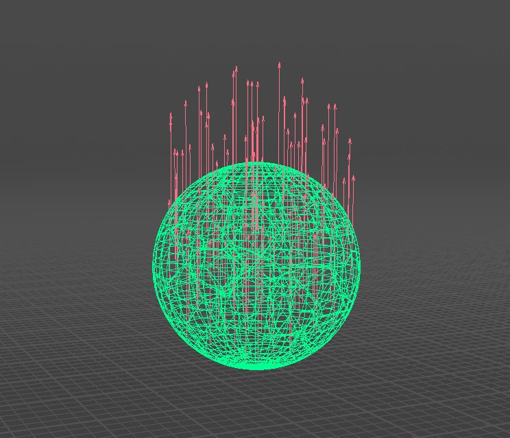
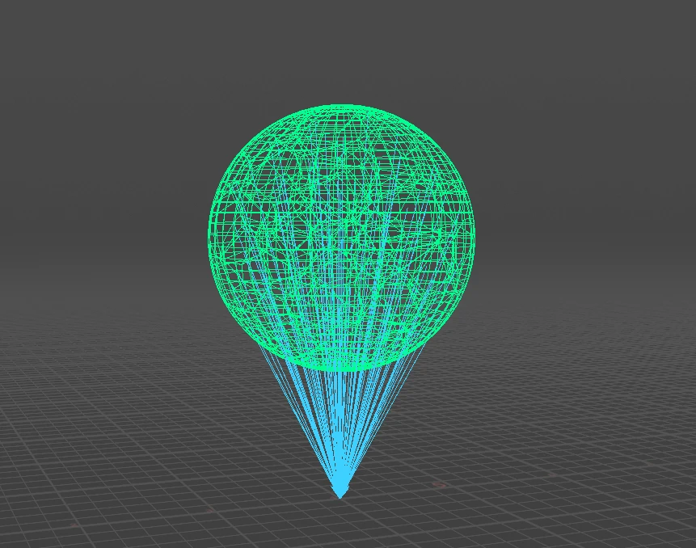
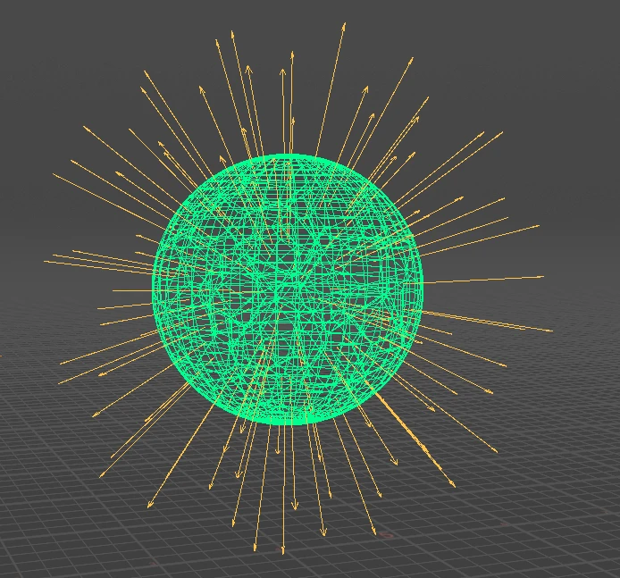
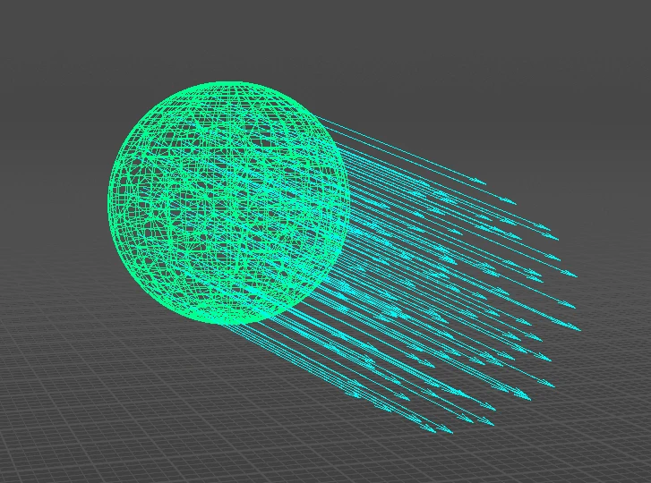
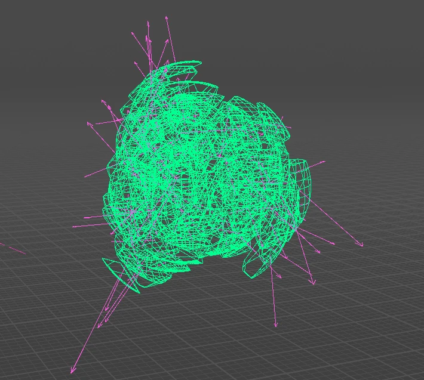
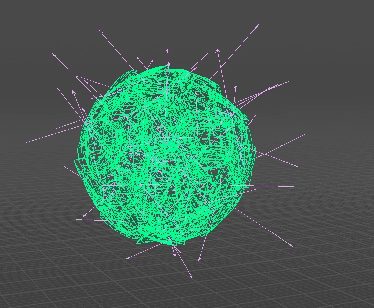
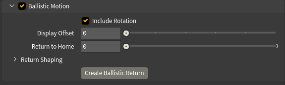
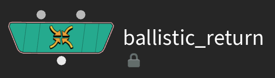

# Using Advanced Velocity

This page covers the setup surface: the six velocity types, the mixer, the output and the visualization. The event workflow gets [its own page](timed-events.md).

## The six velocity types

Each type lives in its own collapsible section with a checkbox in the header. The controls stay hidden until you turn the type on.

### Basic

A fixed vector applied to every point. The one you reach for when you just want to give the whole body a shove in one direction.

### Directional

Velocity aimed at, around, or away from a target. **Direction** picks where the target comes from:

* **To Position** (default) — a typed world-space position. No geometry needed.
* **SOP Path** — aim at another SOP. **Method** decides how its centre is measured (centre of mass, bounding box, convex hull), and **Target Group** restricts that measurement to part of it. A single point number in there aims at exactly that point.
* **Use Second Input** — aim at whatever's wired into the second input. Press **Create Point** and the node builds an Add SOP with a single point above your mesh and wires it in for you.
* **To Rest Pose** — every point aims at its own captured rest position. This is the reassembly mode: pair it with **Track Motion** and an earlier event that throws the pieces, and each piece gets pulled back to its own spot — see [rest attributes](timed-events.md#rest-position-attributes).

**Direction Bias** is a continuum, not a set of modes: **+1** aims straight at the target, **0** orbits around an axle through it, **−1** points straight away. Anything in between spirals — a vortex that also pulls things inward, with no second node needed. The **Toward / Around / Away** buttons just snap the bias to those three values. **Orbit Axis** sets the axle: *Toward Target* runs it from the object's centre through the target, or you give it a fixed *Custom Vector*.

**Normalize Direction** makes every direction unit length, so distance stops affecting speed. **Distance Falloff** fades velocity with distance — from the target, or from the axle when orbiting.

### Exploding

An outward burst, with two different origins.

**Whole Object** radiates from the body itself:

* **Centroid** — everything pushes away from a single point, offset with **Move Centroid**.
* **Medial Axis** — direction is measured from the body's skeleton instead. Hollow, curved or L-shaped objects don't have a meaningful centre, so a centroid just slides everything away from one averaged point; the skeleton bursts outward sensibly instead. It's slower to compute.

**Point Source** gets [its own section below](#point-source-explosions).

### Velocity from Motion

Velocity derived from the movement the input already has, frame to frame — the same idea as a Trail SOP. Use it to hand pre-sim momentum to an RBD or POP solve: animate a character swinging a prop, fracture the prop, and the pieces inherit the swing. Only meaningful on animated or deforming input — a static mesh gives you zero.

### Curl Noise

A turbulent field — natural swirls, no sources or sinks — for debris drift and secondary motion. **Frequency** is vortex size, **Amplitude** is speed, **Octaves / Roughness / Lacunarity** add fractal detail, and **Evolution Speed** churns the field over time (0 = frozen). This authors an *initial* velocity — a one-time push, not a force that keeps acting inside the sim.

### Angular

An extra `@w` spin vector, in radians per second, for solvers that read it. **Source** is either a *Constant* vector, or *Inherited from Motion*, computed from the input's own rotation between frames (needs a point `orient` quaternion on the input). This type is independent of the mixer — `@w` is written whenever the type is on.

---

## Point Source explosions

Point Source places a single blast origin inside the object, and only pieces within its **Falloff Radius** (a wireframe sphere in the viewport) get affected. Built for dense fractured RBD — a wall taking an impact in one spot, rather than the whole building flying apart.

The falloff is measured to each packed piece's real bounds, not just its centre, so the radius behaves the way it looks against the sphere.

The falloff also decides which pieces move at all: Adjust and Mask variation (including Randomize) shape the pieces the blast caught, but can never add motion to a piece outside the radius.

### Placing the source interactively

Press **Place Source** and the viewport enters a placement state:

| Input | Action |
| --- | --- |
| **LMB drag** | Place the source on the surface, sliding it as you drag |
| **Scroll** (while dragging) | Grow or shrink the area of influence — the radius sphere follows live |
| **Shift + scroll** (while dragging) | Push the source into or out of the mesh, along the view ray |
| **Ctrl** + either scroll | Bigger steps |
| **Shift + R** | Reset depth and radius |
| **Esc** | Finish |

The controls are also shown on screen while the state is active.

### Seeing what will move

**Show Affected Pieces** highlights the pieces the blast will actually move, through the **Affected Color** ramp — green across most of the blast, hot pink at the core. The highlight is normalized against the strongest affected piece, so the core always reads clearly whatever radius or strength you've set.

This is drawn in the viewport, not painted onto your geometry — nothing gets written to the output, so you can leave it on and send the result straight into a solver. It only shows while the node's own tool is active — click the node in the viewport, or press **Restore Viewport HUD** on the Utilities tab if it's gone quiet.

### Direction

* **Off Surface** (default) — pieces travel away from the object: along their point normals if present, otherwise away from the body's centre. Reads as "blowing a hole outwards."
* **Outward** — radiates away from the source point itself, as if a charge sat right there. Careful with this one: with the source placed *on* the surface, it drives material through the body and out the far side. Usually Off Surface is what you actually wanted.
* **Inward** — pieces get pulled toward the source. Implosions.
* **Both** — for thin objects: walls, panels, floors. Pieces get pushed off both faces instead of radiating sideways within the slab. Uses point `@N` when present, otherwise the thinnest axis of the bounding box.

**Never Push Into Surface** mirrors any velocity heading back into the body — an override for Outward / Inward. Both and Off Surface already leave the body, so this control hides for those.

---

## Adjust and Mask

Every velocity type carries the same pair of folders, promoted from Houdini's own Attribute Adjust nodes.

**Adjust** reshapes the velocity: scale the length, rotate the direction, spread it, or drive it from a random value or noise. Turn on **Adjust Value** to enable it. The Noise / Random section appears once you pick a random or noise value type.

At the top of every Adjust folder sits **Randomize**: pick a **Variation** level (1 Subtle to 5 Extreme) and press the dice. The node checks whether your input is discrete pieces (per-piece random) or a continuous surface (coherent noise) and presets the Adjust controls accordingly. Everything stays hand-tunable, and the undo arrow reverts it. On Curl Noise the dice re-rolls the swirl pattern instead.

**Mask** restricts the velocity to part of the geometry — a constant, random values, noise, another attribute, or a line / radial / bounding-box gradient, remapped through a ramp. The Line and Radial guides fit themselves to your input the first time you enable them, and a **Fit to Input** button re-fits them anytime.

Both blocks are Houdini's own controls — for anything not covered here, see the [Attribute Adjust Vector](https://www.sidefx.com/docs/houdini/nodes/sop/attribadjustvector.html) and [Attribute Adjust Float](https://www.sidefx.com/docs/houdini/nodes/sop/attribadjustfloat.html) help pages.

---

## The Velocity Mixer

**Additive** multiplies each enabled type by its **Gain** and sums them up. Gains default to 1 and can go above it — your straightforward "more of this, less of that" mode.

**Weighted (Normalized)** blends the types in proportion to their **Weights**. Weights are normalized, so only the ratio between them matters, and the result can never exceed the source magnitudes.

**Incoming Velocity** takes the velocity already on the geometry and feeds it in as another stream. It's on by default, and it's what lets you stack multiple Advanced Velocity nodes or build on top of a cache or previous sim. Its amount slider is a multiplier in Additive mode and a weight in Weighted mode. In Timed Events it plays as a live base layer under the events.

**Master Speed** is the overall magnitude control, applied after the gains/weights in both modes.

In Timed Events the tab gains a second block above all this: **Event Strength**, one slider per event. Gains and Weights balance the velocity types baked into an event; Event Strength balances whole events against each other. It applies live at playback — drag a slider and nothing goes stale, no Update needed. One exception: a strength of 0 does not close an event's Injecting Now / Mute Gravity windows, since those key off timing, not amount — use **Mute** when you want an event genuinely out of the solve.

**Group**, at the top of the node, restricts the final write: points outside the group keep whatever velocity they arrived with. This is how several Advanced Velocity nodes can each drive their own region.

---

## Output

**Combine Into Attribute** writes the mixed result to the output attribute — on by default.

**Output As** picks between the two ways a solver can take motion from you, and the choice depends entirely on what you're feeding:

* **Velocity (`@v`)** — for the **RBD Bullet Solver**, which has no per-point force input. Velocity is *set*, not added — whatever the solve had accumulated gets replaced on the frames you write. That's why an RBD setup needs gating (below); leave this writing every frame and the pieces can never fall.
* **Force (`@force`)** — for **POP** and **Vellum**, which accumulate forces every step. Nothing gets overwritten, so no gating is needed, and a fading release just stops pushing rather than braking motion the sim already has.

The short version: **if it's Bullet, write velocity and gate it; if it's POP or Vellum, write force and forget about it.**

**Velocity Attribute** and **Force Attribute** let you rename the written attribute in each mode — author `targetv` for Vellum without touching a wrangle.

**Injecting Now** and **Muting Gravity** are live 0/1 readouts for driving an RBD solve, and **Create Connected RBD Sim** builds a solver already wired to both — see [Driving an RBD solver](timed-events.md#driving-an-rbd-solver).

### Ballistic Motion — the second output

The node's second output delivers the pieces already flying: advanced along the velocity you authored, frame by frame, tumbling with any baked `@w` if **Include Rotation** is on. No solver involved. Output 1 is untouched — your sim still gets the pieces at rest with `@v` on them — so wire output 2 when a real solve is overkill: previz, motion-graphics moves, a quick look before committing to Bullet.

It's a straight-line prediction — no collisions, no gravity. **Display Offset** slides the result sideways in multiples of the object's width, for reading it next to the original.

**Return to Home** is what makes it a tool rather than a toy. Keyframe it from 0 to 1 and every piece flies back to exactly where it started — at 1, output 2 equals the input bit for bit, however far the motion carried the pieces or however you've shaped it. Reassembly in one slider.

**Return Shaping** (collapsed under the slider) art-directs the way home without ever breaking the landing:

* **Return Profile** — a ramp over the blend, for easing the approach.
* **Stagger** gives each piece its own return window; **Return Order** decides who leads: Random, Nearest First, or Farthest First. Everyone's still home by 1.
* **Arc** bows each piece's path sideways instead of a straight line; **Swirl** blends those arcs toward a shared rotation around the **Swirl Axis**.
* **Extra Turns** adds whole loops to the unwind — invisible at both ends, so it only shows mid-flight.
* **Seed** re-rolls the per-piece arc directions.

**Return Paths** draws each piece's route home as a guide curve, sampled from the same curve the blend walks.

### Ballistic Return — reassembling a real simulation

Everything above returns pieces home from a prediction. But once the pieces have actually simulated — tumbled, hit the ground, settled — that reassembly can't happen on this node, since by then the solve is downstream. It gets a node of its own.

Press **Create Ballistic Return** at the bottom of the Ballistic Motion folder. You get a second node, shipped inside the same file and listed in the JV tab menu as **Advanced Velocity Ballistic Return**, wired for you: input 1 takes the simulated pieces (it finds the RBD solver under your node), input 2 takes the rest pose from this node's first output.

Keyframe **Return to Home** from 0 to 1 — same slider, same Return Shaping, same guarantee: at 1 every piece is exactly home, whatever the sim left behind. Nothing is snapshotted, so you can re-sim upstream all day and this node never goes stale.

**Rest Attribute** matters here. Leave it empty and "home" means the second input's positions — right for a static mesh. But if your input is *animated*, those positions have moved on by the time the return happens, and you'd be aiming at a moving target. Turn on **Export Rest Position Attributes** on the Advanced Velocity node, then name `startframe_rest` here (or any event's captured pose) and the pieces return to that frozen pose instead. The dropdown lists whatever's actually arriving on the input.

**Post-Process** holds the final touches:

* **Clamp Speed** clamps the final speed into a Min / Max range.
* **Scale by Piece Size** makes big chunks fly slower than slivers — probably the single biggest realism win on fractured RBD. Mass comes from a point `mass` attribute when present, otherwise each packed piece's real size; **Influence** blends from uniform (0) through equal-energy (0.5) to full inverse mass (1). The average-sized piece keeps its speed, so overall shot energy doesn't change.

**Additional Exports** (collapsed by default) keeps the individual sub-velocities on the output as named attributes — `@basic_vel`, `@dir_vel`, `@exp_vel`, `@motion_vel`, `@curl_vel` — plus the rest-position attributes, for blending or retargeting downstream. Anything not exported gets stripped.

---

## Visualization

The guides are guide geometry: they draw in the viewport while the node is current and never touch the output, so there's nothing to clean up before a sim. Select a downstream node and they disappear, same as Houdini's own node guides.

* **Show Guides** is the master switch.
* Each stream has a toggle, a colour, and its own **Scale**, on top of **Guide Global Scale**. Trail lengths scale by each stream's real contribution to the mix — turn a gain down and its guides shorten with it. Live setup trails draw dashed; baked event trails draw solid.
* **Normalize Guide Length** blends every trail toward one uniform length. Reach for it when a few fast points leave everything else unreadably short — at full normalization every guide draws at exactly Guide Global Scale length, so colour and direction carry the information instead of magnitude. Directions never change; it's purely a display control, the output velocities are untouched.
* **Guide Density** draws only a fraction of the trails, for viewport speed on heavy fractures. The same pieces stay chosen frame to frame, so nothing flickers. On dense inputs the trails auto-cap at the **Visualization Limit** (default 100,000), with Density scaling within that budget — raise the limit or switch it off if you want to draw everything.

    The first time you connect geometry to a fresh node, Density gets set for you from the input's point count, aiming at roughly 500 trails. This happens once and silently — change the value and it's yours, and re-wiring a different mesh later won't override it.
* Two further groups appear in Timed Events only. **Timed Events** holds **Source** (which stream the guides draw — Setup, Events or Both), **Preview Motion** with its ghost, **Ghost Style** and **Offset**, and **Unify Baked Guides**. Preview Motion ships **off** on purpose — it's the one control here with a real cost, since the ghost redraws your pieces every refresh. **Ghost Style** ships on **Full Wireframe**, the best-looking and most expensive option — drop it to **Bounding Boxes** or **Points** on heavy input. Flip the preview on to check timing, then off again; on anything heavy it makes the whole scene sluggish. **Timeline HUD** holds the on-screen event ruler — see [the timeline and the preview](timed-events.md#the-event-timeline).

Need the guides as renderable geometry, for a breakdown or preview render? **Utilities ▸ Output Guides Only** swaps the node's output to the guide curves themselves.

In Timed Events this always gives you the baked event trails in their per-type colours, ignoring **Show Guides** and **Source** — so the pass can't come out empty or accidentally pick up the pinned Setup guides. **Preview Motion is respected**: with it on, the trails follow the predicted motion; with it off you get trails anchored at rest positions. The ghost never enters the pass either way, so what you see is what you render.
