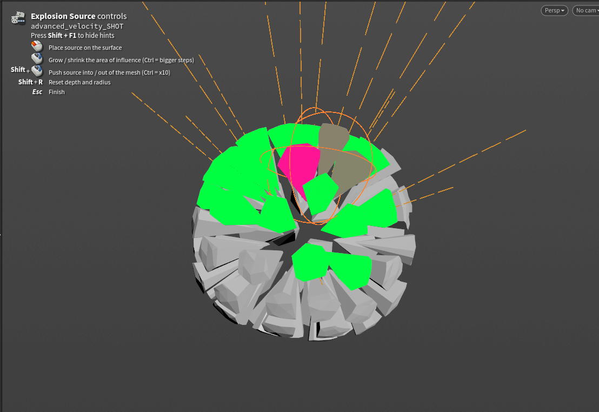

# Using Advanced Velocity

This page covers the setup surface: the six velocity types, the mixer, the output, and the visualization. The event workflow has [its own page](timed-events.md).

## The six velocity types

Each type lives in its own collapsible section with a checkbox in the header. The controls stay hidden until the type is switched on, so the interface only shows what you're actually using.

### Basic

A fixed vector applied to every point. The simplest possible velocity, and the one you'll reach for to give a whole body a shove in one direction.

### Directional

Velocity with a *direction* — at a target, around it, or away from it. **Direction** chooses where the target comes from:

* **SOP Path** (the default) — aim at another SOP in the scene. **Method** decides how its centre is measured (centre of mass, bounding box, convex hull), and **Target Group** restricts the measurement to part of it — put a single point number there to aim at exactly that point.
* **Use Second Input** — aim at geometry wired into the node's second input. Press **Create Point** and the node builds an Add SOP holding a single point above your mesh and wires it in for you.
* **To Rest Pose** — each point aims at its own captured rest position: the scene start frame, or any event's frame. The reassembly mode — see [rest attributes](timed-events.md#rest-position-attributes).
* **To Position** — aim at a typed world-space position. No geometry needed.

**Direction Bias** is the main control, and it's a continuum rather than a set of modes: **+1** aims straight at the target, **0** is a pure orbit around an axle through it, **−1** points straight away. Anything in between spirals — a vortex that also draws inward needs no second node. The **Toward / Around / Away** buttons snap the bias to those three values. **Orbit Axis** decides the axle: *Toward Target* runs it from the object's centre through the target (move the target to tilt the spin), or give it a fixed *Custom Vector*.

**Normalize Direction** makes every direction unit length, so distance no longer affects speed. **Distance Falloff** fades the velocity with distance — measured from the target, or from the axle when orbiting.

### Exploding

An outward burst, with two very different origins.

**Whole Object** radiates from the body itself:

* **Centroid** — everything pushes away from one point, which you can offset with **Move Centroid**.
* **Medial Axis** — the direction is measured from the *skeleton* of the body, so hollow, curved, or L-shaped objects burst outward sensibly instead of all sliding away from one average point. It's considerably slower, since it runs a VDB shrink loop to find the skeleton.

**Point Source** is covered [below](#point-source-explosions).

### Velocity from Motion

Velocity derived from the input's own frame-to-frame movement, the way a Trail SOP computes it. Use it to hand pre-sim momentum to an RBD or POP solve — animate a character swinging a prop, fracture the prop, and the pieces inherit the swing. Only meaningful on animated or deforming input; a static mesh yields zero.

### Curl Noise

A divergence-free turbulent field — natural swirls with no sources or sinks — for debris drift and secondary motion. **Frequency** sets the vortex size, **Amplitude** the speed, **Octaves / Roughness / Lacunarity** add fractal detail, and **Evolution Speed** churns the field over time (0 holds it static). This authors an *initial* velocity: a one-time push, not a sustained in-sim force.

### Angular

An extra `@w` spin vector, in radians per second, for solvers that read it. **Source** is either a *Constant* vector, or *Inherited from Motion* — computed from the input's own rotation between frames, which needs a point `orient` quaternion on the input. Independent of the mixer: `@w` is simply written when the type is on.

---

## Point Source explosions

Point Source places a single blast origin *inside* the object and only affects the pieces within its **Falloff Radius** — drawn as a wireframe sphere in the viewport. This is the mode built for dense fractured RBD: a wall taking an impact in one spot rather than an entire building flying apart.

The falloff is measured to each packed piece's **real bounds**, not just its centre, so the radius behaves the way it looks against the sphere.

### Placing the source interactively

Press **Select Source Position Interactively** and the viewport enters a placement state:

| Input | Action |
| --- | --- |
| **LMB drag** | Place the source on the surface, sliding it as you drag |
| **Wheel** (while dragging) | Push the source into or out of the mesh, along the view ray |
| **Ctrl / Shift** + wheel | Depth step ×10 / ×0.1 |
| **Shift + R** | Reset depth — the next click lands back on the surface |
| **Esc** | Finish |

The controls are also listed on screen while the state is active.

<!-- Screenshot 2 — the interactive placement state, HUD visible, affected pieces tinted:
 -->

### Seeing what will move

**Show Affected Pieces** tints the pieces the blast will move, through the **Affected Color** ramp — green across most of the blast, hot pink at the core. The tint is normalized against the strongest affected piece, so the core always reads clearly whatever the radius or strength.

### Direction

* **Off Surface** (the default) — pieces travel away from the *object*: along their point normals when the input has them, otherwise away from the body's centre. The source still decides which pieces are caught and how hard. This is the mode that reads as blowing a hole outwards.
* **Outward** — radiating away from the source point itself, like a charge sitting at that point. With the source placed *on* the surface this drives material through the body and out the far side — geometrically correct, and usually what Off Surface is the better answer to.
* **Inward** — pieces are pulled toward the source, for implosions.
* **Both** — for thin objects: walls, panels, floors. Pieces are pushed off **both faces** instead of radiating sideways within the slab. Uses a point `@N` when present, otherwise the thinnest bounding-box axis.

**Never Push Into Surface** mirrors any velocity heading back into the body. It's an art-directable override for Outward / Inward; the modes that already leave the body (Both, Off Surface) hide it.

---

## Adjust and Mask

Every velocity type carries the same pair of folders, promoted from Houdini's own Attribute Adjust nodes.

**Adjust** reshapes the velocity: scale its length, rotate its direction, spread it, or drive it from a random value or noise. Turn on **Adjust Value** to enable it. The Noise / Random section appears once you pick a random or noise value type, and carries the full fractal controls plus animation over time.

At the top of every Adjust folder sits the **Randomize** row: pick a **Variation** level (1 Subtle to 5 Extreme) and press the dice. The node detects whether your input is discrete pieces (per-piece random) or a continuous surface (coherent noise) and presets the Adjust controls accordingly — everything it does stays visible and hand-tunable, and the undo arrow reverts it. On Curl Noise the dice re-rolls the swirl pattern instead: different swirls, same character.

**Mask** restricts the velocity to part of the geometry — through a constant, random values, noise, another attribute, or a line / radial / bounding-box gradient, remapped through a ramp. The Line and Radial guides **fit themselves to your input** the first time you enable them, and the **Fit to Input** button re-fits them any time.

Both blocks are Houdini's own controls, so the [Attribute Adjust Vector](https://www.sidefx.com/docs/houdini/nodes/sop/attribadjustvector.html) and [Attribute Adjust Float](https://www.sidefx.com/docs/houdini/nodes/sop/attribadjustfloat.html) help pages are the full reference for the parameters not described here.

---

## The Velocity Mixer

**Additive** multiplies each enabled type by its **Gain** and sums them. Gains default to 1 and go above it, so this is your straightforward "more of this, less of that" control.

**Weighted (Normalized)** blends the types in proportion to their **Weights**. The weights are normalized, so only their *ratio* matters and the result can never exceed the source magnitudes.

**Incoming Velocity** feeds the velocity already on the geometry in as another stream — on by default, which is what lets you stack Advanced Velocity nodes, or build on a cache or a previous sim. Its amount slider is a multiplier in Additive mode and a weight in Weighted mode. In Timed Events it plays as a live base layer under the events.

**Master Speed** is the single overall magnitude control, applied after the gains or weights in both modes.

**Group**, at the very top of the node, restricts the final write: points outside the group keep whatever velocity they arrived with, so several Advanced Velocity nodes can each drive their own region.

---

## Output

**Combine Into Attribute** writes the mixed result to the output attribute — the normal output, on by default.

**Quick Setups** configures the whole folder for the solver you're feeding:

* **RBD Bullet Solver** — velocity into `@v`. The Bullet solver has no per-point force input.
* **POP / Vellum** — force into `@force`. Those solvers *accumulate* forces, so a fading release can never brake motion the sim already has.

**Output As** switches between the two by hand, and **Velocity Attribute** / **Force Attribute** name the written attribute in each mode — author `targetv` for Vellum, for example, without touching a wrangle.

**Injecting Now** is a live 0/1 readout for driving an RBD solve — see [Driving an RBD solver](timed-events.md#driving-an-rbd-solver).

**Post-Process** holds the final touches:

* **Clamp Speed** clamps the final speed into a Min / Max range.
* **Scale by Piece Size** makes big chunks fly slower than slivers — the single biggest realism win on fractured RBD. Mass comes from a point `mass` attribute when present, otherwise each packed piece's real size; **Influence** blends from uniform (0) through equal-energy (0.5) to full inverse mass (1). The average-sized piece keeps its speed, so the shot's overall energy doesn't change.

The **Additional Exports** section (collapsed by default) keeps individual sub-velocities on the output as their own named attributes — `@basic_vel`, `@dir_vel`, `@exp_vel`, `@motion_vel`, `@curl_vel` — plus the rest-position attributes, for when you want to blend or retarget downstream. Anything not exported is stripped, so the node never leaks its internals.

---

## Visualization

The guides are **guide geometry**: they draw in the viewport while the node is current and never touch the output — nothing to clean up before a sim. Select a downstream node and they disappear with the selection, like Houdini's own node guides.

* **Show Guides** is the master switch.
* Each stream has a toggle, a colour, and its own extra **Scale**, on top of the **Guide Global Scale**. Trail lengths are scaled by each stream's *real contribution to the mix* — turn a gain down and its guides shorten with it, so what you see tracks what the mixer is actually doing. Live setup trails draw dashed; baked event trails draw solid.
* **Guide Density** draws only a fraction of the trails, for viewport speed on heavy fractures. The same pieces stay chosen frame to frame. On dense inputs the trails also auto-cap at the **Visualization Limit** (default 25,000), with Density scaling within that budget — raise the limit or switch it off to draw everything.
* **Event Timeline**, **Preview Motion** and the ghost belong to the event workflow — see [the timeline and the preview](timed-events.md#the-event-timeline).

Need the guides as *renderable* geometry — for a breakdown or a preview render? **Utilities ▸ Output Guides Only** swaps the node's output to the guide curves themselves.
