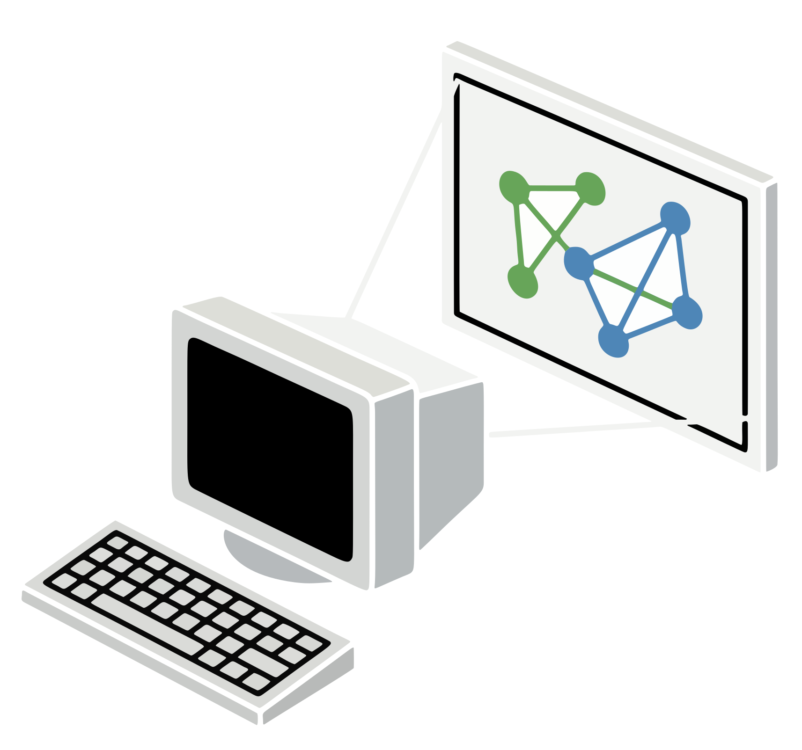

# COPout

  

<a href="https://jvtonehammer.gumroad.com/l/copout_hda"><strong>Get it on Gumroad →</strong></a> <a href="https://jvtools.dev/" style="font-size:0.9em;">More Houdini tools at jvtools.dev</a>

Welcome! **COPout** (v1.1) puts a Copernicus network on a projector or a second screen as a borderless, chrome-free output window — no menu bars, no toolbars, nothing of Houdini in the way.

**TouchDesigner has the Perform Window. After Effects has Mercury Transmit.** Every tool built for live visuals and installation work can put a clean, full-screen image on a second display, because that is how the work gets shown. Houdini has no equivalent — and COPout is it.

Wire a COP Network into the input, press **Output COP**, and the image goes up on the display you pick, at the network's own resolution. That's the whole idea. Everything else on the node exists to get it aimed, aligned and behaving on the night.

## Why it exists

Houdini's Composite View cannot be stripped of its chrome. The entire pane — menu bar, toolbars, footer — is drawn *inside a single GL surface*, so there is no toolbar to switch off and no setting that removes it. It offers no way to position the image either: no zoom, no pan, nothing. For a projector, an installation or a live set, that's a dead end.

So COPout draws the pixels itself. Which is also why it can offer things the native pane never could — alignment that survives a save, fit modes, flips for rear projection, and a grade on the way out.

## What it does

- **Three sources.** The COP image, a clean 3D viewport, or the viewport drawn over the COP.
- **Any screen, any fit.** Pick the projector from a dropdown, go fullscreen, and letterbox, crop, 1:1 or stretch.
- **Several screens at once.** **Duplicate To** puts the same image on every attached display you tick, each following the main window's fit, alignment and grade.
- **Align it by hand, and keep it.** Right-drag moves the image, the arrows nudge it a pixel at a time, and the result is saved with the scene — so a projector alignment survives a save and travels with the hip.
- **A test pattern that works with nothing wired.** Grid, crosshair, aspect circle, colour bars, gamma ramp. Aim and focus the projector before the content exists.
- **Blackout.** Kill the output to black instantly without tearing anything down — and bring it back just as fast, already current.
- **It follows the playbar.** Nothing here runs its own clock, so a COP feedback simulation steps exactly when your scene steps.
- **A grade on the way out.** Exposure and gamma trim, on the GPU, for a projector running dark.

## What it does not do

Worth saying plainly, because each one saves a support conversation:

- It **does not record or render to file.** It is an output window, not a ROP.
- It **does not run its own clock.** If you want the image moving, something has to be advancing time — play the playbar.
- It **shows one image per node.** Duplicate To puts that image on several screens; two *different* images need two nodes.
- The grade is a **display trim only.** It changes nothing upstream in your network.

!!!info Nothing passes downstream by default
The wire from the COP Network tells COPout which network to read; it does not carry that network's geometry on. Turn on **Pass Through Input** (Utilities) if something below COPout expects the canvas to come through, which is how 1.0 behaved. Opening the window is a button press, never a side effect of cooking.
!!!

## Requirements

- **Houdini 22.0+**, Indie or Apprentice — it ships as `.hdalc`
- **Windows** — the only platform it has been tested on
- A **Copernicus network** in the scene (or nothing at all, if you just want the test pattern)

## Pages

- [Getting started](getting-started.md)
- [Using COPout](using.md)
- [Parameter reference](reference/parameters.md)
- [Changelog](reference/changelog.md)
- [License](reference/license.md)
