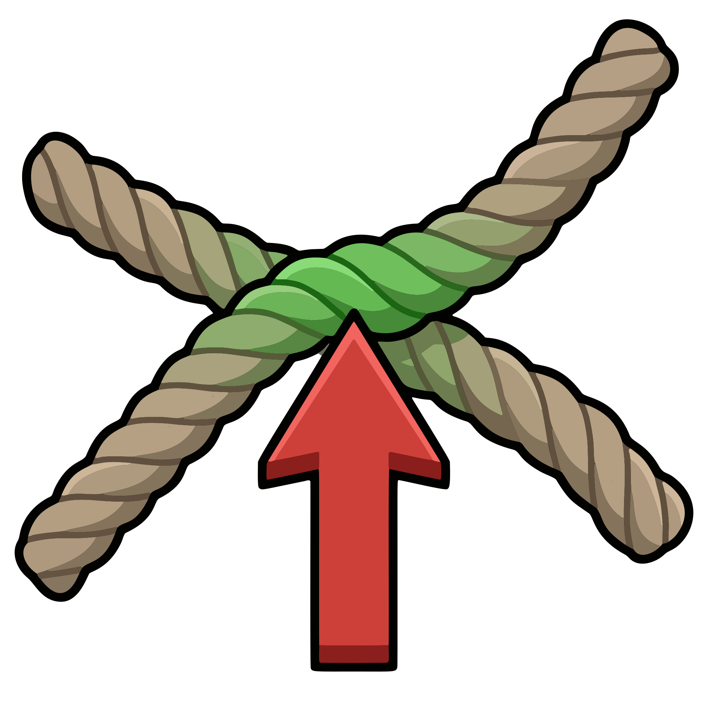

# Deoverlap Polylines

  

<a href="https://jvtonehammer.gumroad.com/l/deoverlap_polylines_hda"><strong>Get it free on Gumroad →</strong></a>

**Deoverlap Polylines** (v{{ dp.version }}) finds where your curves cross and pushes them apart at the crossings, so a tangle reads as separate strands. Hair, fibres, cables, stitched lines, a grid of rows and columns.

The over/under **alternates** by default, so a lattice comes out genuinely woven rather than one set of curves lifted off the other. The push is measured per crossing from both curves' tangents, so it holds up on curves that wander in 3D, and it eases along the curve instead of kinking.

One measured push, not a solver — curves can still touch afterwards.

## Requirements

- **Houdini 22.0+**, Indie or Apprentice — it ships as `.hdalc`
- **Windows** — the only platform it has been tested on

## Pages

- [Getting started](getting-started.md)
- [Using Deoverlap Polylines](using.md)
- [Parameter reference](reference/parameters.md)
- [Changelog](reference/changelog.md)
- [License](reference/license.md)
