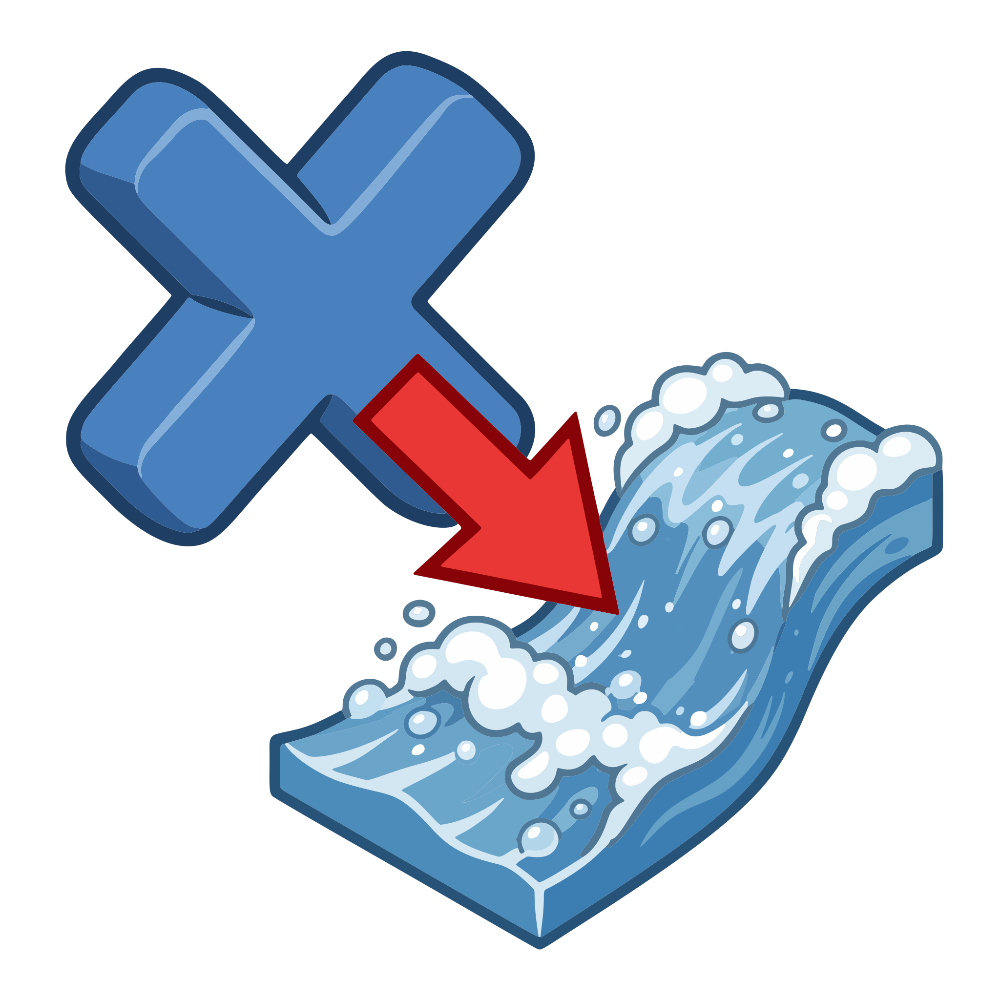

# FLIP DOP Controller

  

<a href="https://jvtonehammer.gumroad.com/l/flipdop_controller_hda"><strong>Get it free on Gumroad →</strong></a>

**FLIP DOP Controller** (v1.0) puts a FLIP simulation's key parameters on one SOP-level node.

The settings are normally spread across three places — Particle Separation and Grid Scale on the **FLIP Object**, substeps, CFL and the volume limits on the **FLIP Solver**, Time Scale and the cache on the **DOP Network**. Point this node at your dopnet, press **Connect Parameters**, and they are all on one panel. It also builds and draws the simulation container.

It changes nothing about how the solver behaves. It links parameters that already exist.

## What it does

- **Connect / Unlink** — writes channel references onto the FLIP nodes, or removes them and freezes each target where it stands.
- **Link checkbox** per parameter — decides what gets connected.
- **Container box** — built here, drives the solver's Volume Limits, can match-size to your input.
- **Add Linked SOPs** — sends a value on to Particle Fluid Surface, Fluid Compress or anything else, with a multiplier.

## What it does not do

It does not build your sim, decide values for you, or change solver behaviour. FLIP only. The SOP FLIP node family is not supported directly.

## Requirements

**Houdini 22.0+**, Indie or Apprentice (ships as `.hdalc`). Windows — the tested platform.

---

[Getting started](getting-started.md) · [Using it](using.md) · [Parameters](reference/parameters.md) · [Troubleshooting](reference/troubleshooting.md) · [Changelog](reference/changelog.md) · [License](reference/license.md)
