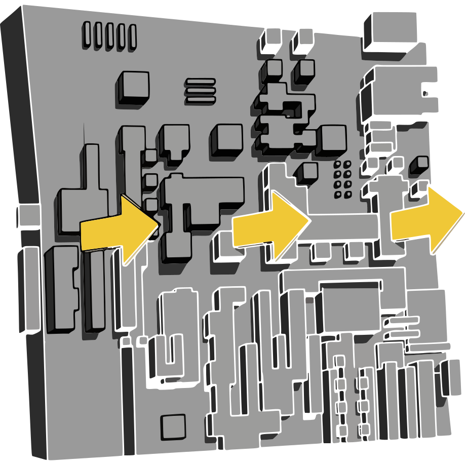

# Hou-DisplacementX

  

<a href="https://jvtonehammer.gumroad.com/l/hou_displacementx_hda"><strong>Get it on Gumroad →</strong></a> <a href="https://jvtools.dev/" style="font-size:0.9em;">More Houdini tools at jvtools.dev</a>

Welcome! **Hou-DisplacementX** (v1.0) is a Houdini port of Displacement X, the free web sci-fi height-map generator by Yehor Misiats, itself a take on Windmill's JSplacement. Two nodes ship in the file: a Copernicus generator, and a Heightfield SOP running the same generator that builds a heightfield or displaces wired-in geometry. Shapes, ranges, defaults and sprite packs are the web version's; this port draws them on the GPU. Free software, GPL-3.0.

## What it does

Each iteration draws one randomly picked shape - rectangles, grids, columns, rows, or full-width lines - into a height map with the machined, panelled look of a sci-fi hull.

- Five shape types plus four sprite packs, each with its own brightness, opacity and blend mode.
- A **Seed** that reproduces the same map at any resolution, which the web version cannot do.
- Full 32-bit float height, so displacement does not band like an 8-bit PNG.
- Four outputs - `height`, `normal`, `basecolor`, `id` - named for Houdini Engine for Unreal's texture types.
- The **Hou-DisplacementX Heightfield** SOP: a heightfield alone, or triplanar displacement of wired-in geometry.
- Runs on the GPU as one OpenCL kernel, so even a busy map cooks fast.

## What it does not do

- No anti-aliasing: every shape is hard-edged, as in the original.
- Will not reproduce the web app's map - the random sequence differs, same settings, same look, different map.
- No custom sprite input in 1.0 - only the four original packs.
- A texture generator, not a modelling tool: displacement moves existing points, it adds none.

## Requirements

- Houdini 22.0+ (Indie or Apprentice - ships as `.hdalc`; FX and Core can load it too, but that switches the session to limited-commercial (Indie) mode, per SideFX).
- Windows is the only tested platform.
- A working OpenCL device - the whole map is drawn by an OpenCL kernel.

## Getting it

- [Getting started](getting-started.md)
- [Using Hou-DisplacementX](using.md)
- [Parameter reference](reference/parameters.md)
- [Troubleshooting](reference/troubleshooting.md)
- [Changelog](reference/changelog.md)
- [License](reference/license.md)
