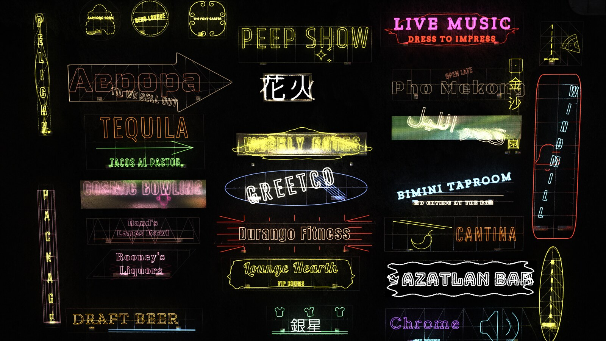

# Neonyte

  

Neonyte is a Houdini SOP that turns placeholder boxes into generated neon signs: lettering, icons, decor tubes, the metal rig behind them, and a Karma material - for dressing buildings and streets. It is built to read as real from across the street. Close-up hero detail is not what it is for.

## What it does

- **Give me the Signs** turns every placeholder into a different sign: name, icon, colours, layout and metalwork.
- **Place Sign in Viewport** places signs by clicking on walls.
- **Real names**, drawn from 34,217 real establishments and 1,934 historical sign names, in Latin, Japanese, Chinese, Cyrillic and Arabic.
- **Wide variety**: 82 hand-authored layouts plus a layout generator, 741 icons, 80 fonts, 24 neon colours and 46 decor kinds.
- **A metal rig** behind every sign: backing, frame, standoffs that reach the building, electrical boxes, cables and rooftop trusses.
- **Adjustment Notes** steers the whole street in plain English, 52 **Manual Override** rows pin any decision, each sign has its own card with a note of its own, and two VEXpression hooks give exact per-sign control.
- **Deterioration** and **Flicker** age the street.
- **Send to Solaris** builds the Karma setup with one button, for both Karma CPU and Karma XPU.
- **The same seed** always rebuilds the same street.
- **Every font is OFL** and every icon is ISC or MIT. Licences are included, and the asset ships unlocked so you can check.

## Where to go next

- [Getting Started](getting-started.md) - install the asset and build your first street.
- [Using Neonyte](using.md) - what each control does.
- [Rendering](rendering.md) - the Karma setup and what rides on the geometry.
- [Control](control/README.md) - Adjustment Notes, Manual Overrides and VEXpression, in full detail.
- [Parameters](reference/parameters.md) - every control on the node.
- [Changelog](reference/changelog.md) - what shipped in 1.0.
