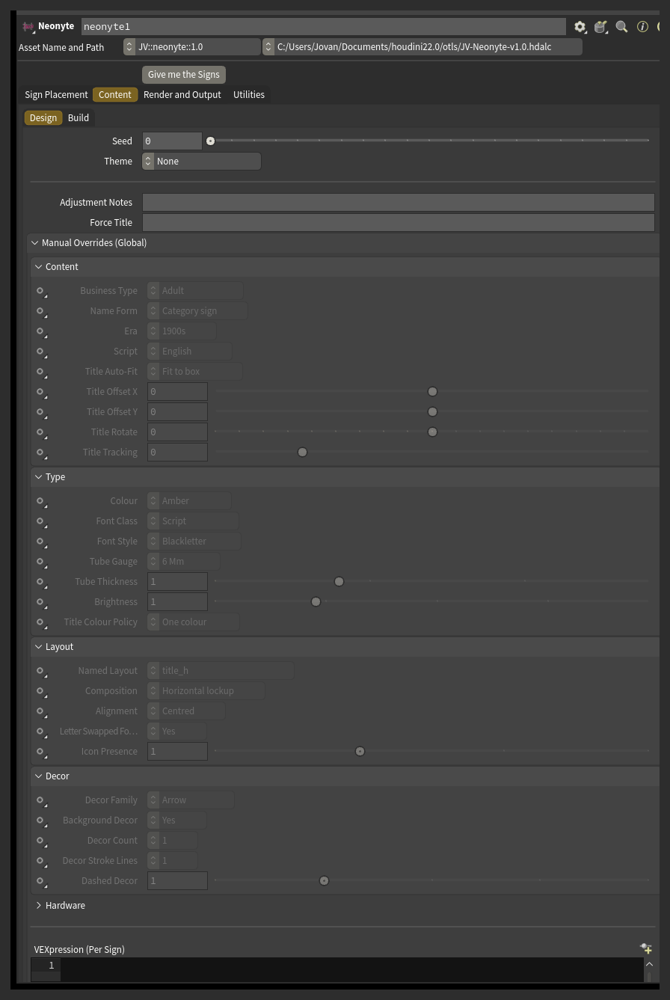
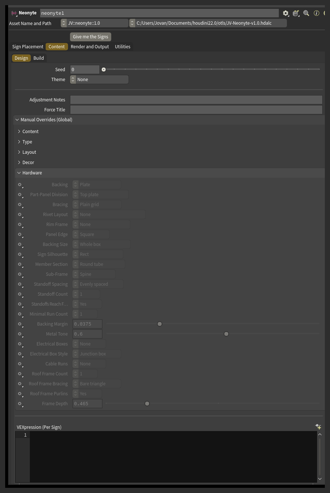

# Advanced rows

52 rows, split across six sections: Content 10, Type 7, Layout 5, Decor 5, Hardware 23, Aging 2.

Every row lives in **Manual Overrides (Global)** and applies to every sign on the street. To change one sign only, use that sign's card **Note**, or the **VEXpression (Per Sign)** field.

Three rows have no Manual Overrides entry of their own, because the ordinary control in the Content tab already does the job: Theme, Deterioration and Deterioration Amount. They are listed below with the rest so the pre-plan VEXpression hooks for them can be found in one place.

Every row has a small **Auto / Custom** menu beside it. On Auto, the engine decides the value. On Custom, the value beside it is forced.

Hardware rows have no pre-plan VEXpression hook. To change hardware from a VEXpression, use the [VEXpression Override](vexpression.md).

## Full row list

#### Content

| Row | Parameter | Kind | What it sets |
|---|---|---|---|
| Theme | `theme` | menu | Pins a style preset across the street (the ordinary Theme menu in the Content tab). |
| Business Type | `ga_type` | menu | Pins the trade every sign advertises, overriding whatever the engine would otherwise pick. |
| Name Form | `ga_form` | menu | Pins the shape of every sign's name - a plain category sign, an owner's name, a place name, and so on. |
| Era | `ga_era` | menu | Weights every sign's owner name toward a decade. |
| Script | `ga_script` | menu | Forces which writing script every sign's title uses. |
| Title Auto-Fit | `ga_txt_fit` | menu | Controls how every sign's title is scaled to fill its space. |
| Title Offset X | `ga_txt_offx` | float | Shifts the title sideways from where the layout would normally place it. |
| Title Offset Y | `ga_txt_offy` | float | Shifts the title up or down from where the layout would normally place it. |
| Title Rotate | `ga_txt_rot` | float | Tilts the title away from its normal orientation. |
| Title Tracking | `ga_txt_track` | float | Adjusts the spacing between the title's letters. |

#### Type

| Row | Parameter | Kind | What it sets |
|---|---|---|---|
| Colour | `ga_colors` | menu | Pins the neon color for every sign. |
| Font Class | `ga_fontclass` | menu | Forces the general category of typeface, overriding whatever the name form would normally call for. |
| Font Style | `ga_font` | menu | Prefers typefaces tagged with a particular style, such as stencil or gothic. |
| Tube Gauge | `ga_gauge` | menu | Forces the thickness of the neon tubing, from real stock sizes. |
| Tube Thickness | `ga_radius` | float | Scales the neon tube thickness up or down from its normal gauge. |
| Brightness | `ga_emit` | float | Scales how brightly every sign's neon glows. |
| Title Colour Policy | `ga_col_mode` | menu | Controls how color is spread across the title's letters. |

#### Layout

| Row | Parameter | Kind | What it sets |
|---|---|---|---|
| Named Layout | `ga_layout` | menu | Pins every sign to one of the hand-built layout templates, and turns off the procedural layout generator so the pin actually sticks. |
| Composition | `ga_arch` | menu | Forces the logo lockup style. |
| Alignment | `ga_align` | menu | Forces which edge every text element on the sign lines up against. |
| Letter Swapped For Icon | `ga_glyph` | menu | Forces one letter in the title to be swapped for a matching icon, or forbids it entirely (a donut for the O in DONUTS is the classic example). |
| Icon Presence | `ga_icon` | float | Scales how likely every sign is to carry an icon. |

#### Decor

| Row | Parameter | Kind | What it sets |
|---|---|---|---|
| Decor Family | `ga_ornaments` | menu | Restricts every sign's decor to one family, like arrows, stars or scallops. |
| Background Decor | `ga_bg` | menu | Forces the dim decor sitting behind everything else on the sign on or off. |
| Decor Count | `ga_decor_n` | menu | Sets how many lines a multi-line decor element draws, such as a set of rays or a row of chevrons. |
| Decor Stroke Lines | `ga_strokes` | menu | Draws decor lines as two or three parallel strokes instead of one. |
| Dashed Decor | `ga_dash` | float | Scales how likely every sign's decor is to be dashed rather than solid. |

#### Hardware

| Row | Parameter | Kind | What it sets |
|---|---|---|---|
| Backing | `ga_hw_l1` | menu | Forces what kind of backing every sign hangs on. |
| Part-Panel Division | `ga_hw_mix` | menu | Forces how a Part panel backing divides the sign face into solid and open regions. |
| Bracing | `ga_hw_brace` | menu | Forces the truss pattern inside each bay of a pipe grid backing. |
| Rivet Layout | `ga_hw_rivet` | menu | Forces the layout of studs and rivets around the backing panel's edge. |
| Rim Frame | `ga_hw_frame` | menu | Forces a rim around the backing - either standing proud of the face or returning back like a shallow cabinet - or removes it. |
| Panel Edge | `ga_hw_edge` | menu | Forces how the backing panel's edge is cut - flat, chamfered out, or chamfered in. |
| Backing Size | `ga_hw_fit` | menu | Forces whether the backing covers the whole sign box or is fitted tight around the neon it sits behind. |
| Sign Silhouette | `ga_hw_shape` | menu | Forces the backing to follow a badge-style outline instead of a plain rectangle. |
| Member Section | `ga_hw_profile` | menu | Forces the cross-section shape of every rig member on every sign. |
| Sub-Frame | `ga_hw_l2` | menu | Forces the shape of the sub-frame that sits behind the backing. |
| Standoff Spacing | `ga_hw_l3pat` | menu | Forces how the standoffs bolting every sign to the building are spaced out. |
| Standoff Count | `ga_hw_l3n` | menu | Forces how many standoffs to try to build. |
| Standoffs Reach For The Wall | `ga_hw_l3fan` | menu | Forces whether standoffs are allowed to angle sideways to find the building, instead of only going straight back. |
| Minimal Run Count | `ga_hw_min_n` | menu | Forces how many straight rails a Minimal runs backing uses. |
| Backing Margin | `ga_hw_margin` | float | Forces how much extra room the backing leaves around the neon it sits behind. |
| Metal Tone | `ga_hw_grey` | float | Forces how light or dark the rig's metal color is. |
| Electrical Boxes | `ga_hw_eb_n` | menu | Forces how many transformer or driver boxes every sign carries. |
| Electrical Box Style | `ga_hw_eb_style` | menu | Forces which kind of electrical box every sign carries. |
| Cable Runs | `ga_hw_cab_n` | menu | Forces how many cable runs lead from the electrical box to the rig. |
| Roof Frame Count | `ga_hw_tr_n` | menu | Forces how many support triangles hold up a rooftop sign. |
| Roof Frame Bracing | `ga_hw_tr_brace` | menu | Forces the internal bracing pattern inside each rooftop support triangle. |
| Roof Frame Purlins | `ga_hw_tr_tie` | menu | Forces whether the rooftop support triangles get longitudinal purlins tying them together. |
| Frame Depth | `ga_hw_tr_base` | float | Forces how far a rooftop support triangle's base runs back across the roof. |

#### Aging

| Row | Parameter | Kind | What it sets |
|---|---|---|---|
| Deterioration | `decay` | toggle | Switches deterioration on or off for the whole street (the Enable Deterioration toggle in the Content tab). |
| Deterioration Amount | `decay_amt` | float | How run-down the street looks overall, as a percentage (the Deterioration slider in the Content tab). |
