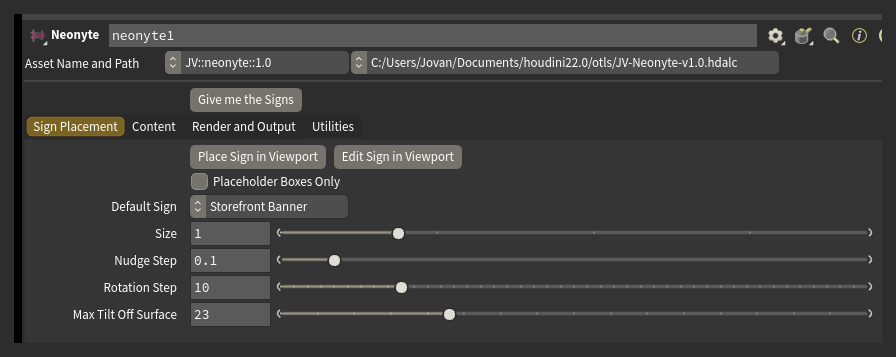

# Getting Started

## Install

Copy `JV-Neonyte-v1.0.hdalc` into your Houdini 22 otls folder. On Windows that is `C:\Users\<you>\Documents\houdini22.0\otls\`. Then Refresh Asset Libraries, or restart Houdini. The node is in the Tab menu under **JV**.

Neonyte needs Houdini 22.0 or newer, Indie or Apprentice - it is an `.hdalc` file.

!!!warning Updating from an older version
Delete the previous version's file from the otls folder first. Two files of the same asset in that folder collide.
!!!

## Your first street

>>> 1. Wire the building in
Drop a Neonyte node and wire your building or street geometry into its first input.
>>>
>>> 2. Place a sign
Press **Place Sign in Viewport** and click a wall. A green placeholder follows the cursor and sits flat on the surface. **T** cycles the sign type. Click to drop it. Place a few signs this way.
>>>
>>> 3. Build the street
Press **Give me the Signs**. Every placeholder comes back as a finished sign.
>>>
>>> 4. Roll again
Press **Give me the Signs** again for a different street. **Seed** is the number the street is built from. Type a value into it to get a street back.
>>>

## Set your scale

Everything in Neonyte is in metres. If your scene is modelled in different units, set **Real-World Scale** before you build: 1 for metres, 100 for centimetres, 3.28 for feet.

## Placing signs

While **Place Sign in Viewport** is active:

- **T** cycles the sign type.
- **F** flips the sign to face the other way.
- **1-8** choose what the mouse wheel adjusts: 1 scales the whole sign, 2/3/4 rotate it, 5 pushes it off the wall, 6/7/8 scale one axis.
- **Shift** and **Ctrl** make the wheel step fine or coarse.
- Dragging with the left mouse button tilts the sign.
- **E** switches to the eraser.
- **P** picks an existing sign to move.
- **B** toggles **Placeholder Boxes Only**.
- **R** resets the current placement.
- Right-click opens the same options as a menu.

**Edit Sign in Viewport** lets you click a sign that already exists and put it back into placement mode. Each card's Edit button does the same thing for that one sign.

The eraser deletes signs: press **E** while placing, or use the eraser button in the Actions row on the Signs tab. Drag over the signs you want gone.

**Placeholder Boxes Only** (or **B** in the viewport) shows the boxes instead of building signs, so laying out a big street stays responsive.

**Default Sign** sets the type the placement tool starts with: Storefront Banner, Marquee, Blade, Vertical Tower, Square, Plaque or Rooftop. Rooftop signs get support triangles instead of standoffs, since there is no wall behind them.

## Bring your own boxes

You can also wire your own placeholder boxes into the node's second input, instead of using the viewport tool. Each box needs a primitive group marking its front face. The default group name is `front`; change it in **Utilities > Front Group**.

If boxes are already in the scene without cards - for example after wiring in an existing sign subnetwork - press **Rebuild List from Signs** to give each one a card.

## See the glow

The viewport shows each sign in its neon colour. The glow itself is only visible in a Karma render. Press **Send to Solaris** and render - see [Rendering](rendering.md) for the full setup.
