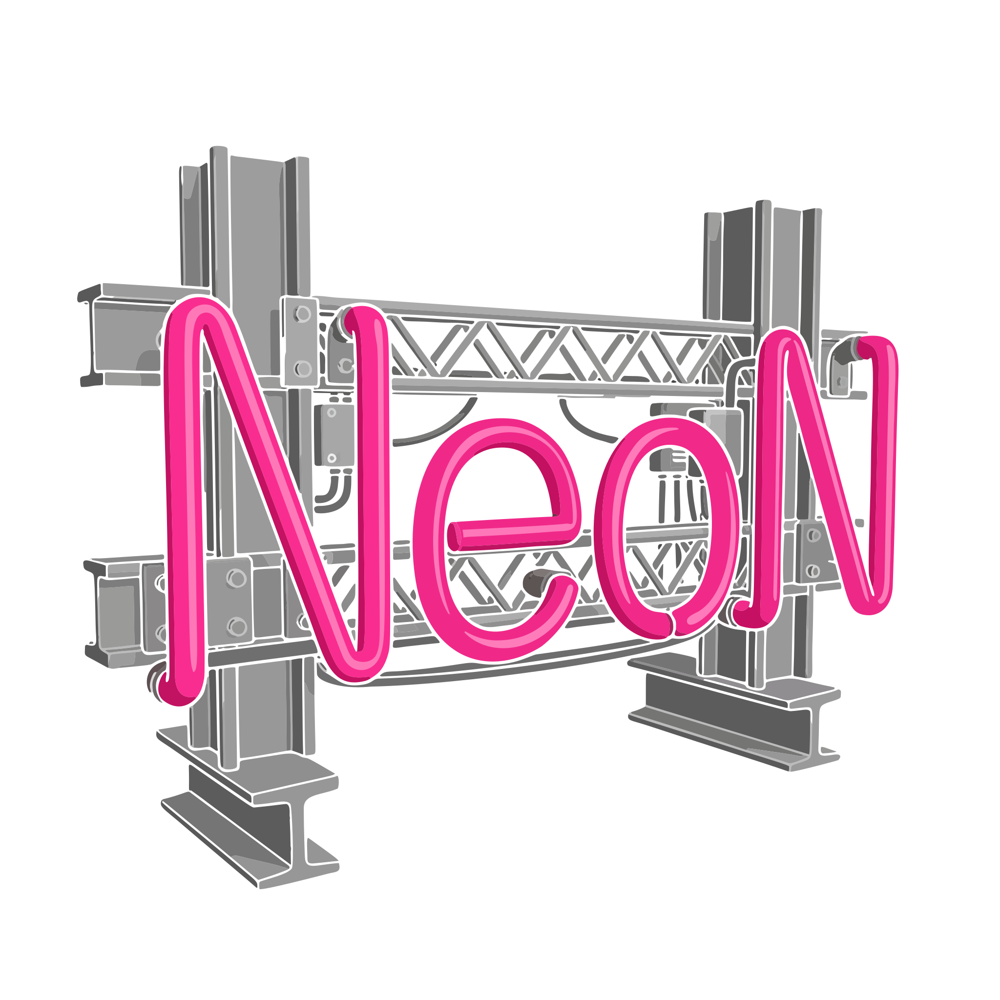

# Neonyte

  

!!!warning Pre-release — private draft
These docs cover **Neonyte v0.9**, which is still in active development. Parameter names, defaults, and whole feature areas may still change before the public release, so treat the reference pages as provisional rather than final. This section is private and not linked from the public site.
!!!

Welcome! **Neonyte** (v0.9) is a single Houdini SOP that turns plain placeholder boxes into **procedurally generated neon signs** — geometry plus emissive Karma/MaterialX shading — for dressing streets, storefronts and skylines. Point it at a wall of boxes, press one button, and every box becomes a different lit sign: a business name, a matching icon, a colour scheme, a layout, and the metal hardware that holds it to the building.

It is built for **set dressing at a distance**. The quality bar is a street that reads as real from across the road — dozens of signs, none of them repeating, each one plausible for the kind of business it advertises. Close-up hero detail is deliberately a non-goal.

## What it does for you

- **Box in, sign out.** Wire it under geometry whose pieces are placeholder boxes (each marking where a sign goes and which way it faces). Neonyte replaces every box with a finished sign and deletes the box.
- **Real-looking names, not word salad.** The content engine picks a business type first and lets that drive everything — the name, whether there's an icon, the colours, the layout. Names come from curated banks and corpora of real establishments, weighted so a street reads authentic rather than randomly generated.
- **Huge layout variety.** Dozens of hand-authored layout templates plus a procedural layout generator arrange lettering, icons, subtitles and decorative tube "armatures" (ovals, underlines, arrows, lattices, borders) — with real neon-style depth layering where elements overlap.
- **Matching iconography.** A ramen place gets a bowl, a bar gets a martini glass — icons are picked from a large tagged library and converted to neon tubes.
- **Colour + glow.** Per-sign neon palettes drive both the viewport colour and per-sign HDR emission for Karma.
- **The metalwork too.** Optional procedural hardware — backing plates and truss, sub-frames, and standoffs that actually reach back and land on the building behind the sign.
- **Steerable.** Plain-language **Adjustment Notes** ("fewer icons, no yellow, only 1950s-style names") and **theme presets** re-weight what gets generated, and a per-box **Signs** panel lets you tune, re-roll or hand-edit individual signs.
- **Deterministic.** The output is a pure function of the seed and the controls, so the same scene rebuilds identically — and pressing Randomize walks through a vast combinatorial space without repeating.

## Where to go next

- **[Getting Started](getting-started.md)** — the box input, marking the front face, and your first street.
- **[Using Neonyte](using.md)** — the ideas behind content, layout, colour, hardware and steering, and how to drive them.
- **[Parameters](parameters.md)** — a tab-by-tab tour of the controls (provisional).
- **[Changelog](changelog.md)** — what's landed so far.
