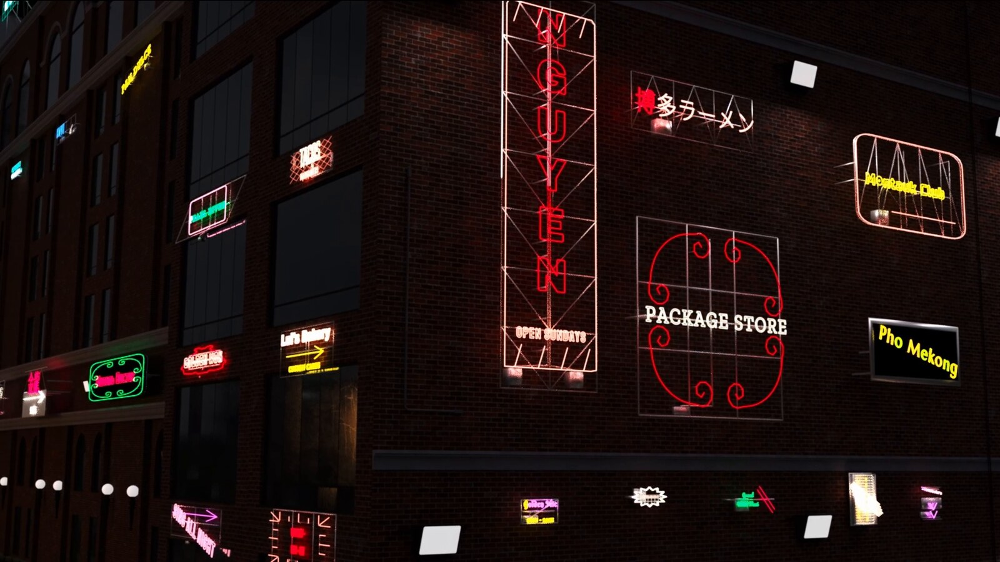
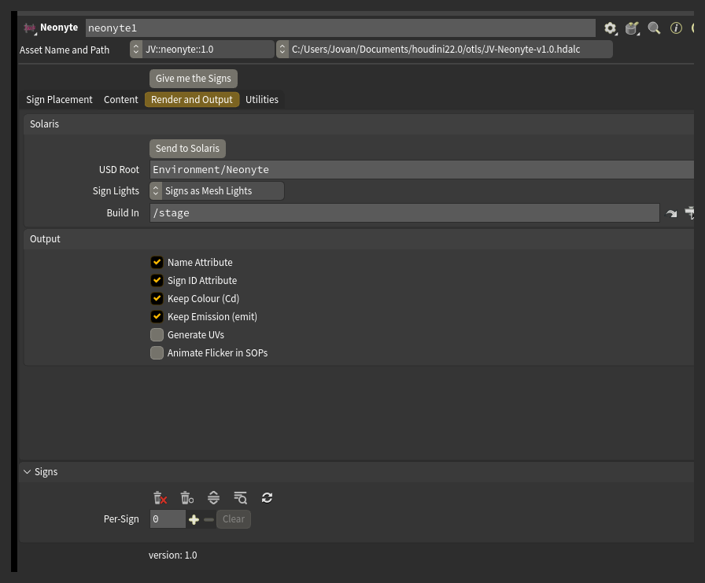

# Rendering

Signs are built for Karma. Both Karma CPU and Karma XPU are supported.

## Send to Solaris

Press **Send to Solaris** to build the render setup: a SOP Import and a material library in the LOP network named in **Build In** (`/stage` by default), wired together, with the signs gathered under **USD Root**.

A plain name in USD Root nests under wherever the import places the geometry, beside the building it came in with. Start it with a slash to pin it to an absolute location instead.

Press **Send to Solaris** again after placing more signs. It reuses the same two nodes and leaves any material edits you have made alone.

One material serves the whole street. It reads the `Cd` and `emit` attributes the node puts on the geometry, so colour and brightness travel with the sign rather than living on the material itself.

## Sign Lights

**Sign Lights** decides whether the signs merely glow or actually light the scene:

- **Emission Only** leaves them as emissive geometry. They glow, and Karma only picks up their light indirectly.
- **Signs as Mesh Lights** makes each sign a real light, tinted its own colour, that casts onto the building.

Careful: Signs as Mesh Lights is one light per sign. A street of fifty signs is fifty lights.

## Flicker

**Flicker** sets how fast the faulty tubes blink. Only signs that Deterioration has made faulty blink at all - with Deterioration off there is nothing for Flicker to act on.

The blink is done in the material, so the node does not cook per frame.

**Animate Flicker in SOPs** moves the blink out of the material and into the geometry instead. Turn it on only if something downstream needs to see a sign go dark - a point cloud, a cache, a light rig driven off `emit`. With it on, the node cooks every frame.

## What rides on the geometry

**Name Attribute** and **Sign ID Attribute** put a name and a number on every sign, so a chain further downstream can address one sign without knowing anything about how it was generated.

**Keep Colour (Cd)** and **Keep Emission (emit)** decide whether the sign's colour and brightness ride out on the geometry. The shipped material reads both.

Careful: turning either off means shading the signs yourself. A sign with Keep Emission off renders unlit unless something downstream supplies emission.

**Generate UVs** is off by default: a street's worth of geometry does not need UVs unless you plan to texture the signs. Turn it on and the tubes get their UVs from the sweep, and the flat parts get a straight projection per sign.

The output also carries prim groups: `neon` and `hardware`, with hardware split further into backing, frame, mounts, electrical, cables and supports.

## Detail and distance

**Tube Detail** is the control that decides what a street costs to render. The glass is most of a sign's geometry.

Past a certain distance from camera, a tube's width covers less than a pixel. Geometry that small is what causes shimmer and fireflies in a render. A coarser tube past that distance is both cheaper and cleaner.

**LOD Presets** sets Tube Detail for a given camera distance in one click, and switches off parts too small to see at that range. Distant builds roughly an eighth of the geometry of Full.
