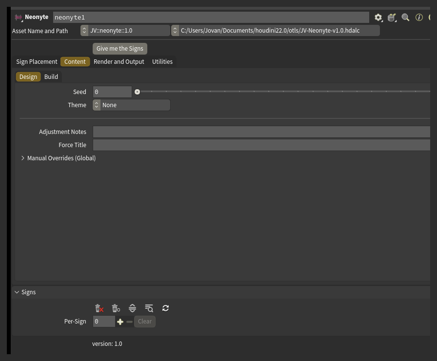
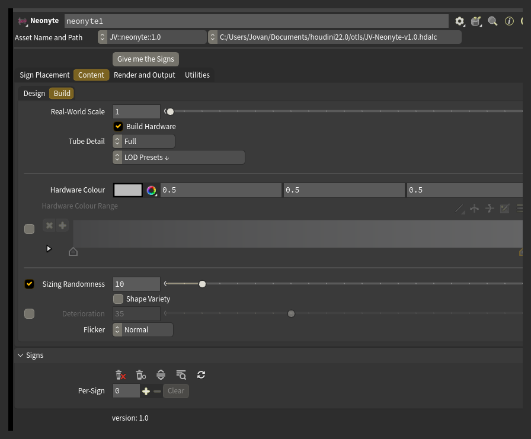
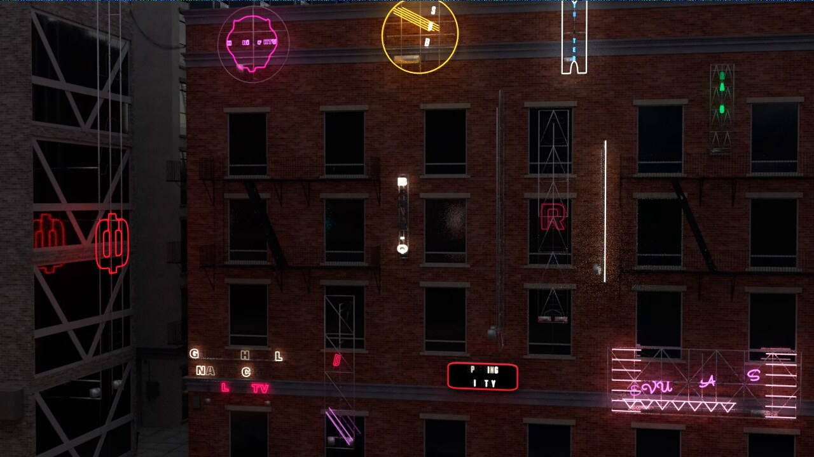

# Using Neonyte

## Content

- **Seed** is the number the whole street is built from. Change it for a different street.
- **Theme** leans the mix toward a look: Classic Americana, Vegas Strip, Cyberpunk, Noir or Modern Minimal.
- Every sign gets a business type, a name in a form that suits it, an icon where the layout has room for one, a colour palette and a layout.
- Names appear in five scripts: Latin, Japanese, Chinese, Cyrillic and Arabic. A non-Latin title shows its English meaning in the card's **Translation** field.
- **Force Title** puts the same word on every sign in the street, keeping each sign's own layout, colours and decor. Leave it blank for a normal street.

These controls live in the Content tab, under **Design**:

## Layout

Layout picks from 82 hand-authored templates plus a layout generator, arranging the title, an icon, decor and, on some layouts, a subtitle.

Decor comes in 46 kinds: arrows, frames, ovals, scallops, rays and more, some in front of the sign and some behind it as a dimmer backdrop.

An icon can replace a letter in the title - a donut for the O in DONUTS is the classic example.

The placeholder box's proportions decide which layouts fit it: a tall narrow box favours a vertical layout, a wide box a banner.

## Colour

Each sign draws a colour palette. The title usually takes the main colour and the decor takes the second. **Title Colour Policy** controls how colour spreads across the letters: one colour for the whole title, one colour per letter, one colour per word, or only the first letter picked out.

The viewport shows each sign in its neon colour. The glow itself only shows up in a Karma render.

## Hardware

The rig, size, wear and detail controls live in the Content tab, under **Build**:

**Build Hardware** switches the whole rig on or off. With it on, every sign gets a backing (a plate, a pipe grid, or a mix of the two), a frame behind that, and standoffs bolting it to the building.

Careful: standoffs only build where they find a building surface to reach. A sign with nothing nearby to bolt to gets fewer standoffs, or none.

Rooftop signs get support triangles instead of standoffs.

**Hardware Colour** paints every rig. Turn on **Enable Hardware Colour Range** and each sign draws one colour from the **Hardware Colour Range** ramp instead, so a street reads as many sign shops rather than one.

## Size and shape

**Default Sign** covers seven types: Storefront Banner, Marquee, Blade, Vertical Tower, Square, Plaque and Rooftop. Each has its own nominal size and its own set of layouts.

**Sizing Randomness** varies the overall size of each sign by up to the percentage you set. At 10%, a sign lands anywhere from a tenth smaller to a tenth larger than its nominal size. Only the size changes; the shape stays the same.

**Shape Variety** is separate: it lets a sign take one of its type's other authored proportions instead of the nominal one - a blade sign square instead of tall, a marquee deep instead of wide. It is off by default.

## Deterioration and Flicker

**Deterioration** ages the street. The amount is drawn per sign, so a middling value gives you a few faulty signs in an otherwise healthy street, rather than every sign equally worn. A faulty sign gets worse in this order: dim, slow blink, medium blink, fast stutter, out.

**Flicker** sets how fast the faulty tubes blink. With Deterioration off there is nothing for it to act on.

To age or restore one sign on its own, use that sign's card **Note** (for example `run down` or `pristine`).

## Detail and speed

**Tube Detail** decides how finely the neon tubes are built. The glass is most of a sign's geometry, so this is the control that decides what a street costs to build and render.

**LOD Presets** is a set of actions, not a mode: pick one and it sets Tube Detail and switches off parts too small to see at that distance, then snaps back to its own header. Everything it changed is a normal control you can see and adjust afterward.

**Placeholder Boxes Only** skips the whole build and shows the boxes instead, so you can lay out and rearrange a street without waiting on every sign to rebuild.

## Steering

Several controls can ask for the same thing. From weakest to strongest: **Theme**, **Adjustment Notes**, **Manual Overrides (Global)**, that sign's own card, then the two VEXpressions. When a stronger control overrides a note, the status bar says which one did it. See [Control](control/README.md) for the full picture.

**Adjustment Notes** is a plain-English field. Type what you want changed - `no yellow`, `more diners and bars`, `only 1950s style names` - and press **Give me the Signs**. Neonyte reports what it understood and what it did not; nothing is guessed. See [Adjustment Notes](control/notes.md) for the full vocabulary.

**Manual Overrides (Global)** is a set of street-wide pins, grouped into Content, Type, Layout, Decor and Hardware. Each row can be left on Auto or switched to Custom and given a fixed value that applies to every sign on the street. To pin something on one sign only, use that sign's card **Note** or the **VEXpression (Per Sign)** field.

**VEXpression (Per Sign)** and **VEXpression Override** are two script hooks for exact, per-sign control. Both beat every other control on the node.

## The Signs tab

The Actions row holds buttons to delete every sign, hand the viewport an eraser, open or close every card at once, find a sign, and rebuild the list.

**Find Sign** takes a business name or a card number and collapses the list to the matching cards.

**Rebuild List from Signs** gives every sign already in the scene a card, for when the list is empty but the signs are there.

Each card is one sign:

- **Title**, with a **Lock** checkbox beside it. Locking a title keeps it while everything else about that sign re-rolls.
- **Subtitle** - a second line, on layouts that have room for one.
- **Translation** - the English meaning of a non-Latin title. Read-only.
- **Business Group** - type the same word on two or more cards to make those signs read as one business, sharing a name, a palette and matching lettering.
- **Transform** - the placeholder's position, rotation and scale.
- **Note**, with **Apply** beside it - a per-sign Adjustment Note. Naming something here means make it that, for this sign alone.
- Five buttons: re-roll (Variation) draws a fresh version of that sign only; Edit picks it up in the viewport; Zoom frames it; Reset clears its Note and the steering it applied; Delete removes it.

## Output

The node puts `Cd` and `emit` on the output geometry, along with a name, an id and USD prim groups per sign, so a chain further downstream can shade, isolate or override any sign on its own. See [Rendering](rendering.md) for the full list and what feeds the Karma material.
