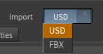

# USD vs FBX

Version 1.2 added a second way to import your character. At the very top of the node is an **Import** dropdown with two choices — **USD** (the default) and **FBX**. Both produce the same shaded, animatable character with the same lookdev controller; they differ only in import speed and in a few features that depend on data Character Creator writes to one export but not the other.

## TL;DR — what you get from each

| | **USD** *(default)* | **FBX** |
|---|---|---|
| **Import speed** | ~1 second, even for HD characters | seconds to minutes (grows with character weight) |
| **Import memory** | ~0.5–1 GB | ~5–40 GB |
| **Skin Cache needed?** | No — import is already instant | Recommended for heavy/HD characters |
| Geometry, skeleton, body + facial animation | ✅ Full | ✅ Full |
| Materials (skin, eyes, teeth, hair, clothing) | ✅ Full | ✅ Full |
| Subsurface, displacement, retarget, Split Body/Facial, Skin Fix, render rig | ✅ Full | ✅ Full |
| **Real CC eye & skin values** (iris color, iris size, limbus, sclera, SSS) | ✅ Read from the file & auto-applied | ⚠️ Not exported — generic starting defaults |
| **Expression wrinkles** | ❌ Not in the USD export | ✅ Yes |
| **Hair root-to-tip ombré + highlight streaks + flow sheen** | ❌ Maps not in the USD export | ✅ Yes |
| Hair flat re-dye + Lightness (Bleach) | ✅ Yes | ✅ Yes |

!!!success Bottom line
Use **USD** for almost everything — it's far faster, far lighter, and *better* at eyes/skin because it carries Character Creator's real shader values. Switch to **FBX** only when you specifically need **animated expression wrinkles** or the **full hair re-dye** (root-to-tip / highlight streaks).
!!!

## Why USD is so much faster

Character Creator's FBX stores every facial blendshape as a full mesh copy, and Houdini has to expand all of them on import — tens of gigabytes of RAM and a minute or more on a heavy HD character. The USD export keeps those blendshapes sparse, so Houdini reads them almost instantly. In our tests a heavy HD character that took ~96 s and ~13 GB via FBX imported in ~1.3 s and ~0.9 GB via USD — and the gap grows the heavier the character. Because USD imports in about a second, the [Skin Cache](../reference/performance.md) is unnecessary there and its controls are hidden.

## What USD does *better* — real Character Creator eye & skin values

The FBX export leaves out most of Character Creator's HD eye shader, so in FBX mode the eye controls start from generic defaults you dial in by eye. **The USD export carries Character Creator's actual shader values**, so in USD mode the tool reads them and seeds the controller automatically — real iris color (when CC actually tinted it), iris size and limbal ring, and sclera shading and subsurface amount from the real per-character values. It's all still adjustable; these are just smarter starting points, and **Reset to Defaults** returns to them. See [Eyes](../using/eyes.md).

## What USD mode does *not* carry

Character Creator's USD export omits some data the FBX export includes. Where that happens, the affected controls stay visible but are **disabled with an "(FBX import only)" note** — nothing is hidden or silently broken.

* **Expression wrinkles** — the animated head-wrinkle system is **FBX only**; the USD export contains no wrinkle maps or weights. See [Wrinkles](../using/wrinkles.md).
* **Root-to-tip and highlight hair re-dye** — Character Creator's USD export leaves out the hair root, ID, and flow maps, so the ombré recolor, highlight streaks, and flow-based sheen are **FBX only**. A **flat re-dye and the Lightness (Bleach) control still work** in USD. See [Hair](../using/hair.md).

Everything else — including **displacement** — works in both modes.

!!!info Mixing sources
USD characters bind in a T-pose (FBX binds in an A-pose). This only matters if you drive a **USD** character with an **FBX** animation-database clip from a *different* character — turn **Retarget Animation** on in that case. A character driven by its own embedded animation is always correct. See [Animation](../using/animation.md).
!!!

## Switching modes

The **Import** dropdown swaps which file field is shown — **CC5/iClone USD** or **CC5/iClone FBX** — and rebuilds accordingly on **Build Character**. You can switch an existing node between modes any time; just set the matching file. Scenes saved before 1.2 load in FBX mode automatically, so nothing you built before changes.

Next: [Preparing Your Character](preparing-your-character.md) covers how to export for **both** modes.
