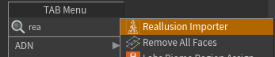

# Requirements & Installation

## Requirements

Before you start, make sure you have:

* **Houdini 21.0 or newer.** The tool uses features introduced in Houdini 21 and is not compatible with earlier versions.
* **Houdini Indie, Core, or FX.** The tool ships as a limited-commercial (Indie) Houdini Digital Asset. See the note about license compatibility below.
* **Windows.** The tool was developed and tested on Windows. It may work on macOS or Linux, but those platforms are untested — use them at your own risk.
* **A Character Creator / iClone character**, exported as FBX. The tool is designed for **Character Creator 5 / iClone 8**, and should work with all **CC3+** base meshes. See [Preparing Your Character](preparing-your-character.md).
* **Karma** for rendering (included with Houdini). The materials are tuned for **Karma XPU** and also render in **Karma CPU**.

!!!warning About the Indie license format
This asset is a black-boxed, limited-commercial Digital Asset (`.hdalc`). It works in Houdini Indie, and it can also be loaded in Houdini Core/FX — but doing so will temporarily switch that session into limited-commercial mode, per SideFX's licensing rules. If you work in a commercial studio pipeline, be aware of this before using the tool. You are responsible for your own compliance with SideFX licensing.
!!!

## Installation

Installing the tool is just a matter of putting one file where Houdini can find it.

### Step 1 — Locate your Houdini `otls` folder

Houdini automatically loads Digital Assets from an `otls` folder in your user preferences directory. On Windows, that's typically:

```
C:\Users\<YourName>\Documents\houdini21.0\otls\
```

If the `otls` folder doesn't exist yet, create it.

### Step 2 — Copy the asset file

Copy the downloaded `.hdalc` file (for example, `JV-Reallusion_Importer-v1.2.hdalc`) into that `otls` folder.

### Step 3 — Restart Houdini

If Houdini was already running, restart it so it picks up the new asset. That's it — the tool is now installed.

### Step 4 — Verify the install

To confirm it loaded:

1. Create a Geometry object (or dive into an existing one).
2. Press **Tab** to open the node menu and type **Reallusion**.
3. You should see **Reallusion Importer** in the list.



If it appears, you're ready to go. Head to the [Quick Start](quick-start.md).

## Alternative: load without installing

If you'd rather not install it permanently, you can load the asset for a single session:

1. Go to **Assets ▸ Install Digital Asset Library** in the main menu.
2. Browse to the `.hdalc` file and select it.

The node will be available until you close Houdini. To make it permanent, use the `otls` folder method above.

## Updating

When a new version is released, copy the new `.hdalc` into your `otls` folder, **delete the previous version's file** (the filename carries the version, e.g. `JV-Reallusion_Importer-v1.2.hdalc`), and restart Houdini. Your existing scenes will pick up the new version automatically — no scene changes needed.

!!!info
Because the tool stores all your look settings on a controller node _inside your scene_ (not inside the asset), updating the asset will not lose your dialed-in looks on existing characters.
!!!
