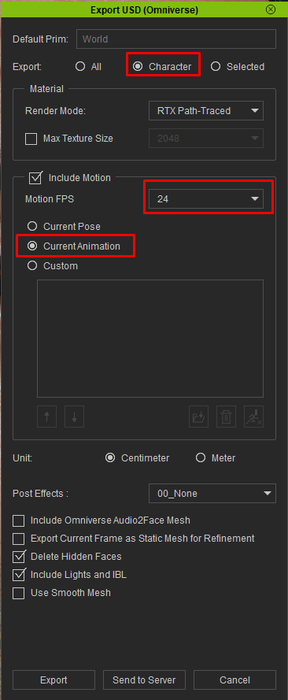
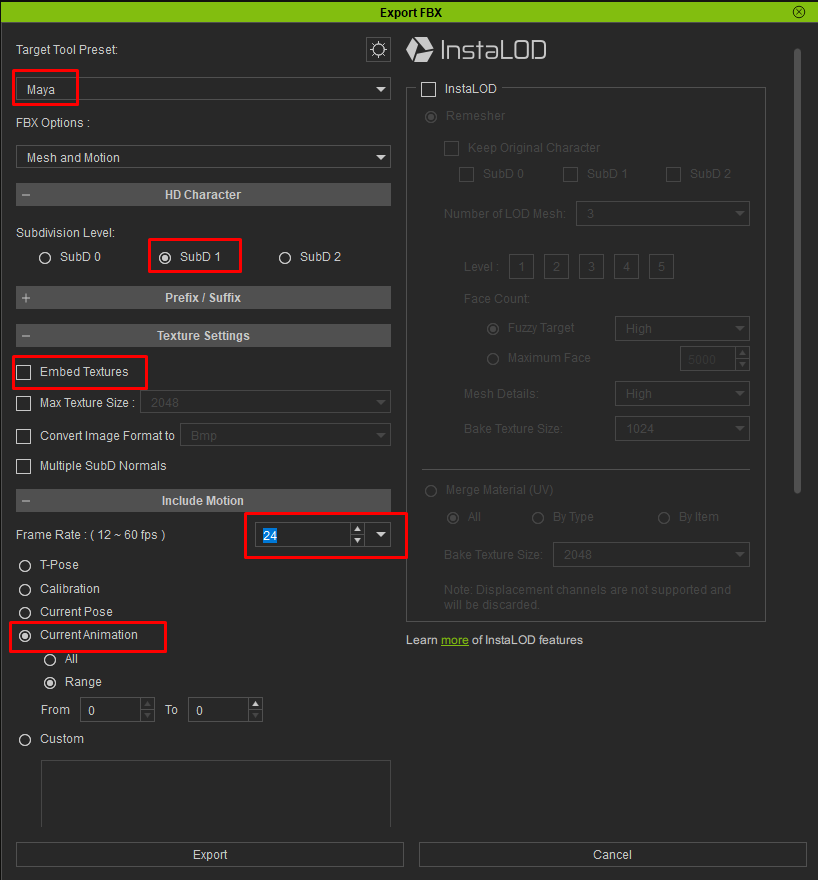
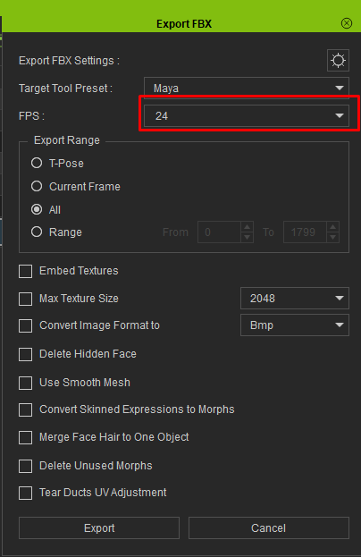

# Preparing Your Character in Character Creator

This is the most important setup page in the documentation. Getting your Character Creator export settings right is the difference between a character that imports perfectly and one that's missing textures, wrinkles, or hair detail. Read this carefully — it'll save you a lot of frustration.

The good news: once you know the correct settings, exporting is quick and you can reuse the same settings every time.

!!!success The best-quality workflow — an FBX character driven by lightweight USD clips
Expression wrinkles and the full hair re-dye are **FBX-only** — Character Creator leaves that data out of its USD export. So for the **best-looking result**, import your character as **FBX** and drive its motion with **lightweight USD motion clips** in the animation database rather than heavy FBX clips. You keep the FBX-only features (the wrinkles that make a Character Creator face look alive) while the animation stays featherweight. If all of the character's motion will come from clips, you can export it **Mesh only**. See [USD vs FBX](import-modes.md) for the full trade-off.
!!!

!!!info Using iClone?
The **character** export settings are the same as Character Creator's, just in a different menu. iClone-authored **animation** needs one extra step to reach Houdini — see [Exporting from iClone](#exporting-from-iclone) below.
!!!

## Which export — USD or FBX?

Version 1.2 can import either Character Creator's **USD (Omniverse)** export or its **FBX** export, chosen with the **Import** dropdown at the top of the node. **USD is the default and recommended** — it imports far faster and uses a fraction of the memory. Export as **FBX** only if you need **animated expression wrinkles** or the **root-to-tip / highlight hair re-dye**, which USD exports don't carry. See [USD vs FBX](import-modes.md) for the full comparison.

Both exports are quick once you know the settings. Follow the section for the mode you're using — **[USD](#exporting-as-usd-recommended)** or **[FBX](#exporting-as-fbx)**.

## Exporting as USD (recommended)

In Character Creator, go to **File ▸ Export ▸ Export USD (Omniverse)**. In the Export USD panel:

* **Export → Character** — *not* **All**. "All" drags scene lights, cameras, and a shadow-catcher into the file. The tool copes with either, but **Character** keeps the file clean.
* **Include Motion → ON**, set to your **Current Animation**, to bring the animation in. Turn it off for a static character.
* **Motion FPS** — match your Houdini scene's FPS (**24** if you haven't changed Houdini's default; see the note under the FBX section about matching frame rate).
* Everything else (Render Mode, **Unit: Centimeter**, Post Effects: None) can stay at its default.



!!!info Delete Hidden Faces is fine
Character Creator's **Delete Hidden Faces** option (on by default) trims faces hidden under clothing. The tool fully handles this — leave it at its default.
!!!

After export you'll have a `.usd` file with a **`Materials`** folder beside it (holding `Materials/Textures/<Material>/…`), and — when motion was included — a **`Motions`** folder with the animation as its own small `.usd` clip. **Keep the `.usd` and its folders together** — the tool resolves textures relative to the `.usd`. The `Motions` clip is also exactly what **Add Animation** takes as a lightweight [animation-database clip](../using/animation.md#add-animation), so USD exports double as a cheap way to bank motion clips. There is **no `.json` sidecar** in USD mode: Character Creator writes the material data (subsurface, displacement, eye/skin shader values, accessory colors) directly into the USD instead. That's everything for USD — you can skip ahead to the [Quick Start](quick-start.md).

## Exporting as FBX

In Character Creator, with your character ready, go to **File ▸ Export ▸ Clothed Character ▸ FBX**. You'll see the Export FBX panel. Here's how to set it, top to bottom.



### Target Tool Preset — Maya

Set the preset to **Maya**. This exports a clean, standard FBX with the bone and material structure the tool expects, and writes the textures into a folder alongside the FBX.

### FBX Options — Mesh and Motion

Choose **Mesh and Motion** to bring the character in with its animation. If you only need the static character, **Mesh** alone works; if you're adding the motion separately, **Motion** alone works too. For most users, **Mesh and Motion** is the right choice.

### Subdivision Level — SubD 1

Set the subdivision level to **SubD 1**. This gives you smooth, render-quality geometry. **SubD 2** is overkill — it quadruples the geometry for detail you won't see, and just costs you memory and import time. **SubD 0** is too coarse for close-ups. **SubD 1 is the sweet spot.**

### Texture Settings — Embed Textures OFF

Leave **Embed Textures** unchecked (off). The tool reads textures from the folders Character Creator writes next to the FBX — the `.fbm` folder and/or a loose `textures` folder — so you don't need them embedded. Leaving it off also keeps the FBX smaller and, importantly, keeps the export **re-importable back into Character Creator** (embedding breaks that).

!!!info
Embedding textures has **no effect** on the material data the tool depends on for displacement, subsurface, wrinkles, and accessory colors — that comes from a separate `.json` file (see [Keeping files together](#keeping-files-together)), not from the embedded images. So there's no reason to turn Embed on.
!!!

Leave the other texture options (Max Texture Size, Convert Image Format, Multiple SubD Normals) at their defaults.

### Frame Rate — match your Houdini scene

Set the **Frame Rate** to match your Houdini scene's FPS. The Maya preset defaults this to 30, but **Houdini's default scene is 24 fps** — so if you haven't changed your Houdini scene, set this to **24**. If your scene runs at a different rate, match that. Getting this right keeps the animation playing at the correct speed after import.

### Motion options

Under Include Motion, choose what to export — **Current Animation ▸ All** brings in the whole clip. Use Range if you only want part of it.

## Other settings — leave at defaults

Everything else in the Export FBX panel can stay at its defaults. In particular, the defaults already bake skin and hair color into the diffuse maps the tool reads — **Bake diffuse maps from skin color** and **Bake diffuse and specular from Digital Human Hair Shader** are on by default, so leave them on. (The tool's hair re-dye system still lets you recolor afterward — see [Hair](../using/hair.md).)

The one default worth double-checking:

* **Bake Wrinkles for Still Frame** must stay **OFF** (its default). Turning it on freezes the expression wrinkles into a single pose so they can't animate.

!!!danger
If your wrinkles don't animate after import, the usual cause is **Bake Wrinkles for Still Frame** being switched on. Make sure wrinkles are exported as live maps, not baked to a frozen pose.
!!!

## Advanced export settings (the gear icon)

The **⚙ gear icon** at the top of the Export FBX dialog opens an advanced panel. You normally don't need to touch it — its defaults are correct — but two of those defaults matter to this tool, so it's worth a glance to confirm they're still set:

* **Export JSON for Auto Material Setup** (General section) — must stay **on** (the default). This writes the `my_character.json` the tool relies on for displacement, subsurface, wrinkles, and accessory colors. If an export ever comes out without a `.json`, this is the switch to check.
* **Normal — OpenGL (Y+)** (Normal section) — must stay **OpenGL (Y+)** (the Maya-preset default), _not_ DirectX (Y−). Houdini and Karma expect OpenGL-convention normal maps; the DirectX option flips the green channel, which inverts the skin's fine surface detail (pores and wrinkles read inward instead of outward).

Everything else in this panel can stay at its defaults.

## Exporting from iClone

iClone is the other half of the Reallusion pipeline — it's where you author and mocap **animation**. There are two things you might export from iClone: the **character** itself, and an **animation** you've built on it.

### The character

You can export a character from iClone the same way you would from Character Creator — the export panels are the same, just reached from iClone's menus:

* **FBX** (**File ▸ Export ▸ Export Clothed Character**) — the reliable choice, identical to the [FBX section](#exporting-as-fbx) above.
* **USD** via the NVIDIA Omniverse plugin (**File ▸ Export ▸ Export USD (Omniverse)**) — see the warning below.



!!!warning iClone's direct USD export is experimental
iClone's "Export USD (Omniverse)" is structured differently from Character Creator's USD export, and this importer targets Character Creator's. **Standard characters generally import correctly** (with textures, as of version 1.2.1), but **stylized characters — especially ones with heavy custom hair or spring-bone rigs — can import badly deformed.** For the most reliable result with an iClone character, export it as **FBX**, or send it to **Character Creator** and export from there — Character Creator's own USD export is the fully-supported USD path.
!!!

### Getting iClone animation into Houdini

If you've authored a performance in iClone that you want as a **motion clip** for the animation database, you have two routes. **Option B (the Character Creator round-trip) is the reliable one** — Option A depends on iClone's experimental USD export above.

#### Option B — FBX round-trip through Character Creator (recommended)

Export your animation from iClone as **FBX**, then bring it onto the character in Character Creator, which re-exports it in a format this tool fully supports:

1. In **Character Creator**, go **Import ▸ Import External Motion** and choose the FBX you exported from iClone.
2. Wait while **"Fetching Characterization Profile"** finishes loading.
3. In the **Motion Import Settings** dialog that follows, you can leave the defaults. Click **Convert All**.
4. Re-export the character from Character Creator — as **USD** (recommended) or FBX — with that motion, using the export sections above.


!!!success
Option B fits the [best-quality workflow](#preparing-your-character-in-character-creator) neatly: keep your character as an FBX import for the expression wrinkles, and bring the iClone motion in as a light **USD** clip re-exported from Character Creator.
!!!

#### Option A — USD, via the NVIDIA Omniverse plugin (experimental)

If you'd rather export USD straight from iClone, install Reallusion's [**iClone Omniverse plugin**](https://www.reallusion.com/iclone/nvidia-omniverse/), following the [official installation guide](https://manual.reallusion.com/Omniverse-Plug-in/Content/ENU/iC-8.3/01-Installation/Installation-Guide-for-Using-NVIDIA-Omnniverse.htm). It adds USD export to iClone directly, so you can export USD (character and motion) much as you would from Character Creator.

!!!warning Large install, and experimental
The Omniverse plugin takes roughly **10–20 minutes to install** and about **10 GB of disk space**. And as noted above, iClone's USD export is **experimental** with this tool — standard characters usually work, but stylized ones may not. If in doubt, prefer **Option B**.
!!!

## Animation

If you want the character's motion to come in with it, export with the animation baked in. The tool reads the embedded FBX animation automatically, and you can add more clips later — see [Animation](../using/animation.md).

!!!info
**Validate with a static pose first.** If you're exporting a long animation (hundreds of frames), it's worth doing a quick static-pose export first to confirm the character imports and shades correctly, before committing to baking a long, heavy animation.
!!!

## Keeping files together

After export you'll have:

```
my_character.fbx
my_character.json          (material data — REQUIRED, see below)
my_character.fbxkey        (Character Creator re-import key)
my_character.fbm/          (textures Character Creator writes beside the FBX)
textures/
    my_character/          (loose texture folders, if any)
        Std_Skin_Head/
        Std_Eye_L/
        Hair_Transparency/
        ...
```

**Keep all of these together.** If you move the FBX, move its `.json`, `.fbm`, and `textures` folder with it. The tool resolves everything relative to the FBX, so as long as they travel together, it'll find them.

!!!info
**Keep the filename simple.** Letters, numbers, and underscores are the safe set (e.g. `aaron_talking.fbx`). The tool handles other characters, but plain names keep paths tidy in Houdini and across your wider pipeline.
!!!

!!!warning The `.json` file is essential — don't lose it
Character Creator writes a `my_character.json` next to the FBX containing material data the FBX itself can't store: **displacement, subsurface scattering, expression-wrinkle weights, and the colors of custom accessories** (horns, props, GoZ clothing). If this file is missing, those features silently won't import — displacement won't appear and untextured accessories render plain white, even though the rest of the character looks fine.

It's produced by the **Export JSON for Auto Material Setup** option, found in the Export FBX dialog's **⚙ gear menu → General** section, which is **on by default**. If your export didn't produce a `.json`, confirm that option is checked and re-export. See [Advanced export settings](#advanced-export-settings-the-gear-icon) above.
!!!

## A note on character versions

The tool is designed for Character Creator 5 / iClone 8, and should work with all **CC3+** base meshes. It works best with characters built on Character Creator's standard base meshes. Some advanced features depend on what your specific character provides:

* **Wrinkles** require the character to have the expression-wrinkle maps (most CC heads do).
* **Hair re-dye** requires the hair to carry Character Creator's hair maps (root, ID, flow). Hair styles that bake everything into a flat diffuse will still import and look correct, but won't be re-dyeable.
* **Displacement** requires exported displacement maps.

The tool detects what each character has and enables those features automatically — you don't need to configure anything. If a feature's controls don't seem to do anything, the most likely reason is that your particular character doesn't carry the maps that feature needs.

## Ready?

With your character exported correctly, head to the [Quick Start](quick-start.md) to import it.
