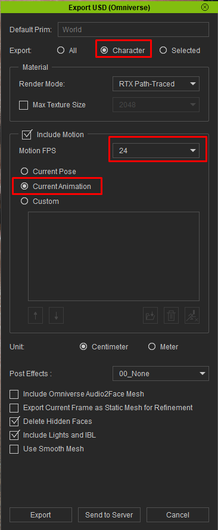
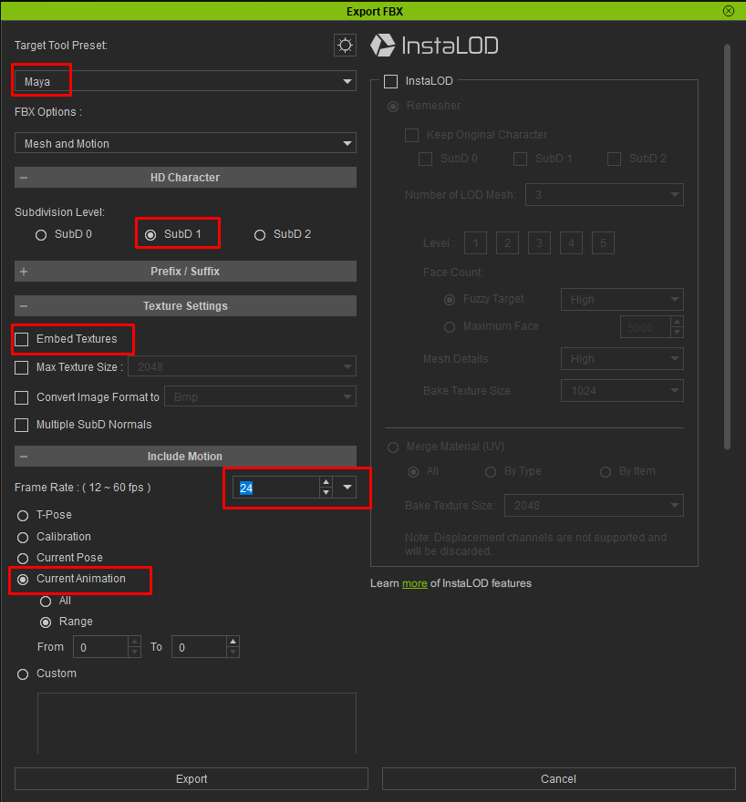
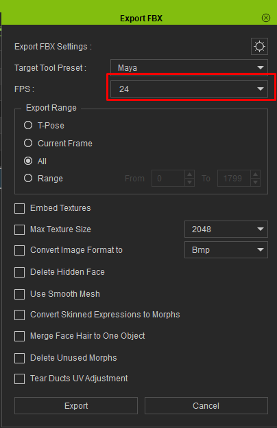
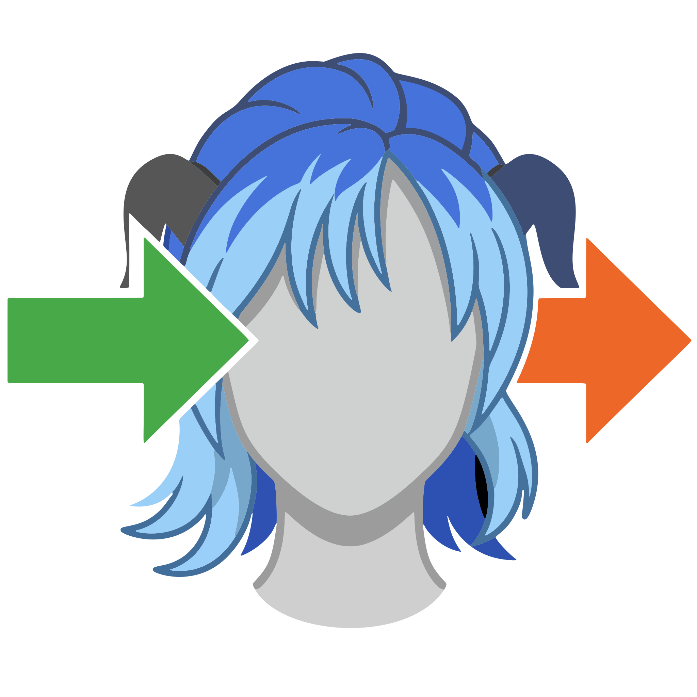
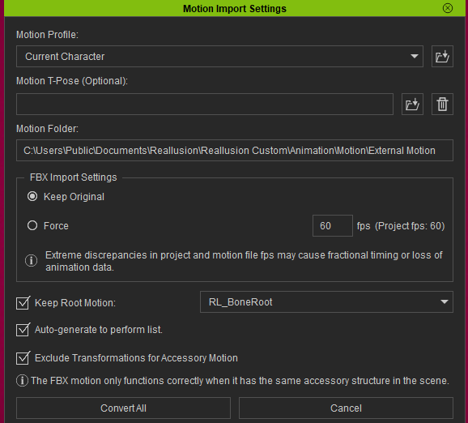

# Preparing Your Character in Character Creator

Getting your export settings right the first time saves you a lot of frustration — a wrong setting is usually the reason a character comes in missing textures, wrinkles, or hair detail. It only takes a minute once you know what to set, and you can reuse the same settings every time.

## Which export — at a glance

The tool imports **FBX** or **USD**, from either **Character Creator** or **iClone**, chosen with the **Import** dropdown at the top of the node.

| Source & format | Status | When to use it |
|---|---|---|
| **Character Creator — USD** | ✅ Fully supported | The **fastest, lightest** import, with the best eye & skin values. No expression wrinkles / limited hair re-dye. The default. |
| **Character Creator — FBX** | ✅ Fully supported | You want **expression wrinkles** or the **full hair re-dye** — both FBX-only. Heavier on memory. |
| **iClone — FBX** | ✅ Fully supported | The reliable way to bring an iClone character or motion in — same settings as Character Creator's FBX. |
| **iClone — USD (Omniverse)** | ⚠️ Experimental | Standard characters usually work; **stylized ones may import deformed**. Prefer FBX, or round-trip through Character Creator. |

!!!success Recommended for the best look
Import the character as **FBX** — it keeps the expression wrinkles and full hair re-dye that make a Character Creator face come alive — and drive its motion with **lightweight USD motion clips** from the animation database. Export the character **Mesh only** if all its motion will come from clips. See [USD vs FBX](import-modes.md) for the full trade-off.
!!!

Using iClone? The **character** export settings match Character Creator's, just from a different menu. iClone-authored **animation** needs one extra step — see [Exporting from iClone](#exporting-from-iclone) below.

Follow the section for your export: Character Creator **[USD](#exporting-as-usd-recommended)** or **[FBX](#exporting-as-fbx)**, then **[iClone](#exporting-from-iclone)** if that's your source.

## Exporting as USD (recommended)

In Character Creator, go to **File ▸ Export ▸ Export USD (Omniverse)**. In the Export USD panel:

* **Export → Character** — *not* **All**. "All" drags scene lights, cameras, and a shadow-catcher into the file. The tool copes with either, but **Character** keeps the file clean.
* **Include Motion → ON**, set to your **Current Animation**, to bring the animation in. Turn it off for a static character.
* **Motion FPS** — match your Houdini scene's FPS (**24** if you haven't changed Houdini's default).
* Everything else (Render Mode, **Unit: Centimeter**, Post Effects: None) can stay default.



Character Creator's **Delete Hidden Faces** option (on by default, trims faces hidden under clothing) is fine to leave at its default — the tool fully handles it.

After export you'll have a `.usd` file with a **`Materials`** folder beside it, and — when motion was included — a **`Motions`** folder holding the animation as its own small `.usd` clip. **Keep the `.usd` and its folders together**; the tool resolves textures relative to the `.usd`. That `Motions` clip is also exactly what **Add Animation** takes as a lightweight [animation-database clip](../using/animation.md#add-animation), so a USD export doubles as a cheap way to bank motion clips. There's **no `.json` sidecar** in USD mode — Character Creator writes the material data (subsurface, displacement, eye/skin shader values, accessory colors) directly into the USD instead. That's it for USD — skip ahead to the [Quick Start](quick-start.md).

## Exporting as FBX

In Character Creator, with your character ready, go to **File ▸ Export ▸ Clothed Character ▸ FBX**. Here's how to set the Export FBX panel, top to bottom.



### Target Tool Preset — Maya

Set the preset to **Maya**. This exports a clean, standard FBX with the bone and material structure the tool expects, and writes the textures into a folder alongside the FBX.

### FBX Options — Mesh and Motion

Choose **Mesh and Motion** to bring the character in with its animation. **Mesh** alone works if you only need the static character; **Motion** alone works if you're adding the motion separately. For most users, **Mesh and Motion** is right.

### Subdivision Level — SubD 1

Set the subdivision level to **SubD 1**. It gives you smooth, render-quality geometry without the cost — **SubD 2** quadruples the geometry for detail you won't see, and **SubD 0** is too coarse for close-ups.

### Texture Settings — Embed Textures OFF

Leave **Embed Textures** unchecked. The tool reads textures from the folders Character Creator writes next to the FBX (the `.fbm` folder and/or a loose `textures` folder), so nothing needs to be embedded — and leaving it off keeps the FBX smaller and re-importable back into Character Creator (embedding breaks that).

Leave the other texture options (Max Texture Size, Convert Image Format, Multiple SubD Normals) at their defaults.

### Frame Rate — match your Houdini scene

Set the **Frame Rate** to match your Houdini scene's FPS. The Maya preset defaults this to 30, but **Houdini's default scene is 24 fps** — so set this to **24** unless your scene runs at something else. Getting this right keeps the animation playing at the correct speed after import.

### Motion options

Under Include Motion, **Current Animation ▸ All** brings in the whole clip. Use Range if you only want part of it.

## Other settings — leave at defaults

Everything else in the Export FBX panel can stay at its defaults. In particular, the defaults already bake skin and hair color into the diffuse maps the tool reads — **Bake diffuse maps from skin color** and **Bake diffuse and specular from Digital Human Hair Shader** are on by default, so leave them on (the hair re-dye system still lets you recolor afterward — see [Hair](../using/hair.md)).

One default is worth double-checking: **Bake Wrinkles for Still Frame** must stay **OFF** (its default).

!!!danger
If your wrinkles don't animate after import, the usual cause is **Bake Wrinkles for Still Frame** being switched on — it freezes the expression wrinkles into a single pose so they can't animate. Make sure wrinkles export as live maps, not baked to a frozen pose.
!!!

## Advanced export settings (the gear icon)

The **⚙ gear icon** at the top of the Export FBX dialog opens an advanced panel. You normally don't need to touch it, but two of its defaults matter here, so it's worth a glance:

* **Export JSON for Auto Material Setup** (General section) — must stay **on** (the default). This writes the `my_character.json` the tool relies on for displacement, subsurface, wrinkles, and accessory colors. If an export ever comes out without a `.json`, check this switch.
* **Normal — OpenGL (Y+)** (Normal section) — must stay **OpenGL (Y+)**, *not* DirectX (Y−). Houdini and Karma expect OpenGL-convention normal maps; DirectX flips the green channel and inverts fine surface detail like pores and wrinkles.

Everything else in this panel can stay default.

## Exporting from iClone

iClone is where you author and mocap **animation**. There are two things you might export from it: the **character** itself, and an **animation** you've built on it.

### The character

You can export a character from iClone the same way as from Character Creator — same panels, reached from iClone's menus:

* **FBX** (**File ▸ Export ▸ Export Clothed Character**) — the reliable choice, identical to the [FBX section](#exporting-as-fbx) above.
* **USD** via the NVIDIA Omniverse plugin (**File ▸ Export ▸ Export USD (Omniverse)**) — see the warning below.



!!!warning iClone's direct USD export is experimental
iClone's "Export USD (Omniverse)" is structured differently from Character Creator's USD export, and this importer targets Character Creator's. **Standard characters generally import correctly** (with textures, as of version 1.2.1), but **stylized characters — especially with heavy custom hair or spring-bone rigs — can import badly deformed.** For the most reliable result, export as **FBX**, or send the character to **Character Creator** and export from there.
!!!

### Getting iClone animation into Houdini

To bring an iClone performance in as a **motion clip** for the animation database, you have two routes. **Option B (the Character Creator round-trip) is the reliable one** — Option A depends on iClone's experimental USD export above.

#### Option B — FBX round-trip through Character Creator (recommended)

Export your animation from iClone as **FBX**, then bring it onto the character in Character Creator, which re-exports it in a format this tool fully supports. The performance leaves iClone, passes through Character Creator, and comes back as something Houdini can read:

<div style="text-align:center; background:#0d1117; border-radius:16px; padding:2rem 1rem; margin:0.5rem 0 1.5rem;">
  
</div>

1. In **Character Creator**, go **Import ▸ Import External Motion** and choose the FBX you exported from iClone.
2. Wait while **"Fetching Characterization Profile"** finishes loading.
3. In the **Motion Import Settings** dialog that follows, leave the defaults and click **Convert All**.
4. Re-export the character from Character Creator — as **USD** (recommended) or FBX — with that motion, using the export sections above.



!!!success
Option B fits the best-quality workflow neatly: keep your character as an FBX import for the expression wrinkles, and bring the iClone motion in as a light **USD** clip re-exported from Character Creator.
!!!

#### Option A — USD, via the NVIDIA Omniverse plugin (experimental)

To export USD straight from iClone, install Reallusion's [**iClone Omniverse plugin**](https://www.reallusion.com/iclone/nvidia-omniverse/), following the [official installation guide](https://manual.reallusion.com/Omniverse-Plug-in/Content/ENU/iC-8.3/01-Installation/Installation-Guide-for-Using-NVIDIA-Omnniverse.htm). It adds USD export to iClone directly, so you can export character and motion much as you would from Character Creator.

!!!warning Large install, and experimental
The Omniverse plugin takes roughly **10–20 minutes to install** and about **10 GB of disk space** — and as noted above, iClone's USD export is **experimental** with this tool. If in doubt, prefer **Option B**.
!!!

## Animation

To bring the character's motion in with it, export with the animation baked in — the tool reads the embedded FBX animation automatically, and you can add more clips later. See [Animation](../using/animation.md).

If you're exporting a long animation (hundreds of frames), it's worth doing a quick static-pose export first to confirm the character imports and shades correctly before committing to a long, heavy bake.

## Keeping files together

After export you'll have:

```
my_character.fbx
my_character.json          (material data — REQUIRED, see below)
my_character.fbxkey        (Character Creator re-import key)
my_character.fbm/          (textures Character Creator writes beside the FBX)
textures/
    my_character/          (loose texture folders, if any)
        Std_Skin_Head/
        Std_Eye_L/
        Hair_Transparency/
        ...
```

**Keep all of these together.** If you move the FBX, move its `.json`, `.fbm`, and `textures` folder with it — the tool resolves everything relative to the FBX.

Keep filenames to letters, numbers, and underscores (e.g. `aaron_talking.fbx`) — the tool handles other characters, but plain names keep paths tidy across your pipeline.

!!!warning The `.json` file is essential — don't lose it
Character Creator writes a `my_character.json` next to the FBX containing material data the FBX itself can't store: **displacement, subsurface scattering, expression-wrinkle weights, and the colors of custom accessories** (horns, props, GoZ clothing). If this file is missing, those features silently won't import — displacement won't appear and untextured accessories render plain white, even though the rest of the character looks fine.

It's produced by **Export JSON for Auto Material Setup**, in the Export FBX dialog's **⚙ gear menu → General** section, on by default. If your export didn't produce a `.json`, confirm that option is checked and re-export.
!!!

## A note on character versions

The tool is designed for Character Creator 5 / iClone 8, and should work with all **CC3+** base meshes — best with characters built on Character Creator's standard base meshes. Some advanced features depend on what your character provides:

* **Wrinkles** require expression-wrinkle maps (most CC heads have them).
* **Hair re-dye** requires Character Creator's hair maps (root, ID, flow). Hair baked into a flat diffuse will still import and look correct, just won't be re-dyeable.
* **Displacement** requires exported displacement maps.

The tool detects what each character has and enables those features automatically — nothing to configure. If a feature's controls don't seem to do anything, your character probably doesn't carry the maps that feature needs.

## Ready?

With your character exported correctly, head to the [Quick Start](quick-start.md) to import it.
