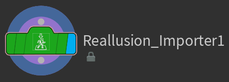
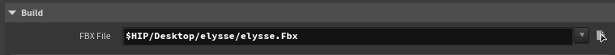
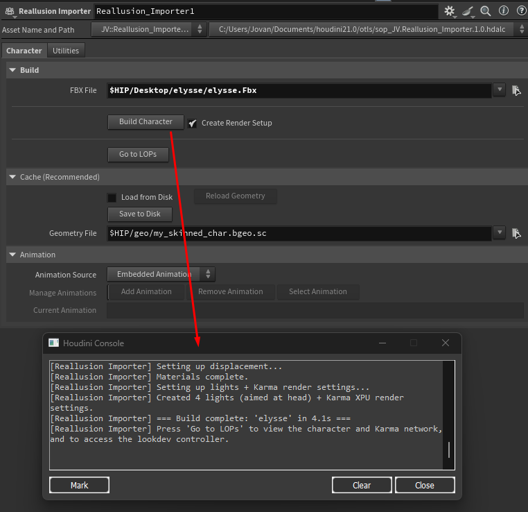
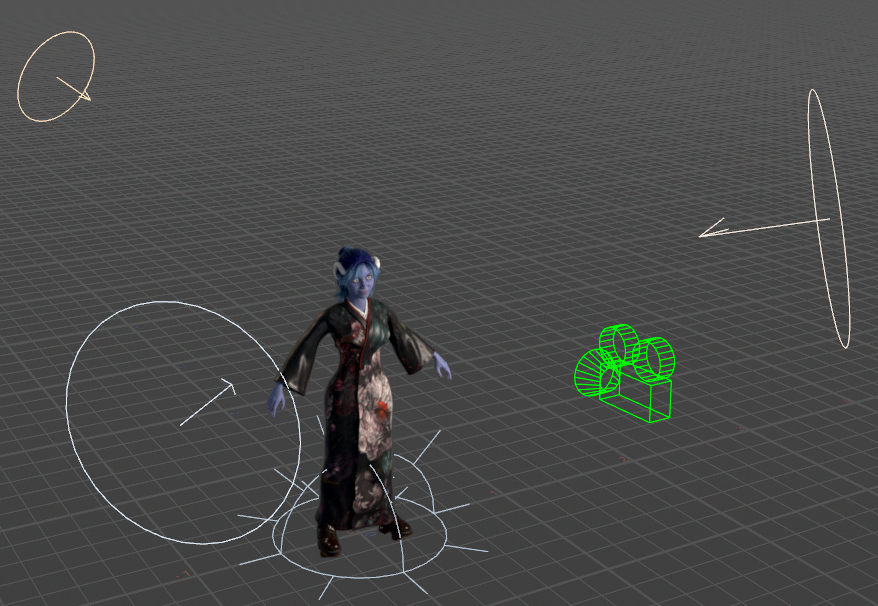
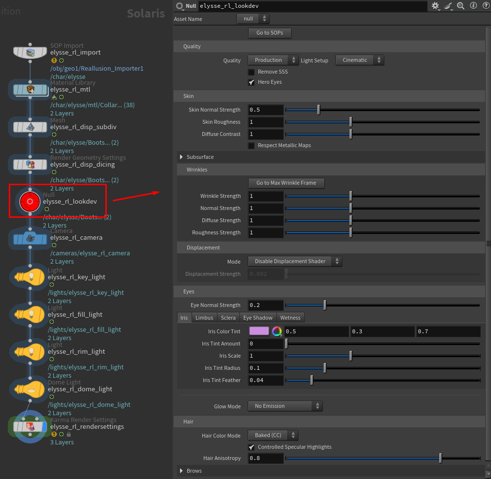

# Quick Start

This page gets you from a fresh Houdini scene to a shaded, rendered character in about five steps. We'll keep it simple here — every control is explained in depth later in the [Using the Asset](../using/lookdev-controller.md) section.

!!!success Before you begin
Make sure your character is exported from Character Creator correctly. The export settings genuinely matter — see [Preparing Your Character](preparing-your-character.md) first if you haven't already.
!!!

## Step 1 — Create the node

Inside a Geometry object, press **Tab**, type **Reallusion**, and place a **Reallusion Importer** node.

## Step 2 — Choose an import mode and point it at your file

At the top of the node is an **Import** dropdown. Leave it on **USD** (the default, and much faster) if you exported a USD file, or switch it to **FBX** for an FBX export. New to the two modes? See [USD vs FBX](import-modes.md).

Then set the file field the dropdown shows — **CC5/iClone USD** or **CC5/iClone FBX** — to your exported file.

!!!info
Keep your character's textures beside its file, exactly as Character Creator exports them — a `Materials` folder next to the `.usd`, or a `textures` folder next to the `.fbx`. The tool resolves them relative to the character file.
!!!

## Step 3 — Build the character

Click the **Build Character** button.

The tool will now import the character, build all of its materials, set up displacement and wrinkles where the character supports them, and create a look controller. On a heavy or HD character this can take anywhere from a few seconds to a couple of minutes — the progress bar at the bottom of the Houdini window shows what it's doing.

!!!warning
In **FBX** mode the first build is the slow part, because Houdini has to load and expand the FBX (subsequent look changes are fast). In **USD** mode import takes about a second even on heavy characters — this is the main reason USD is the default. See [Performance & Caching](../reference/performance.md) for details.
!!!

## Step 4 — Look at your character

Your character is now built in Solaris (Houdini's `/stage` context). Click the **Go to LOPs** button on the node to jump there, then set up a viewport with a Karma render to see it.

If you'd like an instant lighting and camera setup, see [Rendering](../using/rendering.md) — the tool can build a three-point light rig, a camera, and Karma render settings for you.

## Step 5 — Art-direct the look

Find the bright **red controller node** in the LOP network (or click **Go to LOPs** to get there). This node holds every look control: skin, wrinkles, eyes, hair, and more. Adjust a slider or color and the Karma render updates live.

That's the whole workflow. From here, explore the [Lookdev Controller](../using/lookdev-controller.md) to learn what every control does — or just start dragging sliders and watching what happens.

## What next?

* **Want to recolor the hair?** See [Hair](../using/hair.md).
* **Want glowing eyes?** See [Eyes](../using/eyes.md).
* **Adding animation?** See [Animation](../using/animation.md).
* **Something not working?** See [Troubleshooting & FAQ](../reference/troubleshooting.md).
