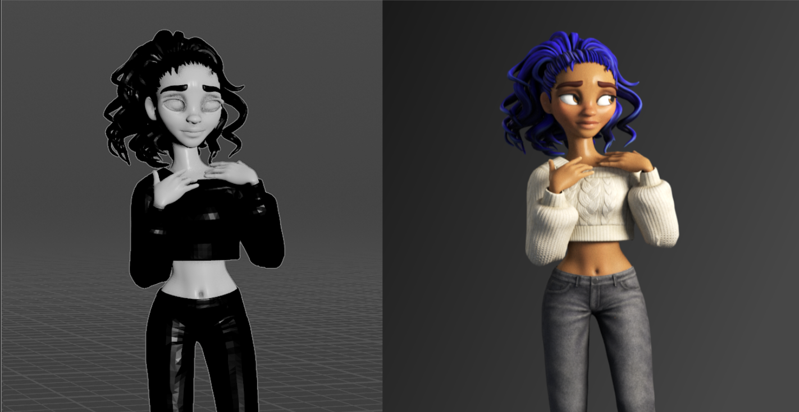

# Reallusion Importer for Houdini v1.2.1

  

<a href="https://jvtonehammer.gumroad.com/l/reallusionimporterforhoudini"><strong>Get it on Gumroad →</strong></a>

Welcome! **Reallusion Importer for Houdini** turns a Character Creator 5 or iClone 8 character into a fully shaded, animatable, render-ready character in Houdini's Solaris environment — in seconds instead of hours.

You export your character from Character Creator — as **USD** (fast and light, the recommended default) or **FBX** — point this tool at it, and click one button. Behind the scenes it rebuilds your character in Solaris with proper Karma MaterialX materials for skin, eyes, teeth, hair, and clothing — then gathers every meaningful look control onto a single, friendly panel so you can art-direct the result without touching a single shader node.

The tool is designed for Character Creator 5 / iClone 8 and works with all CC3+ characters. It ships as a black-boxed Houdini Digital Asset, and its materials are tuned for Karma XPU while also rendering in Karma CPU.

!!!success The best-quality workflow
USD import is fast and light, but the **expression wrinkles** — the thing that makes a Character Creator face look alive — are **FBX-only**. For the best-looking result, import your character as **FBX** and drive its motion with **lightweight USD motion clips**. You keep the wrinkles while the animation stays featherweight. See [USD vs FBX](getting-started/import-modes.md#the-best-quality-workflow).
!!!

## What it does for you

* **One-click character setup.** Import, material building, and look controls happen automatically. No manual shader wiring.
* **Karma XPU materials out of the box.** Physically-based MaterialX skin (with subsurface scattering), refractive eyes, teeth, and transparent card hair — all built to render in Karma XPU.
* **Animated facial wrinkles.** The expression-driven wrinkle system that makes Character Creator faces look alive is reconstructed live in Karma, reacting to the character's animation.
* **A full hair re-dye system.** Recolor any character's hair — root-to-tip ombré, highlight streaks, and realistic directional sheen — without going back to Character Creator.
* **Stylized eyes.** Make eyes glow, or even cast light into the scene, with several artistic modes.
* **Flexible animation.** Add multiple motion clips and switch between them, retarget clips from differently-proportioned Character Creator characters, and even drive the body from one clip while keeping another's facial performance.
* **Skin Fix.** Quickly clean up mesh intersections — clothing poking through the body — with built-in Sculpt and Soft Edit tools, right inside the asset.
* **Optional render setup.** A three-point light rig, camera, and Karma render settings, ready to go.

## Who it's for

This tool is built for indie character artists, animators, and small studios who use Character Creator or iClone to build characters and want to render them beautifully in Houdini and Karma — without becoming a lookdev TD first.

You don't need to know how MaterialX works. You don't need to understand subsurface scattering or anisotropic hair shading. The tool handles the hard parts and gives you simple sliders and color pickers for the creative parts.

## How to use this documentation

If you're brand new, read these three pages in order:

1. [Requirements & Installation](getting-started/installation.md) — get the tool into Houdini.
2. [Preparing Your Character in Character Creator](getting-started/preparing-your-character.md) — export your character the right way (this matters!).
3. [Quick Start](getting-started/quick-start.md) — import your first character.

After that, the **Using the Asset** section explains every control in friendly detail, and the **Reference** section covers performance, troubleshooting, and what's new in each version.

!!!info
This tool is an independent product and is not affiliated with, endorsed by, or sponsored by Reallusion or SideFX. "Character Creator," "iClone," and "Houdini" are trademarks of their respective owners.
!!!
