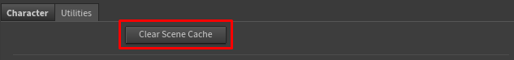
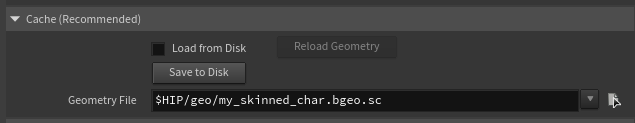

# Performance & Caching

Character Creator characters are detailed, and detailed characters use memory. This page explains where the cost comes from and how to keep your sessions fast and lean.

## The fastest fix: import as USD

Version 1.2's **USD import mode** sidesteps almost all of this cost, and it's the default. Character Creator's USD export keeps the facial blendshapes sparse, so Houdini imports even a heavy HD character in **about a second, using a fraction of the memory** — roughly **50–75× faster and 10–14× less RAM** than the FBX path. If performance or memory is a concern, exporting and importing as **USD is the single biggest thing you can do**. See [USD vs FBX](../getting-started/import-modes.md).

The rest of this page applies mainly to **FBX import**, which still has to expand the character on load (and which you'd use for FBX-only features like wrinkles). One thing USD does **not** change is playback memory over long frame ranges — see [Long animations and playback memory](#long-animations-and-playback-memory) below.

## Why the first FBX build is slow

When you import an FBX character, the slow part is Houdini loading and expanding it — particularly its blendshapes (the facial expression targets). A fully-featured CC character has many of these, and expanding them is memory- and time-intensive. This is inherent to how Houdini handles FBX character data, not something specific to this tool. (USD import avoids it — see above.)

The good news: this cost is paid **once**, at build time. After that, adjusting your look on the controller is fast, because the materials just reference the controller — they don't re-cook the character.

!!!info
Expect a heavy or HD character imported **via FBX** to use a substantial amount of RAM once loaded — this is normal for film-quality character data in Houdini. Lighter characters are correspondingly cheaper, and USD import is cheaper across the board.
!!!

## Keeping look-dev fast

While you're working on the look, use these to stay responsive:

* **Quality ▸ Preview** — turns off subsurface scattering and uses cheap eyes. The single biggest speed-up. (See [The Lookdev Controller](../using/lookdev-controller.md).)
* **Displacement ▸ Disable or Bump** — true displacement is expensive; use it only for final renders.
* **Hero Eyes off** — for any character whose eyes aren't the focus.

Switch all of these to full quality only when you're ready for final renders.

## Managing memory

### FBX animation clips are heavy

FBX animation is the single biggest driver of memory use in the tool — bigger than the character itself. Each FBX clip you add to the database uses a significant amount of memory, and the cost scales with the clip's **length**: Houdini holds the expanded character for every frame in the range. A few hundred frames is comfortable; multi-thousand-frame clips can balloon RAM fast. Keep your clip frame-ranges to what you actually need, add only the clips you'll use, and use **Remove Animation** to free clips you're done with. **USD motion clips sidestep this** — they *store* lightly and load instantly regardless of length, so prefer them when available. (Note this is about how the clip is *stored*; *playing* a long range still fills the playback cache in either mode — see the next section.) (See [Animation](../using/animation.md).)

### Long animations and playback memory

This one applies to **both USD and FBX**, and is separate from import cost. Once a character is animated, Houdini caches the **deformed mesh for every frame you play or scrub** so playback stays smooth. For a heavy or HD character that's roughly **20 MB per frame**, so a several-hundred-frame range can add **10–20 GB** on top of the character itself — and it grows the more of the range you touch.

USD does **not** avoid this: USD makes *import* cheap, but the per-frame deformed mesh is the same size whichever way you imported, so playing a long animation fills the cache the same. (This is why USD's memory win is dramatic on import but only modest once you're playing back a long clip.)

To keep it under control:

* **Lower Houdini's geometry cache limit** — *Edit ▸ Preferences ▸ Cache*, "Cache Memory (MB)". This is a hard ceiling on exactly this memory; a smaller value trades some scrub smoothness for a lower RAM cap.
* **Play only the range you need** — the cache fills in proportion to the frames you actually visit. Set your playback range to the shot, not the whole clip.
* **Clear Scene Cache** (below) after you're done scrubbing a heavy range.

### Clear Scene Cache

The **Clear Scene Cache** button (in the Utilities section) unloads cached geometry from Houdini's caches to reclaim memory — useful after deleting characters or removing animation clips.

!!!warning Geometry that's currently displayed won't unload
Houdini keeps actively-displayed data resident by design. Clear Scene Cache reclaims cooked data that's no longer needed (from deleted characters or removed animations), not the character you're currently looking at. To free a loaded character's memory, delete or bypass its nodes first, then clear the cache.
!!!

## Skin Cache (Save / Load to Disk)

!!!info FBX mode only
The Skin Cache exists to avoid the slow FBX expansion. **USD import is already about a second**, so the cache is unnecessary there — its folder is hidden in USD mode. This section applies to **FBX import**.
!!!

The first FBX import of a heavy or HD character is the slow part. To avoid paying that cost every time you open the scene, the tool lets you **save the character's cooked geometry to a cache file on disk** and load that back instantly.

In the **Skin Cache (recommended)** folder on the Reallusion Importer node:

* **Save to Disk** — writes the current character geometry to a cache file (`.bgeo.sc`) at the location set in the **Geometry Cache File** field. Recommended for heavy/HD characters.
* **Load from Disk** — loads the cached geometry from disk instead of re-importing and re-expanding the FBX. Much faster for heavy characters.
* **Reload** — re-reads the cache from disk (use after re-saving the cache).

!!!success Workflow
Import the character once, click **Save to Disk**, then switch to **Load from Disk**. From then on the character loads from the fast cache instead of the slow FBX expansion. Re-save whenever you change the source character.
!!!

!!!info Keep the FBX File set
The cache accelerates the geometry side only — the heavy mesh and blendshape expansion. The skeleton and animation always read from the FBX, so the **FBX File** field must stay filled even when loading from disk (the cache makes it fast, not optional).
!!!

**About the node's second output:** the Reallusion Importer node has two outputs. The first is the finished character. The second, **Utility Cache**, is an internal tap of the character's rest geometry that the **Save to Disk** button reads from — it isn't meant to be wired into your scene. Leave it unconnected.

## Multiple characters

You can have several characters in one scene — each gets its own stem-prefixed nodes and its own lookdev controller, so they don't interfere with each other. Just be mindful that each one carries its own memory cost. On a memory-constrained machine, work with one character at a time.
