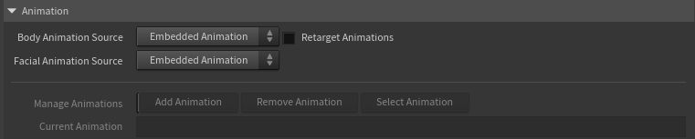
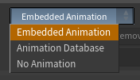
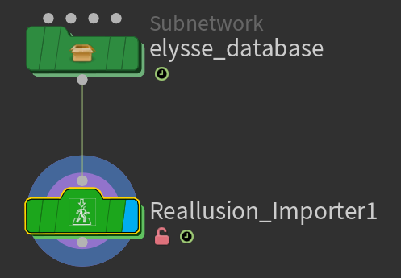

# Animation

The tool can play the motion baked into your character's FBX, and it can also manage a small library of additional animation clips that you add from other FBX files — letting you switch between different motions on the same character.

!!!info Using a clip from a different character?
A motion clip carries the skeleton and proportions of the character it was exported with. Clips made for _this same character_ play back directly. For a clip authored on a **differently-proportioned** Character Creator character, turn on [**Retarget Animation**](#retarget-animation) — it remaps the motion onto your character, and the facial performance (expressions, visemes, blinks) comes along automatically.
!!!

The **body** and the **face** are chosen separately — two menus — so you can keep one character's body motion while driving the face from a different clip (or freezing it).

## Body Animation Source

Chooses where the character's **body** motion comes from (the skeleton — torso, limbs, head):

* **Embedded Animation** — the motion baked into the character's own FBX (what came in when you imported).
* **Animation Database** — the active clip from a library of clips you've added.
* **No Animation** — freezes the body in a static pose with no movement (the embedded motion held at the timeline's start frame). Use this for stills, look-dev, or any time you want the character motionless without removing its animation.

## Facial Animation Source

Chooses where the **face** comes from — expressions, visemes, blinks, eye gaze and the wrinkle response — **independent of the body**:

* **Embedded Animation** — the facial performance baked into the character's own FBX.
* **Animation Database** — the active database clip's facial performance.
* **Bypass Animation** — freezes the face in its neutral expression while the body keeps moving.

The headline use is **Body = Animation Database + Facial = Embedded**: borrow a body performance (mocap, a clip from another character) while keeping *this* character's own facial animation. When the two sources differ, the chosen face is grafted onto the body and **Retarget Animations** turns on automatically so the body is first conformed to this character's skeleton (otherwise the face would sit on a mismatched skull).

!!!info Bypass note
Bypass freezes the facial *blendshapes* (visemes, expressions, blinks). The head, jaw and eye *bones* still follow the body clip, so they can still move — it calms the face, it isn't a hard freeze of every facial bone.
!!!

## Retarget Animation

A motion clip is normally tied to the proportions of the character it was made for. **Retarget Animation** lets you drive _this_ character with a database clip that was authored on a **different** Character Creator character. **It's off by default.**

* **Off** — leave it off for clips that were made for **this** character. They already match its skeleton and proportions, so they play back correctly as-is, with no extra cost.
* **On** — turn it on for a clip from a **different** Character Creator character. The body is proportion-matched to the source motion, and the teeth, tongue and eyes are corrected so they stay seated instead of clipping. The facial performance — expressions, visemes and blinks — transfers automatically, because every Character Creator character shares the same blendshape set.

!!!info Which one do you need?
If a database clip makes the character look broken — teeth or eyes clipping through the face, or distorted proportions — it almost certainly came from a different character. Turn Retarget Animation on and it snaps into place.
!!!

It's most useful when **Body Animation Source** is **Animation Database** with a clip from another character. It also turns on **automatically** whenever **Facial Animation Source** differs from **Body Animation Source** — grafting one clip's face onto another clip's body needs the body conformed to this character first. Retargeting adds some cooking cost, so for a clip made for this character, leave it off.

!!!success
Even with automatic retargeting, things may break if the characters are different enough (eg. a stylized animal getting animation from a humanoid character). Keep all serious animation authoring in Character Creator/iClone.
!!!

## Building an animation library

You can add extra motion clips from other FBX files and switch between them.

### Add Animation

Opens a file browser to add a motion clip from an FBX file. The first clip you add creates a small **animation database** — a green container node placed next to the Reallusion Importer. Adding a clip automatically switches the source to Animation Database and makes the new clip active.

### Select Animation

Choose which clip in your library plays on the character. Switching clips is instant.

### Current Animation

A display-only field showing the name of the clip currently playing.

### Remove Animation

Removes a clip from the library and frees its memory. If you remove the last clip, the source falls back to Embedded FBX Animation.

!!!danger
**Animation is the biggest driver of memory use in the whole tool** — and the cost scales with a clip's **length**, since Houdini holds the expanded character for every frame in the range. Often several gigabytes per clip, and far more for long, multi-thousand-frame clips. Keep your frame-ranges to what you actually need, add only the clips you'll use, and use **Remove Animation** to free clips you're done with (it also clears the scene cache to reclaim RAM). See [Performance & Caching](../reference/performance.md).
!!!

## Workflow tips

* Keep your animation library lean. Two or three active clips is comfortable; a dozen will eat your RAM.
* When you finish with a clip, remove it rather than leaving it loaded.
* Probably you're only ever using the character's own baked motion ("Mesh + Motion" FBX export in CC), you don't need the database at all — just leave the source on Embedded FBX Animation.
