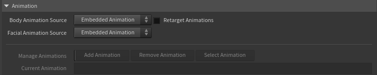
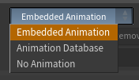
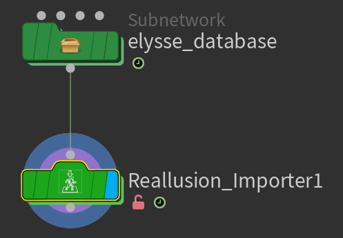

# Animation

The tool plays the motion baked into your imported character, and it can also manage a small library of extra animation clips — added from **FBX files or USD motion clips** — so you can switch between motions on the same character.

!!!info Using a clip from a different character?
A motion clip carries the skeleton and proportions of the character it was exported with. Clips made for _this same character_ play back directly. For a clip authored on a **differently-proportioned** Character Creator character, turn on [**Retarget Animation**](#retarget-animation) — it remaps the motion onto your character, and the facial performance (expressions, visemes, blinks) comes along automatically.
!!!

The **body** and the **face** are chosen separately, so you can keep one character's body motion while driving the face from a different clip — or freezing it.

## Body Animation Source

Where the character's **body** motion comes from (the skeleton — torso, limbs, head):

* **Embedded Animation** — the motion baked into the character's own FBX.
* **Animation Database** — the active clip from a library of clips you've added.
* **No Animation** — freezes the body in a static pose, held at the timeline's start frame. Use this for stills, look-dev, or any time you want the character motionless without removing its animation.

## Facial Animation Source

Where the **face** comes from — expressions, visemes, blinks, eye gaze, wrinkle response — **independent of the body**:

* **Embedded Animation** — the facial performance baked into the character's own FBX.
* **Animation Database** — the active database clip's facial performance.
* **Bypass Animation** — freezes the face in its neutral expression while the body keeps moving.

The headline use is **Body = Animation Database + Facial = Embedded**: borrow a body performance (mocap, a clip from another character) while keeping *this* character's own facial animation. When the two sources differ, the chosen face is grafted onto the body and **Retarget Animations** turns on automatically, so the body first conforms to this character's skeleton — otherwise the face would sit on a mismatched skull.

!!!info Bypass note
Bypass freezes the facial *blendshapes* (visemes, expressions, blinks). The head, jaw and eye *bones* still follow the body clip, so they can still move — it calms the face rather than freezing it outright.
!!!

## Retarget Animation

A motion clip is normally tied to the proportions of the character it was made for. **Retarget Animation** lets you drive _this_ character with a database clip authored on a **different** Character Creator character. **Off by default.**

* **Off** — leave it off for clips made for **this** character. They already match its skeleton and proportions, so they play back correctly as-is, at no extra cost.
* **On** — turn it on for a clip from a **different** character. The body is proportion-matched to the source motion, and the teeth, tongue and eyes are corrected so they stay seated instead of clipping. The facial performance transfers automatically — every Character Creator character shares the same blendshape set.

!!!info Which one do you need?
If a database clip makes the character look broken — teeth or eyes clipping through the face, distorted proportions — it almost certainly came from a different character. Turn Retarget Animation on and it snaps into place.
!!!

It matters most when **Body Animation Source** is **Animation Database** with a clip from another character. It also turns on **automatically** in two cases: whenever **Facial Animation Source** differs from **Body Animation Source**, and whenever a database clip's **format** (USD/FBX) differs from the **Import** mode — the two exports bind different rest poses. Retargeting costs some extra cooking, so leave it off for a clip made for this character in the same format.

If this character has rig parts the clip's character doesn't — hair spring bones, accessory rigs — those can't receive motion from the clip. They follow along rigidly instead (hair rides the head with no secondary motion).

!!!success
Even with automatic retargeting, the result is approximate: proportions may distort if the characters are different enough (eg. a stylized animal getting animation from a humanoid). Keep serious animation authoring in Character Creator/iClone.
!!!

## Building an animation library

Add extra motion clips — FBX or USD — and switch between them.

### Add Animation

Opens a file browser to add a motion clip: an **FBX** animation export, or a **USD motion clip** (the `Motions` folder Character Creator writes beside every USD character export). The first clip you add creates a small **animation database** — a green container node placed next to the Reallusion Importer. Adding a clip switches the source to Animation Database and makes the new clip active.

**USD clips are the light option** — instant to load, very little memory, while each FBX clip costs significant RAM. A USD clip binds to the character's USD export, found automatically next to the clip; you're only asked to point at it if none is found.

Both formats mix freely in one database, and either works in either import mode. Driving an **FBX-imported character with USD clips** is a particularly good combination — you keep the FBX-only features (expression wrinkles, full hair re-dye) while the clips stay featherweight. When a clip's format differs from the Import mode, [**Retarget Animation**](#retarget-animation) turns on automatically.

### Select Animation

Choose which clip in your library plays on the character. Switching clips is instant.

### Current Animation

A display-only field showing the name of the clip currently playing.

### Remove Animation

Removes a clip from the library and frees its memory. Remove the last clip and the source falls back to Embedded FBX Animation.

!!!danger
**FBX animation is the biggest driver of memory use in the whole tool**, and the cost scales with a clip's **length** — Houdini holds the expanded character for every frame in the range. Often several gigabytes per clip, more for long, multi-thousand-frame clips. Keep frame ranges to what you actually need, add only the clips you'll use, and use **Remove Animation** to free clips you're done with (it also clears the scene cache). **USD motion clips don't have this problem** — as stored clips they stay light regardless of length. See [Performance & Caching](../reference/performance.md).
!!!

## Workflow tips

* **Prefer USD motion clips when you have them** — instant to load, near-zero RAM, and they work on FBX-imported characters too.
* Keep your FBX clip library lean. Two or three active clips is comfortable; a dozen will eat your RAM.
* Remove an FBX clip once you're done with it rather than leaving it loaded.
* If you're only using the character's own baked motion ("Mesh + Motion" FBX export in CC), skip the database entirely — leave the source on Embedded FBX Animation.
