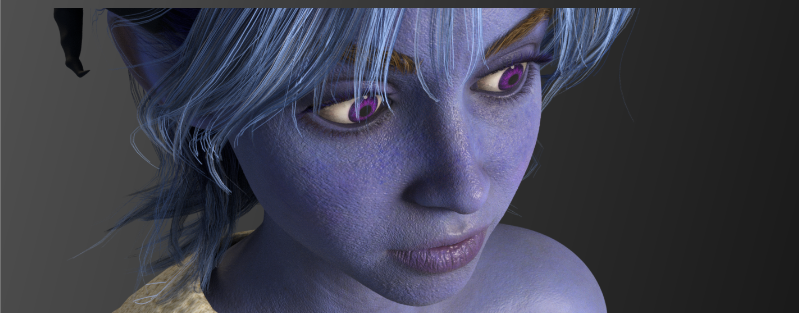
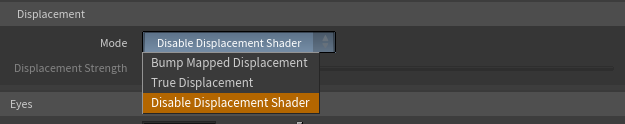

# Displacement

Displacement adds real, fine surface relief to your character — skin pores, deep wrinkles, fabric weave — by physically pushing the geometry around at render time, based on displacement maps. It's more expensive than a normal map, but it produces genuine silhouette detail that catches light realistically.

This only applies to characters exported **with displacement maps** (Character Creator 5 exports these for many assets). If your character has none, these controls simply have nothing to act on.

## Displacement controls

The Displacement folder lives inside the Skin folder on the controller.

### Mode

Chooses how displacement maps are used:

* **Disable Displacement Shader** _(default)_ — displacement maps are ignored. Fastest, and a fine default for most work.
* **Bump** — uses the displacement map as a bump map. This fakes the lighting detail cheaply without actually moving geometry. A good middle ground.
* **True Displacement** — actually subdivides and displaces the geometry for real silhouette-level detail. The most realistic and the most expensive; it requires the mesh to be subdivided at render time.

!!!info
Start with **Disable** or **Bump** while you work, and switch to **True Displacement** only for final hero renders where the extra detail matters and the longer render time is acceptable.
!!!

### Displacement Strength

Scales how far the displacement pushes the surface. Displacement maps are sensitive, so the useful values are small — around **0.002** is typical. If your surface looks like it's exploding or developing cracks, your strength is too high; bring it down.

!!!warning
True Displacement requires the mesh to be treated as a subdivision surface and diced finely by Karma, which the tool sets up for you automatically when you choose that mode. Be aware this increases both render time and memory use.
!!!
