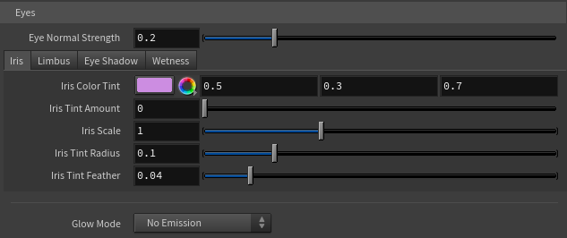
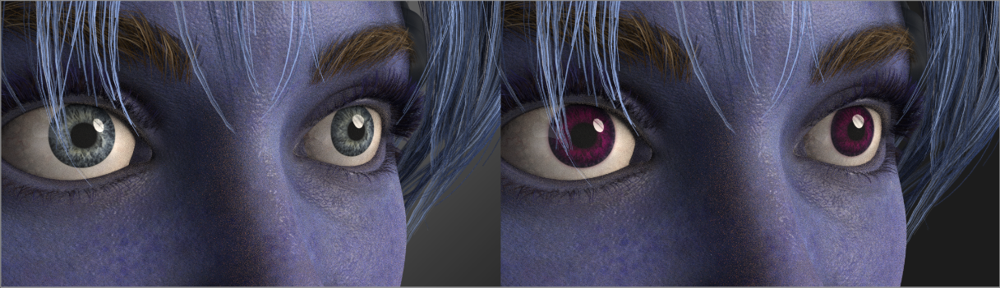
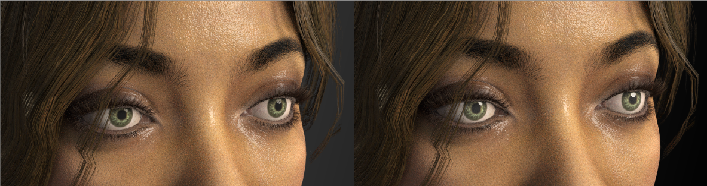
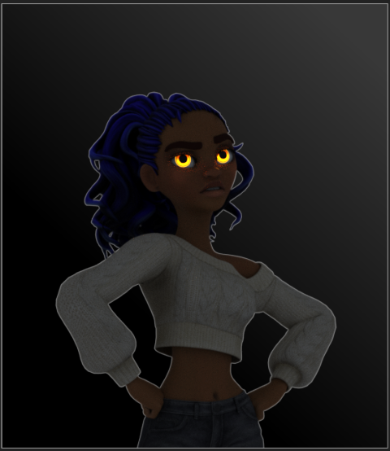

# Eyes

The Eyes folder gives you deep control over your character's eyes — recreating much of Character Creator's HD eye look, plus stylized glow effects. The controls are organized into tabs: **Iris**, **Limbus**, **Sclera**, **Eye Shadow**, and **Wetness**, with the **Glow** controls below.

!!!info Why these controls exist
Character Creator's HD eye shader bakes very little of its look into the exported file, so the eye imports with a neutral base color. These controls rebuild that look in Houdini. A few aspects of CC's eye (true depth/parallax, pupil resize) can't be reproduced because the data isn't exported — see [Limitations](../reference/limitations.md). The short version: author your eye look here, not by trying to match a CC render.
!!!

!!!success USD import — real Character Creator values already applied
If you imported via **USD**, the tool reads Character Creator's actual eye shader values and has **already seeded these controls with them** — real iris color, iris size, limbal ring width, and sclera shading — so your starting point is the character's real eye rather than a generic default. (In FBX mode those values aren't exported, so you dial them in yourself.) Everything here stays fully adjustable either way, and **Reset to Defaults** returns to the real Character Creator values in USD mode.
!!!

## Eye Normal Strength

At the top of the Eyes folder, separate from the head skin. Controls the strength of the eyeball's surface detail (sclera veins, iris relief). Kept low by default (0.2) because Character Creator's eye normal map is very strong — at full strength the veins read as raised welts. Raise for more surface detail, lower for a smoother eyeball.

## Iris tab

**Iris Color Tint** + **Iris Tint Amount** — reproduces Character Creator's iris color (which isn't baked into the export). Set the tint to your desired iris color, then raise the amount from 0 to apply it. The tint is masked to the iris, so the white of the eye stays white. The amount can exceed 1 (type a higher value) to over-saturate for a more intense color.

**Iris Scale** — resizes the iris. 1 is the original; above 1 is bigger, below 1 is smaller. Keep close to 1 for realism — large changes distort the iris/sclera boundary.

**Iris Tint Radius** + **Iris Tint Feather** — the size and edge softness of the tint disc. Increase the radius until the tint just covers the iris without spilling onto the white; feather softens the edge.

## Limbus tab

The limbus is the dark ring at the iris/sclera boundary — a subtle but powerful realism cue.

**Limbus Color** (default black), **Limbus Width**, **Limbus Scale**, **Limbus Strength** (default 0, off), and **Limbus Feather**. Raise the strength to bring in the dark ring; adjust width for its thickness and feather for the softness of its outer edge. **Limbus Scale** sizes the ring as a multiple of the Iris Tint Radius — 1 sits right at the iris edge, below 1 pulls it inward, above 1 pushes it out onto the white — so you can fit the ring to the iris without touching the Iris Tint Radius. A little goes a long way.

## Sclera tab

The sclera is the white of the eye. These two controls let you tint it — useful for a subtle warm/cool push toward realism, or a fully stylized colored eye.

**Sclera Color** (default white) and **Sclera Tint Amount** (default 0, off). Raise the amount to apply the tint. The mask is the exact inverse of the iris disc, so the iris is never affected — only the white tints. Keep the tint very subtle for realism; saturated colors read as stylized.

## Eye Shadow tab

A soft shadow the eyelids cast onto the eyeball, faked on the eye-occlusion mesh (Character Creator's exported occlusion has no shadow gradient of its own). Biased toward the top, where the upper lid shadows most.

**Eye Shadow Color** (default black), **Eye Shadow Strength** (on by default at 0.25 — without it the eyeball reads as too open/bulging versus Character Creator; set 0 to turn it off), **Eye Shadow Radius** (default 0.4 — how far in from the edge it reaches; bigger is more coverage), and **Eye Shadow Feather** (default 0.1 — edge softness).

## Wetness tab

**Eye Glossiness** — the overall wetness/shine of the eyeball. 1 is as imported; above 1 is glossier and wetter (sharper reflections). This works on **every character**, so it's your reliable wet-eye control. A typical wet look is around 1.2–2.

**Tearline Gloss**, **Tearline Presence**, and **Tearline Ripple** — control the wet rim along the lids, _on characters that ship a tear-line mesh_. Not all characters have one; on those that don't, these have no effect (use Eye Glossiness instead). The tear-line is built as a fully transparent water film: you always see the eye through it, so these controls only shape its glint and can never darken the eye.

* **Tearline Gloss** is the rim's roughness (default 0.25, Character Creator's wet reference). Very low reads as a hard mirror glint; around 0.45 reads drier.
* **Tearline Presence** scales the strength of the wet reflection (default 1.0, a physically full water film). The glint itself comes from what your lights or HDRI give it to reflect — with a flat-color environment there's little to mirror, so a studio HDRI on the dome light makes it read far wetter. The slider caps at 1 but accepts higher typed values to overdrive.
* **Tearline Ripple** adds fine wet-ripple micro-detail (default 0.3), breaking the reflection into tiny moist bumps so the rim reads as genuinely wet rather than a flat mirror sheen. 0 is smooth/mirror.

## Glow (stylized emission)

Below the tabs, the Glow controls make the eyes emit light — for fantasy characters, creatures, or robots.

### Glow Mode

* **No Emission** — normal eyes (default).
* **Flat Color** — the whole eye glows one color.
* **Use Eye Texture** — the eye glows its own texture colors.
* **Multiply with Texture** — texture colors tinted by the glow color.
* **Iris (Circle)** — only the iris area glows, soft-edged.
* **Iris (Dot)** — a solid glowing disc at the eye center.

### Glow controls

**Glow Strength** and **Glow Color** (for the Flat, Texture, and Multiply modes); **Iris Color**, **Iris Strength**, **Iris Radius**, and **Iris Feather** (for the Iris modes). These update live in the render.

## Eyes as a light source

The glowing eyes can actually illuminate the scene — casting light onto the face and surroundings.

**Eyes Cast Light**, **Light Quality** (reduces noise the eye light casts), and **Light Intensity** (how strongly the eyes light surroundings, independent of visible glow brightness).

!!!info The eye-light controls need a render restart
Eyes Cast Light, Light Quality, and Light Intensity are Karma render properties, read only when a render begins. Restart your Karma render after changing them. The glow color and strength update live.
!!!
