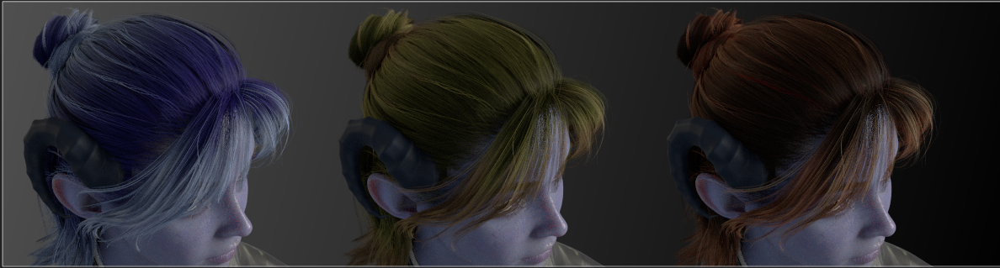
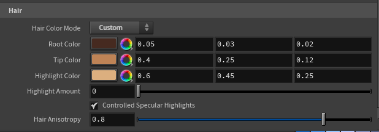
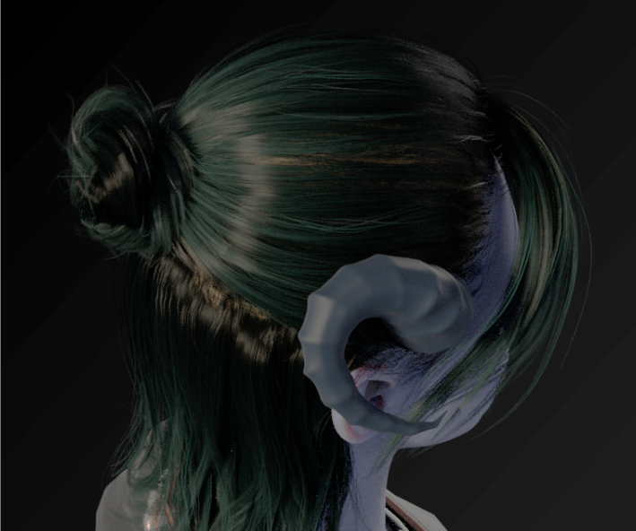
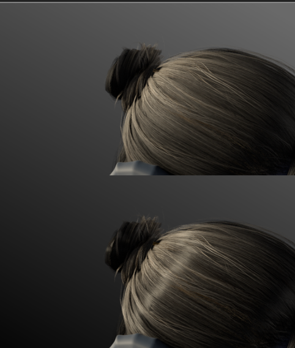

# Hair

The Hair folder is one of the tool's most powerful features: a complete hair **re-dye system**. You can recolor any compatible character's hair — change it from brown to silver, add ombré fades, paint in highlight streaks — all without going back to Character Creator. On top of that, you get controls for realistic hair sheen.

## A quick note on what's possible

Character Creator bakes your chosen hair color into the exported texture. This tool can use that baked color as-is, **or** rebuild the color from scratch using your own choices — while preserving all the fine strand detail that makes hair look like hair.

This works on hair that carries Character Creator's hair maps (the root, ID, and flow maps). Most styled scalp hair does. Simpler hair, caps, and some brows/lashes bake everything into a flat color and will keep their original look — the recolor controls just won't affect them. The tool handles this automatically; you don't need to know which is which.

!!!info
This is one of several character-dependent features — see [Limitations & Expectations](../reference/limitations.md) for the full picture of what varies by export.
!!!

!!!warning USD import — some hair features are FBX only
The root-to-tip **ombré**, **ID-based highlight streaks**, and **flow-based anisotropic sheen** rely on Character Creator's hair root/ID/flow maps, which its **USD** export leaves out — so those are **FBX import only** (their controls are disabled in USD mode). A **flat re-dye** and the **Lightness (Bleach)** control still work in USD mode, so you can recolor and lighten hair — just not drive a root-to-tip gradient or paint highlight streaks. Import as FBX for the full hair system. See [USD vs FBX](../getting-started/import-modes.md).
!!!

## Hair Color Mode

The master switch for the whole system:

* **Baked (CC)** _(default)_ — uses the hair color exactly as Character Creator exported it. Your character looks just like it did in CC. Nothing changes.
* **Custom** — re-dyes the hair using the controls below. The strand detail is preserved, but the _color_ now comes from your choices.

When you switch to Custom, the color controls appear.

## Root Color & Tip Color (the ombré)

These two create the root-to-tip color gradient — the **ombré** effect:

* **Root Color** — the color at the roots (near the scalp).
* **Tip Color** — the color at the ends of the hair.

Set the tips lighter than the roots for a natural, sun-kissed fade. Or set both to the same color for a solid, uniform dye. Want a bold fantasy look? Try deep blue roots fading to bright cyan tips — the gradient follows the hair's natural flow.

!!!success
The gradient uses the hair's built-in root map, so it follows the actual structure of the hairstyle — roots stay at the roots and tips at the tips, even on complex styles.
!!!

## Lightness (Bleach)

Root and Tip Color change the _hue_ of the hair, but they can't make dark hair lighter on their own. Here's why: the re-dye keeps the original strand detail by preserving the diffuse's brightness, then paints your color on top. On dark brown or black hair that brightness is very low — so no color choice can read lighter than the original strands. Tint a brown-haired character golden and you get a dark, muddy gold, not blonde.

**Lightness** fixes this. It lifts the overall brightness of the hair — the digital equivalent of bleaching. Unlike the color controls, it works in **both Baked and Custom modes** (independent of Hair Color Mode), so you can brighten a character's hair without re-dyeing it at all:

* **1** _(default)_ — unchanged.
* **Above 1** — bleaches the hair lighter, toward blonde and platinum. As with real bleaching, the brightest strands blow out first.
* **Below 1** — darkens the hair.

Dark hair needs a big lift to actually read light — the slider goes to 20, and you can type higher still if you need it. To turn a dark-haired character blonde in Custom mode, set golden Root and Tip Colors **and** push Lightness up until the hair reaches the shade you want.

## Highlight Color & Highlight Amount (the balayage)

On top of the ombré, you can paint in **highlight streaks** — like balayage in a real salon:

* **Highlight Color** — the color of the highlighted strands.
* **Highlight Amount** — how strongly the highlights show. **0** turns them off entirely; raise it to bring them in.

The highlights land on specific strands (defined by the hair's ID map), giving a natural, streaky variation rather than a uniform tint. Subtle amounts look most realistic, but crank it up for a bold two-tone look.

## Controlled Specular Highlights

This toggle controls how the hair's shine behaves:

* **On** _(default)_ — uses the hair's specular mask to restrain over-bright highlights, matching Character Creator's intended, controlled look.
* **Off** — full, unrestrained specular on every strand, for a shinier, glossier appearance.

The difference is most visible under a hard, direct light raking across the hair. If your hair looks too shiny or "hot" in places, leaving this on tames it; if it looks too flat, try turning it off.

## Hair Anisotropy

This is what makes hair sheen look like _hair_ rather than plastic. Real hair reflects light in a band that runs **along the strands** — that characteristic streak of highlight that travels as the light or camera moves. This control creates that effect.

* **0** — a plain, round highlight (no anisotropy).
* **Higher values** _(default 0.8)_ — the highlight stretches along the strand direction, following the hair's flow map for a realistic directional sheen.

!!!info
Anisotropy is most visible when there's a clear light hitting the hair. If you don't see much difference, make sure a light is catching the hair and try viewing from an angle where the highlight is visible.
!!!

## Brows

The **Brows** sub-folder (at the bottom of the Hair folder) re-tints the eyebrows independently of the scalp hair, so you can match them to a dyed hair color.

* **Brow Tint Color** — the hue to push the brows toward.
* **Brow Tint Amount** — how strongly it's applied. **0** _(default)_ keeps the brows' original baked color; raise it to bring in the tint.

Like the hair re-dye, the tint preserves the brows' strand detail — only the hue is replaced. It affects eyebrow materials only (not scalp hair or lashes). Brow underlay layers that export no diffuse texture can't be tinted and stay as they are.

## Putting it together

A natural-looking custom dye might use: dark brown roots, warm caramel tips, a touch of golden highlight at a low amount, Controlled Specular on, and Anisotropy around 0.8. To go blonde on a dark-haired character, add some Lightness on top so the strands actually brighten. A bold stylized look might use saturated complementary colors for roots and tips with strong highlights. Experiment — every control updates live, so you can see the result immediately.
