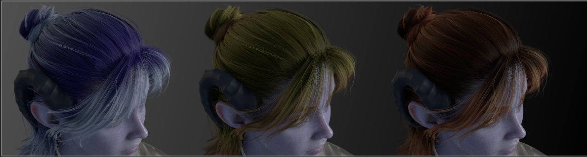
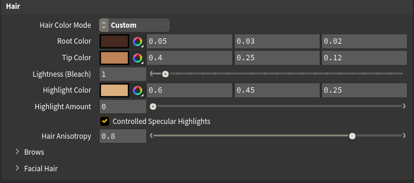
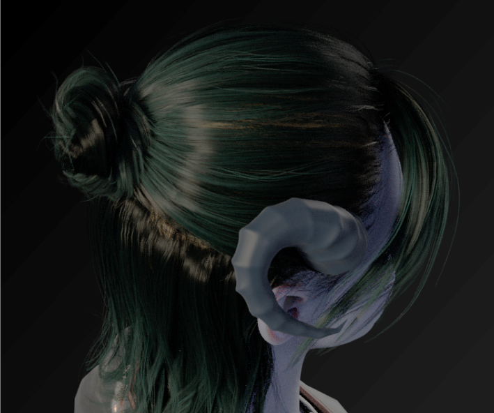
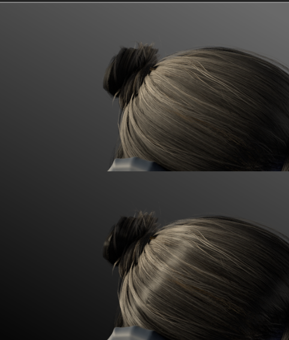

# Hair

The Hair folder is one of the tool's most powerful features: a complete hair **re-dye system**. Recolor any compatible character's hair — brown to silver, ombré fades, painted-in highlight streaks — without going back to Character Creator. You also get controls for realistic hair sheen.

## A quick note on what's possible

Character Creator bakes your chosen hair color into the exported texture. This tool can use that baked color as-is, **or** rebuild the color from scratch using your own choices, while preserving all the fine strand detail that makes hair look like hair.

It works on hair carrying Character Creator's hair maps (root, ID, and flow). Most styled scalp hair does. Simpler hair, caps, and some brows/lashes bake everything into a flat color and keep their original look — the recolor controls just won't touch them. The tool handles this automatically; you don't need to know which is which.

!!!info
This is one of several character-dependent features — see [Limitations & Expectations](../reference/limitations.md) for the full picture of what varies by export.
!!!

!!!warning USD import — some hair features are FBX only
The root-to-tip **ombré**, **ID-based highlight streaks**, and **flow-based anisotropic sheen** rely on Character Creator's hair root/ID/flow maps, which its **USD** export leaves out — so those are **FBX import only** (disabled in USD mode). A **flat re-dye** and **Lightness (Bleach)** still work in USD mode, so you can recolor and lighten hair — just not drive a root-to-tip gradient or paint highlight streaks. Import as FBX for the full hair system. See [USD vs FBX](../getting-started/import-modes.md).
!!!

## Hair Color Mode

The master switch for the whole system:

* **Baked (CC)** _(default)_ — the hair color exactly as Character Creator exported it. Nothing changes.
* **Custom** — re-dyes the hair using the controls below. Strand detail is preserved; the _color_ now comes from your choices.

Switch to Custom and the color controls appear.

## Root Color & Tip Color (the ombré)

These two create the root-to-tip color gradient — the **ombré** effect:

* **Root Color** — the color at the roots (near the scalp).
* **Tip Color** — the color at the ends of the hair.

Set the tips lighter than the roots for a natural, sun-kissed fade, or set both to the same color for a solid, uniform dye. For a bold fantasy look, try deep blue roots fading to bright cyan tips — the gradient follows the hair's natural flow.

!!!success
The gradient uses the hair's built-in root map, so it follows the actual structure of the hairstyle — roots stay at the roots, tips at the tips, even on complex styles.
!!!

## Lightness (Bleach)

Root and Tip Color change the hair's _hue_, but can't make dark hair lighter on their own: the re-dye keeps the original strand detail by preserving the diffuse's brightness, then paints your color on top. Dark brown or black hair has very low brightness, so no color choice can read lighter than the original strands — tint a brown-haired character golden and you get dark, muddy gold, not blonde.

**Lightness** fixes this. It lifts the overall brightness of the hair — the digital equivalent of bleaching. Unlike the color controls, it works in **both Baked and Custom modes** (independent of Hair Color Mode), so you can brighten a character's hair without re-dyeing it at all:

* **1** _(default)_ — unchanged.
* **Above 1** — bleaches the hair lighter, toward blonde and platinum. Like real bleaching, the brightest strands blow out first.
* **Below 1** — darkens the hair.

Dark hair needs a big lift to actually read light — the slider goes to 20, and you can type higher still. To turn a dark-haired character blonde in Custom mode, set golden Root and Tip Colors **and** push Lightness up until the hair reaches the shade you want.

## Highlight Color & Highlight Amount (the balayage)

On top of the ombré, paint in **highlight streaks** — like balayage in a real salon:

* **Highlight Color** — the color of the highlighted strands.
* **Highlight Amount** — how strongly the highlights show. **0** turns them off entirely; raise it to bring them in.

Highlights land on specific strands (defined by the hair's ID map), giving natural, streaky variation rather than a uniform tint. Subtle amounts look most realistic; crank it up for a bold two-tone look.

## Controlled Specular Highlights

How the hair's shine behaves:

* **On** _(default)_ — uses the hair's specular mask to restrain over-bright highlights, matching Character Creator's intended, controlled look.
* **Off** — full, unrestrained specular on every strand, for a shinier, glossier appearance.

The difference is most visible under a hard, direct light raking across the hair. If your hair looks too shiny or "hot" in places, leave this on; if it looks too flat, try turning it off.

## Hair Anisotropy

What makes hair sheen look like _hair_ rather than plastic. Real hair reflects light in a band that runs **along the strands** — that characteristic streak of highlight that travels as the light or camera moves. This control creates that effect.

* **0** — a plain, round highlight (no anisotropy).
* **Higher values** _(default 0.8)_ — the highlight stretches along the strand direction, following the hair's flow map for a realistic directional sheen.

!!!info
Anisotropy is most visible with a clear light hitting the hair. If you don't see much difference, make sure a light is catching the hair and view from an angle where the highlight is visible.
!!!

## Brows

The **Brows** sub-folder, near the bottom of the Hair folder, gives the eyebrows their own controls so you can match them to a dyed hair color.

* **Brow Lightness** — lifts the brows' overall brightness. **1** _(default)_ is unchanged; the slider runs to 20 and accepts higher typed values.
* **Brow Tint Color** — the hue to push the brows toward.
* **Brow Tint Amount** — how strongly it's applied. **0** _(default)_ keeps the brows' original baked color; raise it to bring in the tint.

**Raise Brow Lightness first.** Character Creator's eyebrow textures are almost black, and a tint can only shade the strand detail that's already there — so whatever color you choose gets multiplied back down to near-black, and the tint reads as broken when it is in fact working perfectly. Lift the brows and the color appears. Somewhere around **6 to 14** is where brows typically start reading properly, which is why the slider goes as high as it does.

Brow Lightness applies at **any** tint amount, including 0 — so it's also how you grey or lighten eyebrows without re-tinting them at all.

Like the hair re-dye, the tint preserves the brows' strand detail; only the hue changes. Brow underlay layers that export no diffuse texture can't be tinted and stay as they are.

!!!warning Custom hair mode re-dyes the brows too
Eyebrows still run through the main scalp re-dye, so with **Hair Color Mode** set to _Custom_ your Root and Tip colors reach the brows as well, and these Brow controls layer on top of that result. Facial hair does **not** work this way — see below. If the brows land somewhere unexpected after a custom dye, this is why.
!!!

## Facial Hair

Beards, moustaches and sideburns have their own sub-folder below Brows.

* **Facial Hair Lightness** — lifts the beard's brightness. **1** _(default)_ is unchanged; slider to 20, higher values accepted.
* **Facial Hair Tint Color** — the hue to push the facial hair toward.
* **Facial Hair Tint Amount** — how strongly it's applied. **0** _(default)_ keeps the exported color.

**Facial hair is deliberately decoupled from the hair on the head.** It used to run through the same re-dye, which meant every hair color change dragged the beard along with it — dark hair with a grey beard simply couldn't be authored. The scalp controls now leave facial hair alone entirely, and this folder is the only thing that colors it.

The darkness problem from the Brows section applies here too, though less severely: beard textures are dark, so raise **Facial Hair Lightness** before deciding the tint does nothing. Beards start to blow out from around **4x** — much earlier than brows, because Character Creator exports them a good deal brighter to begin with.

Beards do still follow **Controlled Specular Highlights** and **Hair Anisotropy**. Those shape the strand shading rather than the color, and a beard should catch the light the same way the hair does.

Characters with no facial hair are unaffected — the controls just have nothing to act on.

!!!info What counts as facial hair
Character Creator names these materials `Beard1`, `Beard2` and so on regardless of what the piece actually is. Moustaches, sideburns, soul patches and chinstraps all arrive as beard materials, so they all follow these controls.
!!!

## Putting it together

A natural-looking custom dye might use dark brown roots, warm caramel tips, a touch of golden highlight at a low amount, Controlled Specular on, and Anisotropy around 0.8. To go blonde on a dark-haired character, add Lightness on top so the strands actually brighten. A bold stylized look might use saturated complementary colors for roots and tips with strong highlights. Experiment — every control updates live, so you see the result immediately.
