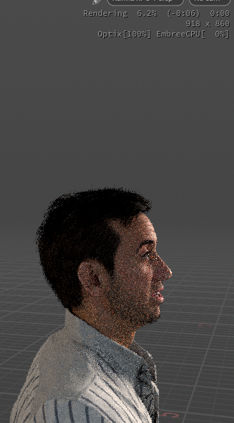

# Rendering

The tool builds your character's materials specifically for **Karma XPU**, Houdini's GPU-accelerated production renderer. This page covers how to get your character on screen and the optional one-click render setup.

## Rendering with Karma XPU

Your shaded character lives in Solaris (the `/stage` context). To see it rendered:

1. Click **Go to LOPs** on the Reallusion Importer node to jump to the LOP network.
2. Set your viewport to use the Karma renderer.
3. You'll need a camera and some lights for a proper render — which the tool can build for you (see below).

!!!info Works on both Karma XPU and Karma CPU
The materials are built and tuned for **Karma XPU**, which is the recommended renderer for the look and speed they were designed around — but they also render correctly in **Karma CPU**, so you're covered if your setup favours CPU.
!!!

## Motion blur

The tool computes a velocity attribute on the character's geometry, so **motion blur works automatically** on animated characters in Karma — fast movement renders with natural blur rather than looking strobed or unnaturally crisp. Enable motion blur in your Karma render settings as usual; the character's motion will be picked up without any extra setup.

## Optional one-click render setup

If you'd like a lighting and camera rig set up automatically, the tool can build one for you. When enabled, building a character also creates:

* A **camera**, framed on the character.
* A **three-point light rig** — key, fill, and rim lights — the standard setup for flattering character lighting.
* A **Karma render settings** node, configured and ready.

This setup is chained after the lookdev controller, so it picks up your character automatically. It's the fastest way to get from import to a good-looking render.

Once the rig is built, the **Light Setup** control in the Quality folder on the lookdev controller lets you switch between two pre-tuned looks — **Cinematic** (warm, moody key light) and **Neutral** (flat, even lighting) — without touching the nodes themselves.

!!!success
The auto-built rig is a great starting point. Feel free to move the lights, adjust their intensities, or swap the camera for your own — it's all standard Houdini nodes you can edit freely.
!!!

## Performance while look-developing

Rendering skin with subsurface scattering and refractive eyes is expensive. While you're setting up shots and dialing in looks, use the **Quality ▸ Preview** preset (see [The Lookdev Controller](lookdev-controller.md)) to turn off the costly effects and keep the viewport responsive. Switch to **Production** for your final renders.

See [Performance & Caching](../reference/performance.md) for more on keeping things fast and managing memory.

## A note on render properties

A few controls — SSS Quality and the eye-light controls — are Karma _render properties_. Karma reads these only when a render starts, so changing them requires restarting your Karma render to take effect. Every other control updates live. The controls that behave this way are noted on their respective pages and in their tooltips.
