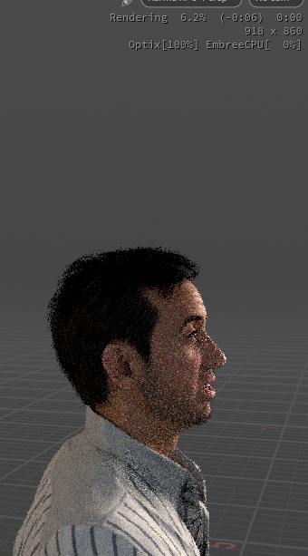

# Rendering

The tool builds your character's materials specifically for **Karma XPU**, Houdini's GPU-accelerated production renderer. This page covers getting your character on screen, plus the optional one-click render setup.

## Rendering with Karma XPU

Your shaded character lives in Solaris (the `/stage` context). To see it rendered:

1. Click **Go to LOPs** on the Reallusion Importer node to jump to the LOP network.
2. Set your viewport to use the Karma renderer.
3. You'll need a camera and some lights for a proper render — the tool can build these for you (see below).

!!!info Works on both Karma XPU and Karma CPU
The materials are built and tuned for **Karma XPU**, the recommended renderer for the look and speed they were designed around — but they also render correctly in **Karma CPU**, so you're covered if your setup favours CPU.
!!!

## Color management and ACES

The tool inherits your scene's color management rather than imposing its own. It never sets a view transform, never applies a tonemap, and never overrides your OCIO config — whatever you've configured is what you get.

What makes that safe is that **every texture is tagged with its colorspace explicitly**, at build time:

* **Color maps** — diffuse, and the wrinkle diffuse sets — are tagged `sRGB`.
* **Everything else** — normal, roughness, metallic, opacity, ambient occlusion, displacement, and the hair flow and ID maps — is tagged `raw`.

Nothing is left on "auto" and nothing is baked into an assumed space, so OCIO converts each texture into whatever working space your scene uses. In practice that means an **ACES pipeline works out of the box** — the materials were developed and tuned in an ACEScg working space, so an ACES look is what the tool was built for, not something bolted on afterwards. Full character builds have been verified under two generations of ACES config, and the colorspace tags resolve correctly in every ACES **CG** and **Studio** config tested, across Houdini 20.5, 21, and 22.

Two things worth knowing if you're on ACES:

* The optional light rig (below) puts a studio `.hdr` on its dome light for reflections. That one texture isn't explicitly tagged, so it follows your config's file rules. If lighting accuracy matters to you, use your own IBL or set the dome light's colorspace yourself. Your character's materials are unaffected either way.
* The shipped material defaults were tuned while viewing un-tone-mapped. Seen through a full ACES output transform you'll get the same data through a filmic curve — a slightly softer render. Nothing's wrong; your key light's exposure and **SSS Amount** are the two dials worth a nudge.

!!!info Not sure what config you're on?
Houdini 20.5 and later ship three ACES-based OCIO configs under `$HFS/packages/ocio`, and which one you use decides your working space. The **cg** config works in ACEScg — that's the one to point `OCIO` at for an ACES setup. Houdini's own **houdini** config works in linear Rec.709. Textures convert correctly under either, because they're tagged rather than assumed.

The **reference** config is the one exception: it doesn't define a standard sRGB texture space at all, so the tool's tags can't resolve there and you'll get an error rather than a wrong-looking render. It isn't meant for texturing work — use the cg config instead.
!!!

## Motion blur

The tool computes a velocity attribute on the character's geometry, so **motion blur works automatically** on animated characters in Karma — fast movement renders with natural blur instead of looking strobed or unnaturally crisp. Just enable motion blur in your Karma render settings as usual; the character's motion is picked up with no extra setup.

## Optional one-click render setup

If you want a lighting and camera rig set up automatically, the tool can build one for you. When enabled, building a character also creates:

* A **camera**, framed on the character.
* A **three-point light rig** — key, fill, and rim lights — the standard setup for flattering character lighting.
* A **Karma render settings** node, configured and ready.

This setup chains after the lookdev controller, so it picks up your character automatically — the fastest way from import to a good-looking render.

Once the rig is built, the **Light Setup** control in the Quality folder on the lookdev controller switches between two pre-tuned looks — **Cinematic** (warm, moody key light) and **Neutral** (flat, even lighting) — without touching the nodes themselves.

!!!success
The auto-built rig is a great starting point. Move the lights, adjust intensities, or swap the camera for your own — it's all standard Houdini nodes you can edit freely.
!!!

## Performance while look-developing

Rendering skin with subsurface scattering and refractive eyes is expensive. While setting up shots and dialing in looks, use the **Quality ▸ Preview** preset (see [The Lookdev Controller](lookdev-controller.md)) to turn off the costly effects and keep the viewport responsive. Switch to **Production** for final renders.

See [Performance & Caching](../reference/performance.md) for more on keeping things fast and managing memory.

## A note on render properties

A few controls — SSS Quality and the eye-light controls — are Karma _render properties_. Karma reads these only when a render starts, so changing them requires restarting your Karma render to take effect. Every other control updates live. The controls that behave this way are noted on their pages and in their tooltips.
