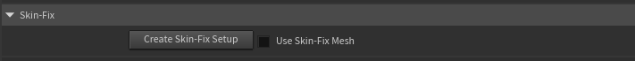
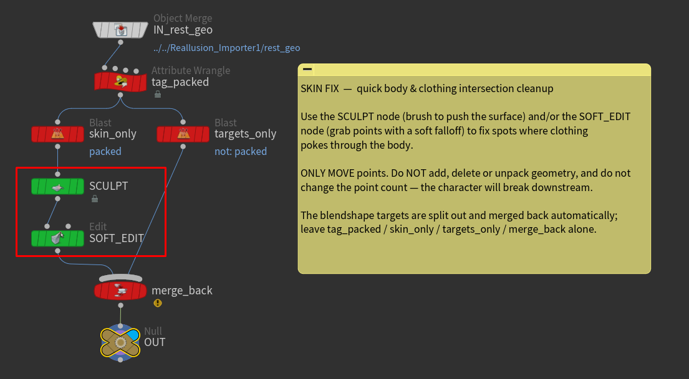

# Skin Fix

Character Creator outfits don't always sit perfectly on every body, so you'll sometimes see a sleeve, collar, or boot poking through the skin. **Skin Fix** gives you a small, editable workspace to nudge the mesh and clean those intersections up, before the character is skinned and cached — so the fix carries all the way through to the animated, rendered result.

It's built for **quick body and clothing fixes**, not full mesh sculpting. You move points; you don't change the mesh.

_(This setting is on the main body of the HDA, not the lookdev controller.)_

## How it works

When you press **Create Skin-Fix Setup**, the asset builds a small container node (muted gold) just to the left of the importer. Inside, the character's rest mesh is split into two streams for you:

* the **editable skin** — the polygons you actually fix, wired through a green **Sculpt** node and a green **Soft Edit** node, ready to use;
* the **blendshape data** — packed primitives that carry the character's facial morph targets, routed around your edits and merged back automatically.

You only ever touch the **green** nodes. The red nodes are the plumbing that separates and rejoins the blendshape data — leave them alone.

## Using it

* Press **Create Skin-Fix Setup**. (Pressing it again just jumps you back to the subnetwork.)
* Double-click into the gold container and select the green **Sculpt** node. Brush the surface to push the body in (or a garment out) where they intersect. The **Soft Edit** node is there too, for grabbing a cluster of points with a soft falloff.

* Turn on **Use Skin Fix** to switch the character onto your edited mesh.

That's it — the edit flows downstream through skinning, animation, and rendering.

!!!danger Move points only
Do **not** add, delete, or otherwise change the point count of the mesh — the character depends on a fixed topology downstream and will break if it changes. Don't delete or unpack the blendshape data, and don't touch the red plumbing nodes. Stick to the green Sculpt / Soft Edit nodes and only nudge points around.
!!!

!!!info
**Use Skin Fix** is safe to toggle at any time. If it's on before you've created a setup (or after you delete one), the character simply falls back to the original, unedited mesh — no error.
!!!

!!!success Best for body & clothing
Because the blendshape targets are defined against the original rest shape, edits in areas driven by facial morphs can be partially overridden when those morphs fire. For body and clothing intersections — which have no morphs — it works cleanly. For anything beyond quick fixes, do the work back in Character Creator/ZBrush and re-export.
!!!
