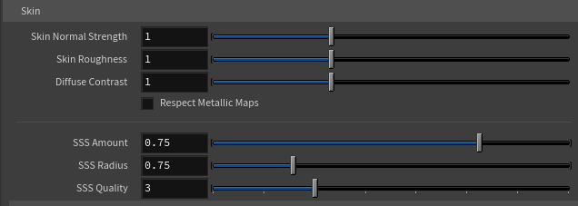

# Skin

The Skin folder on the lookdev controller fine-tunes how your character's skin reads. The tool already builds physically-based skin with subsurface scattering, normal detail, and proper roughness — these controls let you push it toward your taste or your shot's lighting.

## Skin Normal Strength

Controls the intensity of the skin's normal map — the pore-level surface detail and fine wrinkles baked into the texture. **Defaults to 1** (as authored). Lower values smooth the skin out; higher values exaggerate the surface detail.

Use this if a character's skin looks too smooth (raise it) or too noisy/harsh under your lighting (lower it).

## Skin Roughness

A multiplier on the skin's roughness.

* **Below 1** makes skin glossier and more reflective — often more lifelike, since real skin has a subtle sheen, especially on the forehead, nose, and cheekbones.
* **Above 1** makes skin more matte and dry.

Small adjustments go a long way here. Try values like 0.9 or 1.1 before reaching for extremes.

## Diffuse Contrast

Adjusts the contrast of the skin color texture around mid-grey.

* **Above 1** makes freckles, blemishes, and color variation read more strongly — more character and detail.
* **Below 1** flattens and evens out the skin tone.

!!!warning
This control is **very sensitive**. The useful range is roughly **1.0 to 1.1** — even small moves have a strong effect. Nudge it gently.
!!!

## Skin Re-tint sub-folder

A quick way to shift the **overall skin tone** — warmer or cooler, more tan, paler — without going back to Character Creator. It tints the skin **diffuse** toward a color (the subsurface color is left alone), live, across all skin materials (head, body, arms, legs, and nails).

* **Skin Re-tint Color** — the color the skin is tinted toward. The skin diffuse is multiplied by this. **White (the default) does nothing.**
* **Skin Re-tint Amount** — how strongly the tint is applied. **0 (the default)** leaves the skin untouched; **1** fully multiplies the skin by the re-tint color. The slider caps at 3 but accepts higher typed values — above 1 overdrives the tint for a stronger push.
* **Skip Nails** — exclude the fingernail/toenail material from the re-tint, so the nails keep their original color while the rest of the skin is tinted. Off by default.

## Respect Metallic Maps

Off by default. Character Creator sometimes exports metallic maps on teeth and inner-mouth materials that aren't meant to be truly metallic, which can make those areas look wrong. The tool ignores them by default for a correct look.

Turn this **on** only if you have a stylized character with genuinely metallic inner-mouth materials (rare).

## Teeth sub-folder

Character Creator exports teeth close to white and quite glossy, which can blow out under Karma's lighting. This sub-folder (below Skin Re-tint, above Subsurface) tames the teeth and tongue without re-exporting.

* **Teeth Brightness** — overall brightness of the teeth/tongue diffuse. **1 is as exported;** pull it below 1 for more natural, slightly darker teeth. Affects the diffuse only.
* **Teeth Roughness** — a multiplier on teeth/tongue roughness. Teeth are wet, so a sharp specular highlight can clip to white; **raise above 1** to spread and soften that highlight (the main fix for glary, blown-out teeth), below 1 for a wetter, glossier look. 1 is as authored.
* **Teeth Specular** — strength of the wet specular reflection. **1 is full;** lower it to reduce the glossy catchlight that can read as blown-out white on close-ups.
* **Teeth SSS Amount** — subsurface scattering on teeth and tongue only, separate from the skin's SSS Amount. The warm scatter lifts the teeth's midtones and adds to the over-bright look; **lower it to make teeth read more solid/opaque.** 1 is the default. Disabled when Remove SSS is on.

## Subsurface sub-folder

The subsurface controls (**SSS Color**, **SSS Amount**, **SSS Radius**, and **SSS Quality**) live together in a **Subsurface** sub-folder inside Skin. All of them are disabled when **Remove SSS** is on (including the Preview preset).

## SSS Color

The color light picks up as it scatters through the skin — the warm, fleshy glow you see where light passes through thin areas (ears, nostrils, the edge of the nose). **Defaults to a warm skin tone (255, 200, 170).** Push it cooler (bluer/greener) or warmer (more orange/red) to shift the character of the scatter. It applies to both skin and teeth. Most characters look right on the default; reach for it only if the scatter reads too warm or too pink under your lighting.

## SSS Amount

How much subsurface scattering the skin (and teeth) receive. Subsurface scattering is what gives skin its soft, lifelike translucency — but at full strength it can wash out fine surface detail. This control lets you balance the two:

* **1** is full lifelike scatter (softest, most translucent).
* **Lower values** reduce the scatter to recover fine surface detail, at the cost of a slightly waxier look.
* **0** is effectively no scatter.

The default (1) is full lifelike scatter; lower it toward 0 to recover fine surface detail at the cost of a slightly waxier look.

## SSS Radius

How deep light scatters through the skin. This is the detail-recovery companion to SSS Amount:

* **Higher** = softer, more translucent, but washes out fine detail.
* **Lower** = keeps more surface detail but looks firmer.

Use it together with SSS Amount to dial in the balance between lifelike scatter and skin detail. Default 0.75.

## SSS Quality

Controls the subsurface scattering ray limit on skin and teeth. Higher values give cleaner, less noisy subsurface — at the cost of render time. The default (3) is a good balance; raise it for final hero renders if you see noise in the soft, light-penetrating areas (ears, nostrils, lips).

!!!info SSS Quality needs a render restart
This is a Karma render property, which Karma reads only when a render begins. If you change it, restart your Karma render to see the effect.
!!!
