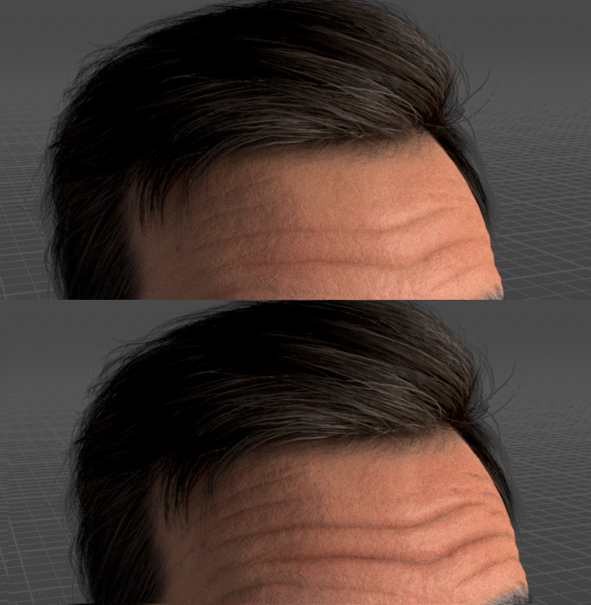
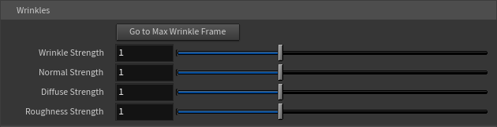
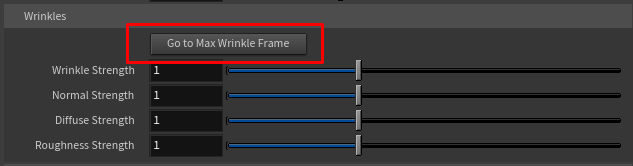

# Wrinkles

One of the tool's standout features is its **animated expression-wrinkle system**. Character Creator faces have a sophisticated wrinkle system — as a character frowns, squints, or opens their mouth, fine wrinkles appear in the right places. This tool reconstructs that system live in Karma, so your character's wrinkles react to their animation in real time.

## How it works (the short version)

You don't need to configure anything for this to work — it's automatic if your character was exported correctly. As the face animates, the tool reads the expression values and blends in the appropriate wrinkle maps (for surface relief, color, and roughness) in the correct facial regions. A surprised brow-raise creates forehead lines; a squint creases the area around the eyes; and so on.

!!!warning
For wrinkles to animate, your character must be exported with **Bake Wrinkles for Still Frame turned OFF**. If your wrinkles aren't moving, that export setting is almost always the cause. See [Preparing Your Character](../getting-started/preparing-your-character.md).
!!!

## The Wrinkles controls

The Wrinkles folder lives inside the Skin folder on the controller.

### Wrinkle Strength

The master intensity for all wrinkles.

* **0** disables wrinkles entirely.
* **1** is the default, tuned to read naturally in Karma (Character Creator's authored wrinkles are scaled to a sensible level so they don't over-read).
* **Above 1** over-drives the wrinkles — useful for hero close-ups or stylized looks where you want the creases to really read.

### Normal / Diffuse / Roughness Strength

These three are per-channel trims layered on top of the master Wrinkle Strength. They let you tune _how_ the wrinkles express themselves:

* **Normal Strength** — the physical relief/depth of the wrinkle (how much it catches light).
* **Diffuse Strength** — the darkening in the crease (how much shadow/color the wrinkle adds).
* **Roughness Strength** — the change in surface sheen along the wrinkle.

In most cases you can leave these at 1 and just use the master Wrinkle Strength. Reach for them when you want, say, deep-looking creases without the extra darkening, or color change without the relief.

## Go to Max Wrinkle Frame

Judging wrinkles is hard when your character is sitting on a neutral frame — there's nothing to see. The **Go to Max Wrinkle Frame** button solves this.

Click it, and the tool scans through your character's animation, finds the frame where the facial expression is most extreme (the most wrinkle activity), and jumps the timeline there. Now you can see the wrinkles at their strongest and dial in the strength controls against a meaningful pose.

This is especially handy right after import — click it, and you'll immediately see whether wrinkles are working and how strong they look.

!!!info
The button scans the playback range, so make sure your timeline covers the character's animation. On a long clip the scan takes a moment.
!!!
